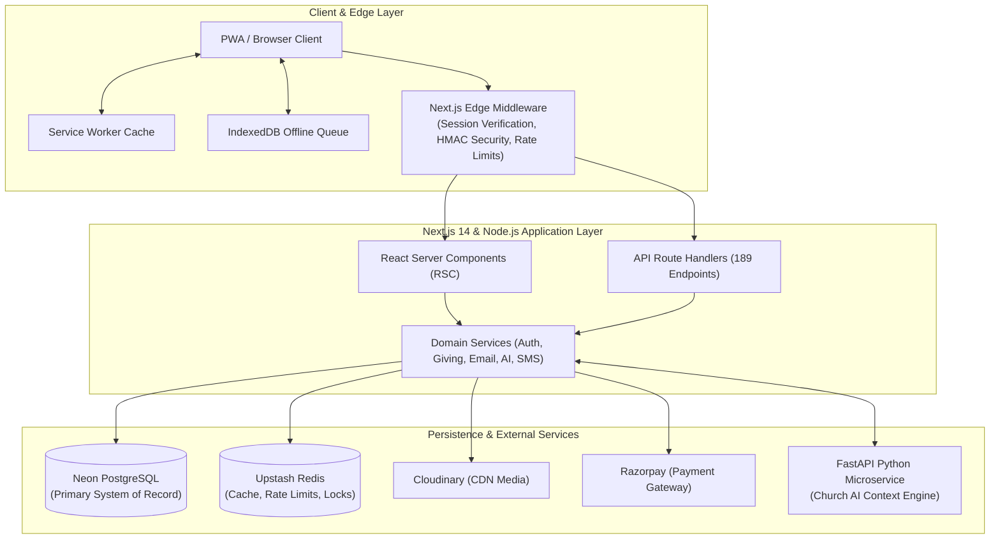

<div align="center">

<a href="https://kcmchurch.vercel.app">
  
</a>

# 🏛️ Kingdom of Christ Ministries (KCM Church) — Enterprise Digital Platform

[](https://kcmchurch.vercel.app)
[](https://nextjs.org/)
[](https://www.typescriptlang.org/)
[](https://neon.tech/)
[](https://www.prisma.io/)
[](https://tailwindcss.com/)
[](https://razorpay.com/)
[](https://web.dev/progressive-web-apps/)
[-22C55E?style=for-the-badge)](docs/frontend/I18N.md)
[](LICENSE)

**A mission-critical, enterprise-grade digital ecosystem built for Kingdom of Christ Ministries (Hyderabad, India).**  
Engineered with Next.js 14 App Router, TypeScript, Neon PostgreSQL, Upstash Redis, Razorpay Online Giving, PWA Offline Sync, and an AI-powered Theological Context Engine.

[Explore Live Web App](https://kcmchurch.vercel.app) • [Architecture Documentation](docs/architecture/ARCHITECTURE.md) • [API Directory](docs/api/API-INVENTORY.md) • [Runbooks](docs/reliability/runbooks/)

</div>

---

## 📋 Table of Contents
- [Executive Overview](#-executive-overview)
- [Enterprise Architecture](#-enterprise-architecture)
- [Security & Access Control](#-security--access-control)
- [Core Platform Capabilities](#-core-platform-capabilities)
  - [1. Multilingual Trilingual Parity](#1-multilingual-trilingual-parity-en--te--hi)
  - [2. Zero-Trust Online Giving & 80G Tax Receipts](#2-zero-trust-online-giving--80g-tax-receipts)
  - [3. Offline-First PWA & IndexedDB Queue](#3-offline-first-pwa--indexeddb-queue)
  - [4. Church AI Context Assistant](#4-church-ai-context-assistant)
  - [5. Centralized Health Engine & Self-Healing](#5-centralized-health-engine--self-healing)
- [Monorepo Directory Layout](#-monorepo-directory-layout)
- [Technology Stack](#-technology-stack)
- [Getting Started & Local Setup](#-getting-started--local-setup)
- [Quality Gates & Testing](#-quality-gates--testing)
- [Security, Backup & Disaster Recovery](#-security-backup--disaster-recovery)
- [Production Infrastructure & Kubernetes](#-production-infrastructure--kubernetes)
- [Contact & Ministry Locations](#-contact--ministry-locations)
- [License](#-license)

---

## 🏛️ Executive Overview

The **Kingdom of Christ Ministries Digital Platform** serves as the central digital ecosystem for church services, sermon broadcasts, community prayer networks, outreach volunteer initiatives, and financial stewardship.

Designed for high reliability, strict data integrity, and cross-device accessibility:
- **Pure White Visual Identity**: Clean, accessible, modern interface enforcing light-only color consistency across Android and desktop web engines.
- **Micro-Audited Data Layer**: 42 relational models in PostgreSQL with point-in-time recovery (PITR) and Prisma interactive transaction boundaries.
- **Edge Access Control**: Cryptographic server-side Edge Middleware session verification protecting authenticated user areas and private workflows.

---

## 🏗️ Enterprise Architecture



---

## 🔐 Security & Access Control

The platform enforces strict server-side session authentication at the Edge Middleware layer ([`frontend/middleware.ts`](frontend/middleware.ts)):
- **Cryptographic Token Verification**: Sessions are verified at the network edge using Web Crypto HMAC-SHA256 tokens stored in secure, HttpOnly, SameSite cookies.
- **IDOR Defense**: All data queries enforce ownership verification server-side, preventing unauthorized cross-account access.
- **CSRF & Origin Protection**: State-mutating API requests validate origin and referer headers against trusted domain allowlists.

---

## ✨ Core Platform Capabilities

### 1. Multilingual Trilingual Parity (EN | TE | HI)
- 100% dictionary synchronization across **English (`en`)**, **Telugu (`te`)**, and **Hindi (`hi`)** (2,286 verified translation keys per locale).
- Zero runtime translation missing-key fallback anomalies.
- Automated parity verification via `npm run i18n:check -w frontend`.

### 2. Zero-Trust Online Giving & 80G Tax Receipts
- **Server-Verified Checkout**: Razorpay orders created exclusively on the backend with client-side price manipulation prevention.
- **HMAC-SHA256 Webhook Verification**: Ingress webhooks capture raw payload buffers and deduplicate via `webhookEventId` (SHA-256 hash).
- **80G Compliant Receipts**: Instant cryptographic verification code generation and verified PDF receipt downloads.

### 3. Offline-First PWA & IndexedDB Queue
- **Resilient Mutation Queue**: Offline actions (prayer submissions, event registrations) are buffered in IndexedDB (`kcm-offline-db` v2) with deterministic client UUIDs.
- **Automatic Replay Engine**: Background sync reconciles queued mutations when network connectivity returns without duplicating records.

### 4. Church AI Context Assistant
- Dedicated conversational assistant with biblical knowledge retrieval, branch schedule context, and theological guardrails.
- Zero server secret leakage; prompt inputs sanitized with DOMPurify and strict rate-limiting.

### 5. Centralized Health Engine & Self-Healing
- 40+ specialized health checkers across 11 subsystems ([`health/`](health/)) auditing database connection pooling, API contracts, responsiveness, and security.
- Integrated automated health monitoring and deployment recovery scripts ([`scripts/deployment/`](scripts/deployment/)).

---

## 📂 Monorepo Directory Layout

```
K.C.M-Portal/
├── frontend/                     # Next.js 14 App Router Web Application
│   ├── app/                      # 148 compiled routes and 35 API subdomains
│   ├── components/               # Pure white UI components, cards, tables, modals
│   ├── hooks/                    # useAuth, useSync, useOnlineStatus, useI18n
│   ├── lib/                      # Services (Razorpay, Email, AI, Prisma singleton)
│   ├── prisma/                   # PostgreSQL schema (42 models) & seeds
│   └── tests/                    # Playwright E2E, chaos, and security test suites
├── backend/                      # Node.js / Express Auxiliary Services
│   ├── src/                      # Background BullMQ queues, cron workers, routes
│   └── server.js                 # Auxiliary server & Socket.io real-time engine
├── health/                       # Centralized 11-Tier Health Check Engine
│   ├── core/                     # HealthRegistry, HealthEngine, registerAllChecks
│   ├── database/                 # 13 database & data-integrity checks
│   ├── backend/                  # 12 API & webhook security checks
│   ├── frontend/                 # 15 responsive, accessibility & PWA checks
│   └── reports/                  # Machine-readable Step 1 to 10 audit JSON reports
├── docs/                         # Engineering Documentation & Runbooks
│   ├── architecture/             # System blueprints and ADR-001 to ADR-006
│   ├── database/                 # Data model, PITR backups, migrations, indexing
│   ├── api/                      # 189-endpoint API directory & contracts
│   ├── frontend/                 # Design tokens, WCAG 2.1 AA, PWA specifications
│   ├── reliability/              # Error budgets, SLOs, and 11 incident runbooks
│   └── infrastructure/           # Disaster recovery & production deployment guides
├── docker/                       # Hardened multi-stage node:22-alpine Dockerfiles
├── k8s/                          # Kubernetes manifests (PDB, NetworkPolicy, Kustomize)
└── package.json                  # Workspace monorepo root
```

---

## 🛠️ Technology Stack

| Domain | Technology | Purpose |
| :--- | :--- | :--- |
| **Frontend Framework** | [Next.js 14](https://nextjs.org/) (App Router) | React Server Components, Streaming SSR, Edge Middleware |
| **Language** | [TypeScript 5.4](https://www.typescriptlang.org/) | Strict end-to-end type safety |
| **Styling & Tokens** | [Tailwind CSS 3.4](https://tailwindcss.com/) | Pure white minimalist design system (`color-scheme: light only`) |
| **Database & ORM** | [Neon PostgreSQL](https://neon.tech/) & [Prisma 5.12](https://www.prisma.io/) | Serverless connection pooling, 42 schema models, ACID transactions |
| **Caching & Queues** | [Upstash Redis](https://upstash.com/) & [BullMQ](https://bullmq.io/) | Rate-limiting sliding windows, distributed locks, retry queues |
| **Payments** | [Razorpay](https://razorpay.com/) | UPI Intent, QR generation, cards, net banking, 80G tax receipts |
| **Media Delivery** | [Cloudinary](https://cloudinary.com/) | On-the-fly media optimization (`f_auto`, `q_auto`) & PDF receipt generation |
| **Testing** | [Playwright](https://playwright.dev/) & [Jest](https://jestjs.io/) | Cross-browser E2E testing (Chromium, Firefox, WebKit, Mobile Safari) |
| **Container & Orchestration**| [Docker](https://www.docker.com/) & [Kubernetes](https://kubernetes.io/) | Non-root container builds, PodDisruptionBudgets, NetworkPolicies |

---

## 🚀 Getting Started & Local Setup

### Prerequisites
- **Node.js**: `>= 20.0.0`
- **npm**: `>= 10.0.0`
- **PostgreSQL**: PostgreSQL 15+ or a free [Neon](https://neon.tech) serverless database.

### 1. Clone & Install Dependencies
```bash
git clone https://github.com/bunnyvalluri/church-.git
cd church-
npm install
```

### 2. Configure Environment Variables
Copy the example environment templates:
```bash
cp frontend/.env.example frontend/.env.local
cp backend/.env.example backend/.env
```

Configure essential variables in `frontend/.env.local`:
```env
# Database Connection (Neon Pooled Connection)
DATABASE_URL="postgresql://[USER]:[PASSWORD]@[HOST]:5432/[DB_NAME]?sslmode=require"

# Session & JWT Secret
SESSION_SECRET="your-secure-64-character-random-hex-secret"

# Public Identifiers (Client-Safe)
NEXT_PUBLIC_GOOGLE_CLIENT_ID="your-google-client-id.apps.googleusercontent.com"
NEXT_PUBLIC_RAZORPAY_KEY_ID="rzp_test_..."
NEXT_PUBLIC_CLOUDINARY_CLOUD_NAME="your-cloud-name"

# Private Server Secrets (Never Exposed to Browser)
RAZORPAY_KEY_SECRET="your-razorpay-key-secret"
RAZORPAY_WEBHOOK_SECRET="your-webhook-secret"
```

### 3. Initialize Database
```bash
# Generate Prisma Client
npm run postinstall

# Push Schema to PostgreSQL
npm run db:push

# (Optional) Seed Initial Church Campuses & Services
npm run db:seed
```

### 4. Run Development Server
```bash
npm run dev
```
Open [http://localhost:3000](http://localhost:3000) to view the application.

---

## 🧪 Quality Gates & Testing

Execute the automated test suites:

```bash
# 1. Typecheck the entire monorepo
npm run typecheck

# 2. Verify 100% multilingual translation sync (EN, TE, HI)
npm run i18n:check -w frontend

# 3. Execute End-to-End Playwright test suite
npm run test:e2e

# 4. Run Centralized Health & Self-Healing Audit
npm run agent:audit

# 5. Build production bundle
npm run build
```

---

## 🛡️ Security, Backup & Disaster Recovery

- **Zero Client Secrets**: Strict client/server quarantine ensuring database credentials and API secrets are never bundled in client code.
- **Continuous PITR Backups**: Neon PostgreSQL maintains 7-day continuous Write-Ahead Log (WAL) archiving with Recovery Point Objective (RPO) < 15 minutes and Recovery Time Objective (RTO) < 30 minutes.
- **Incident Runbooks**: 11 production runbooks available in [`docs/reliability/runbooks/`](docs/reliability/runbooks/) covering database outages, payment webhook failures, and certificate renewals.

---

## 🐳 Production Infrastructure & Kubernetes

Production container images are built using multi-stage `node:22-alpine` Dockerfiles with non-root security contexts (`UID 1001`):

```bash
# Build and run production Docker containers locally
npm run docker:prod

# Deploy to Kubernetes cluster
npm run k8s:apply
```

Kubernetes manifests located in [`k8s/`](k8s/) include:
- `pdb.yaml`: Pod Disruption Budgets ensuring high availability during node drain operations.
- `network-policy.yaml`: Default-deny ingress network policies allowing only verified frontend-to-backend traffic.
- `kustomization.yaml`: Unified resource orchestration.

---

## 📍 Contact & Ministry Locations

**Kingdom of Christ Ministries (KCM Church)**  
- 🌐 **Website**: [https://kcmchurch.vercel.app](https://kcmchurch.vercel.app)  
- 📧 **Primary Email**: [kingofchristministries23@gmail.com](mailto:kingofchristministries23@gmail.com)  
- 📱 **Phone**: +91 96409 43777  
- 📍 **Main Campus**: 15-201, Vivekananda Nagar, Srinivas Nagar, Jeedimetla, Hyderabad – 500055, Telangana, India  
- 📍 **Campuses**: Shapur Nagar • Subhash Nagar • Bahadurpally  

---

## 📄 License

This repository is licensed under the [MIT License](LICENSE).  
Copyright © 2026 Kingdom of Christ Ministries. All rights reserved.
