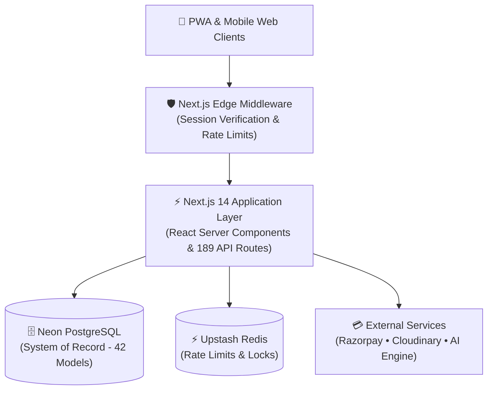

<div align="center">

# 🏛️ Kingdom of Christ Ministries (KCM Church)
### Enterprise Digital Platform

<a href="https://kcmchurch.vercel.app">
  
</a>

<br/><br/>

[](https://kcmchurch.vercel.app)
[](https://nextjs.org/)
[](https://www.typescriptlang.org/)
[](https://neon.tech/)
[](https://www.prisma.io/)
[](https://tailwindcss.com/)
[](https://razorpay.com/)
[](https://web.dev/progressive-web-apps/)
[](docs/frontend/I18N.md)
[](LICENSE)

<br/>

**Mission-critical, enterprise-grade digital ecosystem for Kingdom of Christ Ministries (Hyderabad, India).**  
Engineered with Next.js 14, TypeScript, Neon PostgreSQL, Upstash Redis, Razorpay Online Giving, PWA Offline Sync, and an AI Theological Context Engine.

[**🌐 Live App**](https://kcmchurch.vercel.app) • [**📐 Architecture**](docs/architecture/ARCHITECTURE.md) • [**⚡ API Directory**](docs/api/API-INVENTORY.md) • [**📖 Runbooks**](docs/reliability/runbooks/)

</div>

---

## 📱 Mobile-First Highlights

- **Pure White Visual Identity**: Light-only color consistency across all mobile browsers & Android WebViews.
- **Offline-First PWA**: Background IndexedDB queue for offline prayers and event registrations.
- **Fast 1-Tap Giving**: Razorpay UPI & QR integration optimized for mobile payments.
- **Trilingual Parity**: Instant English, Telugu (`తెలుగు`), and Hindi (`हिंदी`) localization.

---

## 📋 Table of Contents
- [Executive Overview](#-executive-overview)
- [Enterprise Architecture](#-enterprise-architecture)
- [Security & Access Control](#-security--access-control)
- [Core Platform Capabilities](#-core-platform-capabilities)
- [Monorepo Directory Layout](#-monorepo-directory-layout)
- [Technology Stack](#-technology-stack)
- [Getting Started & Local Setup](#-getting-started--local-setup)
- [Quality Gates & Testing](#-quality-gates--testing)
- [Security & Backup](#-security-backup--disaster-recovery)
- [Production Infrastructure](#-production-infrastructure--kubernetes)
- [Contact & Ministry Locations](#-contact--ministry-locations)
- [License](#-license)

---

## 🏛️ Executive Overview

The **Kingdom of Christ Ministries Digital Platform** serves as the central digital ecosystem for church services, sermon broadcasts, community prayer networks, outreach volunteer initiatives, and financial stewardship.

- **Responsive Design**: Fluid UX optimized for smartphones, tablets, laptops, and ultra-wide displays.
- **Micro-Audited Data Layer**: 42 relational models in PostgreSQL with point-in-time recovery (PITR).
- **Edge Access Control**: Cryptographic server-side Edge Middleware session verification protecting private workflows.

---

## 🏗️ Enterprise Architecture



---

## 🔐 Security & Access Control

The platform enforces strict server-side session authentication at the Edge Middleware layer ([`frontend/middleware.ts`](frontend/middleware.ts)):

- **Cryptographic Token Verification**: Sessions are verified at the network edge using Web Crypto HMAC-SHA256 tokens stored in secure, HttpOnly, SameSite cookies.
- **IDOR Defense**: All data queries enforce ownership verification server-side, preventing unauthorized cross-account access.
- **CSRF & Origin Protection**: State-mutating API requests validate origin and referer headers against trusted domain allowlists.

---

## ✨ Core Platform Capabilities

### 1. Multilingual Trilingual Parity (EN | TE | HI)
- 100% dictionary synchronization across **English (`en`)**, **Telugu (`te`)**, and **Hindi (`hi`)** (2,286 verified translation keys per locale).
- Zero runtime translation missing-key fallback anomalies.
- Automated parity verification via `npm run i18n:check -w frontend`.

### 2. Zero-Trust Online Giving & 80G Tax Receipts
- **Server-Verified Checkout**: Razorpay orders created exclusively on the backend with client-side price manipulation prevention.
- **HMAC-SHA256 Webhook Verification**: Ingress webhooks capture raw payload buffers and deduplicate via `webhookEventId` (SHA-256 hash).
- **80G Compliant Receipts**: Instant cryptographic verification code generation and verified PDF receipt downloads.

### 3. Offline-First PWA & IndexedDB Queue
- **Resilient Mutation Queue**: Offline actions (prayer submissions, event registrations) are buffered in IndexedDB (`kcm-offline-db` v2) with deterministic client UUIDs.
- **Automatic Replay Engine**: Background sync reconciles queued mutations when network connectivity returns without duplicating records.

### 4. Church AI Context Assistant
- Dedicated conversational assistant with biblical knowledge retrieval, branch schedule context, and theological guardrails.
- Zero server secret leakage; prompt inputs sanitized with DOMPurify and strict rate-limiting.

### 5. Centralized Health Engine & Self-Healing
- 40+ specialized health checkers across 11 subsystems ([`health/`](health/)) auditing database connection pooling, API contracts, responsiveness, and security.
- Integrated automated health monitoring and deployment recovery scripts ([`scripts/deployment/`](scripts/deployment/)).

---

## 📂 Monorepo Directory Layout

```
K.C.M-Portal/
├── frontend/             # Next.js 14 App Router Web Application
│   ├── app/              # 148 compiled routes & 35 API subdomains
│   ├── components/       # Pure white UI components, cards, modals
│   ├── hooks/            # useAuth, useSync, useOnlineStatus, useI18n
│   ├── lib/              # Services (Razorpay, Email, AI, Prisma)
│   ├── prisma/           # PostgreSQL schema (42 models) & seeds
│   └── tests/            # Playwright E2E, chaos & security tests
├── backend/              # Node.js / Express Auxiliary Services
│   ├── src/              # Background BullMQ queues & cron workers
│   └── server.js         # Real-time WebSocket service
├── health/               # Centralized 11-Tier Health Check Engine
│   ├── core/             # HealthRegistry & HealthEngine
│   ├── database/         # 13 database & data-integrity checks
│   ├── backend/          # 12 API & webhook security checks
│   ├── frontend/         # 15 responsive, accessibility & PWA checks
│   └── reports/          # Machine-readable Step 1-10 audit reports
├── docs/                 # Engineering Documentation & Runbooks
│   ├── architecture/     # System blueprints & ADRs (ADR-001 - 006)
│   ├── database/         # Data model, PITR backups & migrations
│   ├── api/              # 189-endpoint API directory & contracts
│   ├── frontend/         # Design tokens, WCAG 2.1 AA, PWA specs
│   ├── reliability/      # Error budgets, SLOs & 11 runbooks
│   └── infrastructure/   # Disaster recovery & deployment guides
├── docker/               # Hardened multi-stage node:22 Dockerfiles
├── k8s/                  # Kubernetes manifests (PDB, NetworkPolicy)
└── package.json          # Monorepo root configuration
```

---

## 🛠️ Technology Stack

| Layer | Technology | Key Role |
| :--- | :--- | :--- |
| **Frontend** | [Next.js 14](https://nextjs.org/) App Router | Server Components, Streaming SSR, Edge Middleware |
| **Language** | [TypeScript 5.4](https://www.typescriptlang.org/) | Strict type safety across client & server |
| **Design** | [Tailwind CSS 3.4](https://tailwindcss.com/) | Mobile-first pure white design system |
| **Database** | [Neon PostgreSQL](https://neon.tech/) & [Prisma](https://www.prisma.io/) | Serverless connection pooling, 42 relational models |
| **Cache & Queue** | [Upstash Redis](https://upstash.com/) & [BullMQ](https://bullmq.io/) | Sliding window rate-limits & background jobs |
| **Payments** | [Razorpay](https://razorpay.com/) | Mobile UPI Intent, QR, Netbanking, 80G Receipts |
| **Media** | [Cloudinary](https://cloudinary.com/) | Auto-responsive WebP/AVIF images & PDF receipts |
| **Testing** | [Playwright](https://playwright.dev/) & [Jest](https://jestjs.io/) | Mobile Safari, WebKit, Chromium E2E testing |
| **DevOps** | [Docker](https://www.docker.com/) & [Kubernetes](https://kubernetes.io/) | Non-root containers, PDB, NetworkPolicies |

---

## 🚀 Getting Started & Local Setup

### Prerequisites
- **Node.js**: `>= 20.0.0`
- **npm**: `>= 10.0.0`
- **PostgreSQL**: PostgreSQL 15+ or a free [Neon](https://neon.tech) database.

### 1. Clone & Install Dependencies
```bash
git clone https://github.com/bunnyvalluri/church-.git
cd church-
npm install
```

### 2. Configure Environment Variables
```bash
cp frontend/.env.example frontend/.env.local
cp backend/.env.example backend/.env
```

Configure essential variables in `frontend/.env.local`:
```env
# Database Connection
DATABASE_URL="postgresql://[USER]:[PASSWORD]@[HOST]:5432/[DB_NAME]?sslmode=require"

# Session & JWT Secret
SESSION_SECRET="your-secure-64-character-random-hex-secret"

# Public Client Configuration
NEXT_PUBLIC_GOOGLE_CLIENT_ID="your-google-client-id.apps.googleusercontent.com"
NEXT_PUBLIC_RAZORPAY_KEY_ID="rzp_test_..."
NEXT_PUBLIC_CLOUDINARY_CLOUD_NAME="your-cloud-name"

# Private Server Secrets
RAZORPAY_KEY_SECRET="your-razorpay-key-secret"
RAZORPAY_WEBHOOK_SECRET="your-webhook-secret"
```

### 3. Initialize Database
```bash
# Generate Prisma Client & push schema
npm run postinstall
npm run db:push

# (Optional) Seed initial data
npm run db:seed
```

### 4. Run Development Server
```bash
npm run dev
```
Open [http://localhost:3000](http://localhost:3000) on your desktop or mobile browser.

---

## 🧪 Quality Gates & Testing

```bash
# 1. Typecheck the entire monorepo
npm run typecheck

# 2. Verify 100% multilingual translation sync (EN, TE, HI)
npm run i18n:check -w frontend

# 3. Execute End-to-End Playwright test suite
npm run test:e2e

# 4. Run Centralized Health & Self-Healing Audit
npm run agent:audit

# 5. Build production bundle
npm run build
```

---

## 🛡️ Security, Backup & Disaster Recovery

- **Zero Client Secrets**: Strict isolation ensuring database credentials and backend secrets are never leaked to client bundles.
- **Continuous PITR Backups**: Neon PostgreSQL maintains 7-day continuous WAL archiving with RPO < 15m and RTO < 30m.
- **Incident Runbooks**: 11 production runbooks in [`docs/reliability/runbooks/`](docs/reliability/runbooks/) covering failovers, webhook retries, and cert renewals.

---

## 🐳 Production Infrastructure & Kubernetes

Production container images are built using multi-stage `node:22-alpine` Dockerfiles with non-root security contexts (`UID 1001`):

```bash
# Build & run production Docker containers locally
npm run docker:prod

# Deploy to Kubernetes cluster
npm run k8s:apply
```

---

## 📍 Contact & Ministry Locations

**Kingdom of Christ Ministries (KCM Church)**  
- 🌐 **Website**: [https://kcmchurch.vercel.app](https://kcmchurch.vercel.app)  
- 📧 **Email**: [kingofchristministries23@gmail.com](mailto:kingofchristministries23@gmail.com)  
- 📱 **Phone**: +91 96409 43777  
- 📍 **Main Campus**: 15-201, Vivekananda Nagar, Srinivas Nagar, Jeedimetla, Hyderabad – 500055, Telangana, India  
- 📍 **Campuses**: Shapur Nagar • Subhash Nagar • Bahadurpally  

---

## 📄 License

This repository is licensed under the [MIT License](LICENSE).  
Copyright © 2026 Kingdom of Christ Ministries. All rights reserved.
