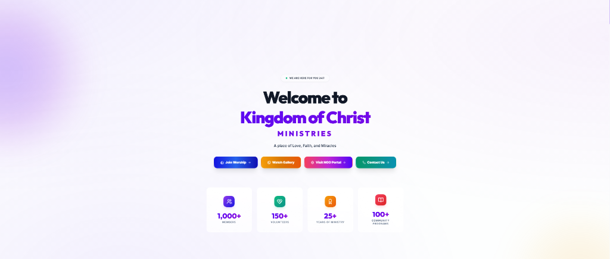
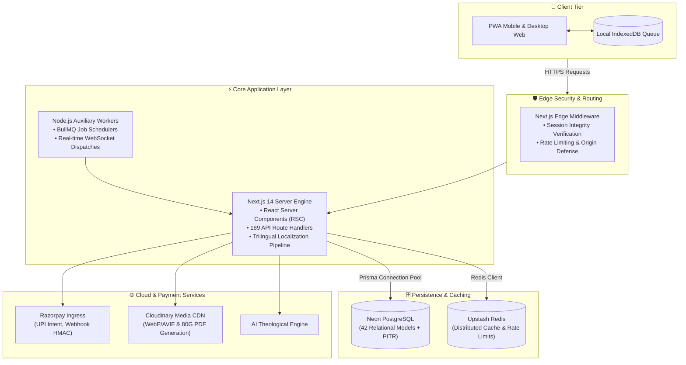

<div align="center">

<a href="https://kcmchurch.vercel.app">
  
</a>

# 🏛️ Kingdom of Christ Ministries
### Enterprise Digital Platform & Ministry Operating System

[](https://kcmchurch.vercel.app)
[](https://nextjs.org/)
[](https://www.typescriptlang.org/)
[](https://neon.tech/)
[](https://www.prisma.io/)
[](https://tailwindcss.com/)
[](https://razorpay.com/)
[](https://web.dev/progressive-web-apps/)
[](docs/frontend/I18N.md)
[](LICENSE)

<br/>

**An enterprise-grade, high-availability digital ecosystem engineered for Kingdom of Christ Ministries (Hyderabad, India).**  
Powering real-time church operations, online stewardship, offline-first congregation engagement, trilingual localization, and multi-campus ministry management.

[**Explore Live Application ↗**](https://kcmchurch.vercel.app) • [**Architecture Specs**](docs/architecture/ARCHITECTURE.md) • [**API Inventory**](docs/api/API-INVENTORY.md) • [**Disaster Recovery Runbooks**](docs/reliability/runbooks/)

</div>

---

## 📑 Table of Contents

- [Overview](#-overview)
- [Core Platform Capabilities](#-core-platform-capabilities)
- [System Architecture](#-system-architecture)
- [Repository Structure](#-repository-structure)
- [Technology Matrix](#-technology-matrix)
- [Getting Started & Local Setup](#-getting-started--local-setup)
- [Quality Assurance & Verification](#-quality-assurance--verification)
- [Platform Security & Reliability](#-platform-security--reliability)
- [Containerization & Deployment](#-containerization--deployment)
- [Ministry Campuses & Contact](#-ministry-campuses--contact)
- [License](#-license)

---

## 🌟 Overview

The **Kingdom of Christ Ministries Platform** is an all-in-one digital operating system built to connect congregations, streamline worship broadcasts, automate tax-exempt financial stewardship, and coordinate community outreach programs.

### Key Highlights
- **Lightning-Fast Performance**: Built on Next.js 14 App Router with React Server Components, streaming SSR, and Edge Middleware optimization.
- **Pure White Modern Design**: Accessible, high-contrast, mobile-first design system with zero layout shifts and instant touch feedback.
- **Resilient Offline Architecture**: Progressive Web App (PWA) with persistent IndexedDB queue for offline prayers, notes, and event check-ins.
- **Trilingual Parity**: 100% dictionary synchronization across English (`en`), Telugu (`te`), and Hindi (`hi`).

---

## ⚡ Core Platform Capabilities

| Module | Description | Key Technologies |
| :--- | :--- | :--- |
| 🌐 **Trilingual Localization** | Complete dictionary synchronization across English, Telugu, and Hindi (2,200+ verified translation keys). Automated CI checks prevent missing-key fallbacks. | Next.js i18n, Static Parity Audits |
| 💳 **Verified Financial Pipeline** | Server-side Razorpay order generation with HMAC-SHA256 signature verification, idempotent webhook processing, and instant 80G tax receipt PDF generation. | Razorpay SDK, Web Crypto HMAC, PDFKit |
| 📱 **Offline-First PWA** | Offline submissions (prayer requests, event registrations) are securely buffered in IndexedDB (`kcm-offline-db`) and automatically replayed upon network recovery. | Service Workers, IndexedDB, Workbox |
| 🎥 **Media & Broadcast Hub** | Real-time live streaming integration, sermon archive indexing, categorization, and adaptive video streaming. | Cloudinary CDN, YouTube API |
| 🧠 **Theological AI Engine** | Context-aware biblical knowledge retrieval engine with input sanitization, rate-limiting, and theological guardrails. | Next.js Edge AI, DOMPurify |
| 🩺 **Automated Health Engine** | Continuous 40+ point automated health checks across database pools, external APIs, queue depth, and responsiveness with self-healing triggers. | Health Engine, BullMQ, Redis |

---

## 🏗️ System Architecture



---

## 📂 Repository Structure

```
K.C.M-Portal/
├── frontend/                 # Next.js 14 App Router Monorepo Package
│   ├── app/                  # Application routes, server components & API handlers
│   ├── components/           # Modern UI components, modals, and design tokens
│   ├── hooks/                # Custom React hooks (useAuth, useSync, useI18n, useOnlineStatus)
│   ├── lib/                  # Shared core libraries (Prisma, Razorpay, Email, AI Engine)
│   ├── prisma/               # PostgreSQL relational schema (42 models) & seeds
│   └── tests/                # Automated Playwright E2E and visual tests
├── backend/                  # Node.js Auxiliary Services & Workers
│   ├── src/                  # Background BullMQ queues & cron workers
│   └── server.js             # Real-time WebSocket dispatcher
├── health/                   # Centralized Health & Diagnostics Engine
│   ├── core/                 # Health check registry and orchestrator
│   ├── database/             # 13 relational database integrity checks
│   ├── backend/              # 12 API endpoint and webhook verification checks
│   └── frontend/             # 15 responsive, accessibility and PWA checks
├── docs/                     # Technical Documentation & Operational Guides
│   ├── architecture/         # System diagrams & Architecture Decision Records (ADRs)
│   ├── api/                  # API inventory and endpoint contracts
│   ├── database/             # Schema documentation & PITR guidelines
│   └── reliability/          # High-availability runbooks and failure recovery guides
├── docker/                   # Multi-stage production-hardened Dockerfiles
├── k8s/                      # Kubernetes manifests (Deployments, Services, PDB, NetworkPolicies)
└── package.json              # Monorepo workspaces and root scripts
```

---

## 🛠️ Technology Matrix

| Layer | Technology | Version | Purpose |
| :--- | :--- | :--- | :--- |
| **Framework** | [Next.js](https://nextjs.org/) | `14.2.x` | React Server Components, Streaming SSR, Edge Middleware |
| **Language** | [TypeScript](https://www.typescriptlang.org/) | `5.4.x` | Monorepo-wide strict type contracts & compile-time safety |
| **Styling** | [Tailwind CSS](https://tailwindcss.com/) | `3.4.x` | Clean, accessible, mobile-first design system |
| **Database** | [Neon PostgreSQL](https://neon.tech/) | `v16` | Serverless relational database with autoscaling & branching |
| **ORM** | [Prisma](https://www.prisma.io/) | `5.12.x` | Type-safe query building, migrations & relational modeling |
| **Caching & Queue** | [Upstash Redis](https://upstash.com/) & [BullMQ](https://bullmq.io/) | `Latest` | Sliding window rate limits, job scheduling & distributed locks |
| **Payment Gateway** | [Razorpay](https://razorpay.com/) | `Latest` | UPI Intent, Cards, Netbanking & verified 80G tax receipting |
| **Media & CDN** | [Cloudinary](https://cloudinary.com/) | `Latest` | Image optimization, AVIF/WebP transformations, PDF rendering |
| **Testing** | [Playwright](https://playwright.dev/) & [Jest](https://jestjs.io/) | `Latest` | Cross-browser automated end-to-end and unit testing |
| **Containerization** | [Docker](https://www.docker.com/) & [Kubernetes](https://kubernetes.io/) | `node:22-alpine` | Hardened non-root containers & declarative cloud orchestration |

---

## 🚀 Getting Started & Local Setup

### Prerequisites
- **Node.js**: `v20.x` or higher (LTS recommended)
- **npm**: `v10.x` or higher
- **PostgreSQL**: PostgreSQL 15+ instance or a free [Neon](https://neon.tech) database

### 1. Clone & Install
```bash
git clone https://github.com/bunnyvalluri/church-.git
cd church-
npm install
```

### 2. Environment Configuration
Copy the template configuration files into your local environment:
```bash
cp frontend/.env.example frontend/.env.local
cp backend/.env.example backend/.env
```

Configure the essential connection parameters in `frontend/.env.local`:
```env
# Database Connection (Neon / PostgreSQL)
DATABASE_URL="postgresql://<USER>:<PASSWORD>@<HOST>:5432/<DB_NAME>?sslmode=require"

# Cryptographic Session Secret
SESSION_SECRET="<generate-a-secure-64-character-hex-string>"

# Public Keys & Client Config
NEXT_PUBLIC_GOOGLE_CLIENT_ID="<your-google-client-id>"
NEXT_PUBLIC_RAZORPAY_KEY_ID="rzp_test_<your-key-id>"
NEXT_PUBLIC_CLOUDINARY_CLOUD_NAME="<your-cloud-name>"

# Private Backend Integration Secrets
RAZORPAY_KEY_SECRET="<your-razorpay-key-secret>"
RAZORPAY_WEBHOOK_SECRET="<your-webhook-secret>"
```

### 3. Database Initialization
```bash
# Generate Prisma Client bindings
npm run postinstall

# Synchronize schema definitions with database
npm run db:push

# (Optional) Seed sample data
npm run db:seed
```

### 4. Start Development Server
```bash
npm run dev
```
Open [http://localhost:3000](http://localhost:3000) to view the application.

---

## 🧪 Quality Assurance & Verification

The project includes an extensive suite of automated checks, static analysis tools, and health monitors:

```bash
# 1. Typecheck the entire monorepo
npm run typecheck

# 2. Verify 100% trilingual translation sync (EN, TE, HI)
npm run i18n:check -w frontend

# 3. Execute End-to-End browser test suite
npm run test:e2e

# 4. Run Centralized Health & Self-Healing Audit
npm run agent:audit

# 5. Compile production build
npm run build
```

---

## 🛡️ Platform Security & Reliability

- **Perimeter Edge Verification**: Cryptographic session tokens verified at the Edge Middleware layer via Web Crypto HMAC-SHA256 using secure, `HttpOnly`, `SameSite=Lax` cookies.
- **CSRF & Origin Enforcement**: State-mutating API routes validate incoming origin and referer headers against trusted domain allowlists.
- **Continuous PITR Backups**: Neon PostgreSQL maintains continuous 7-day WAL archiving with Recovery Point Objective (RPO) < 15 minutes.
- **Operational Runbooks**: 11 detailed production runbooks located in [`docs/reliability/runbooks/`](docs/reliability/runbooks/) covering disaster recovery, cache resets, and database failovers.

---

## 🐳 Containerization & Deployment

Production container images are constructed using multi-stage `node:22-alpine` Dockerfiles with unprivileged non-root execution contexts (`UID 1001`):

```bash
# Build and run production containers locally
npm run docker:prod

# Stop production containers
npm run docker:prod:down

# Apply Kubernetes cluster manifests
npm run k8s:apply
```

---

## 📍 Ministry Campuses & Contact

**Kingdom of Christ Ministries (KCM Church)**  
- 🌐 **Official Portal**: [https://kcmchurch.vercel.app](https://kcmchurch.vercel.app)  
- 📧 **General Inquiries**: [kingofchristministries23@gmail.com](mailto:kingofchristministries23@gmail.com)  
- 📱 **Phone Contact**: +91 96409 43777  
- 📍 **Main Campus**: 15-201, Vivekananda Nagar, Srinivas Nagar, Jeedimetla, Hyderabad – 500055, Telangana, India  
- 📍 **Affiliated Campuses**: Shapur Nagar • Subhash Nagar • Bahadurpally  

---

## 📄 License

This project is licensed under the [MIT License](LICENSE).  
Copyright © 2026 Kingdom of Christ Ministries. All rights reserved.
