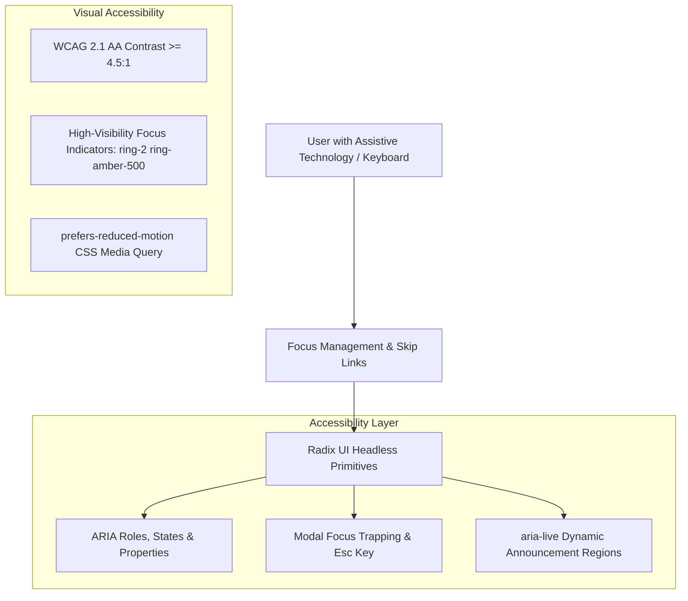

# Web Accessibility (a11y) & WCAG 2.1 AA Compliance

## Purpose
This document provides the technical accessibility specification, WCAG 2.1 Level AA conformance standards, screen reader compatibility guidelines, and keyboard navigation architectures for the Kingdom of Christ Ministries platform.

## Scope
Covers all public websites, authenticated portals, form controls, modals, tabs, dropdowns, and video streaming components.

## Status
> Status: Implemented & Verified

---

## 1. Compliance Baseline & Standards

The platform strictly adheres to **W3C Web Content Accessibility Guidelines (WCAG) 2.1 Level AA** standards across four foundational principles:
1. **Perceivable**: All visual and auditory content provides programmatic text alternatives.
2. **Operable**: All interface controls are fully navigable and interactive using a keyboard alone.
3. **Understandable**: Clear labels, deterministic navigation, and explicit error guidance.
4. **Robust**: Fully compatible with assistive technologies (NVDA, JAWS, Apple VoiceOver, Android TalkBack).

---

## 2. Accessible Component Implementation



---

## 3. Key Accessibility Implementations

### 3.1 Headless UI Primitives (Radix UI)
All interactive dropdowns, dialogs, accordion tabs, and tooltips are built on `@radix-ui` primitives, providing built-in:
- Correct ARIA attributes (`role="dialog"`, `aria-modal="true"`, `aria-expanded`, `aria-controls`).
- Automatic focus trapping within modal dialogs and focus restoration to the trigger element upon closing.
- Native `Escape` key handlers to dismiss floating layers.

### 3.2 High-Visibility Focus Indicators
All interactive elements enforce high-contrast focus rings for keyboard users:
```css
/* Focus visible outline rule */
:focus-visible {
  outline: 2px solid #d97706;
  outline-offset: 2px;
}
```

### 3.3 Accessible Forms & Error Announcements
- Every form field is bound to an explicit `<label htmlFor="...">`.
- Validation errors are linked using `aria-describedby="field-error-id"`.
- Form submission status and toast notifications use `aria-live="polite"` or `role="alert"` for real-time screen reader announcements.

### 3.4 Color Contrast Ratios
- Normal body text (Inter 16px) maintains a contrast ratio >= `5.2:1` against light and dark backgrounds.
- Large headings (Outfit 24px+) maintain a contrast ratio >= `4.8:1`.

---

## 4. Automated Testing & Verification

Accessibility is continuously asserted in CI/CD using `@playwright/test` and `axe-core` (`frontend/tests/accessibility.spec.ts`):

```bash
# Run automated accessibility scan across all primary routes
npm run test:a11y -w frontend
```

---

## 5. Troubleshooting & Diagnostics

| Problem | Cause | Solution |
| :--- | :--- | :--- |
| Screen reader does not announce dynamic search results | Search list container missing live region attribute | Add `aria-live="polite"` to the results container wrapper. |
| Keyboard focus gets stuck in third-party iframe | Video embed lacks keyboard escape listener | Ensure third-party iframe overlays do not trap keyboard focus loops. |

---

## Security Considerations
- Assistive attributes do not leak internal system IDs or confidential security tokens.

## Related Documentation
- [UI-UX.md](UI-UX.md) — Design system and color tokens.
- [Testing.md](Testing.md) — Accessibility testing suites.
- [Frontend.md](Frontend.md) — Component architecture.
