# Architecture & Operational Workflow Diagrams

## Purpose
This document provides visual Mermaid architectural, operational, and sequence diagrams illustrating key data flows, authentication cycles, administrative interactions, infrastructure topologies, and disaster recovery processes across the Kingdom of Christ Ministries platform.

## Scope
Covers all functional workflows, database flows, infrastructure pipelines, and user journeys implemented in the repository.

## Status
> Status: Implemented

---

## 1. Overall System Architecture Topology

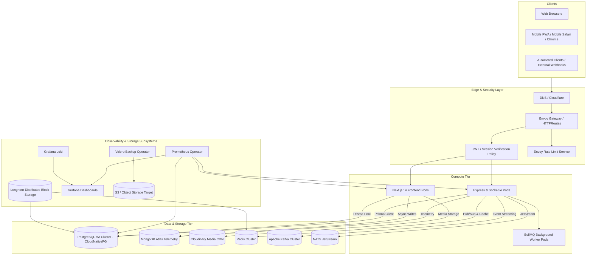

---

## 2. Universal Request Flow

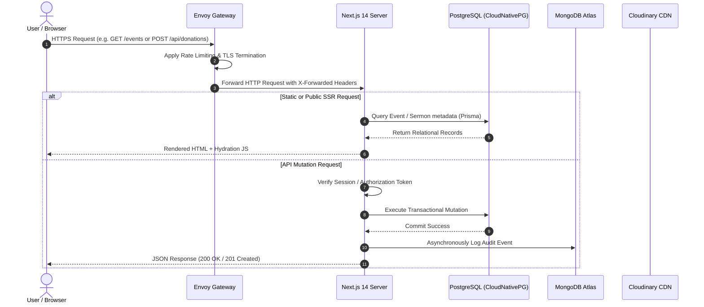

---

## 3. Authentication & Registration Flows

### 3.1 Standard Credentials Registration Flow

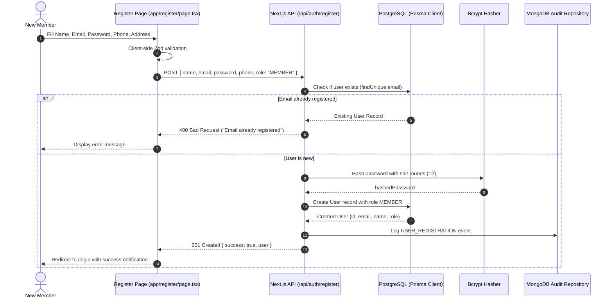

### 3.2 Standard Credentials Login Flow

```mermaid
sequenceDiagram
    autonumber
    actor User as Member / Pastor / Admin
    participant Login as Login Page (app/login/page.tsx)
    participant AuthAPI as Next.js API (/api/auth/login)
    participant DB as PostgreSQL (Prisma)
    participant Hash as Bcrypt Compare
    participant Session as Session Token Generator

    User->>Login: Submit Email & Password
    Login->>AuthAPI: POST { email, password }
    AuthAPI->>DB: Query User by email
    alt User Not Found
        DB-->>AuthAPI: null
        AuthAPI-->>Login: 401 Unauthorized ("Invalid credentials")
    else User Found
        AuthAPI->>Hash: Compare plaintext password with hashed password
        alt Password Mismatch
            Hash-->>AuthAPI: false
            AuthAPI-->>Login: 401 Unauthorized ("Invalid credentials")
        else Password Valid
            Hash-->>AuthAPI: true
            AuthAPI->>Session: Generate Encrypted JWT / Session Cookie
            Session-->>AuthAPI: Set-Cookie: kcm_session=...; HttpOnly; Secure; SameSite=Lax
            AuthAPI-->>Login: 200 OK { user: { id, email, role, name } }
            Login->>Login: Route according to role (MEMBER -> /member, PASTOR -> /pastor, ADMIN -> /admin)
        end
    end
```

### 3.3 Google Sign-In Flow

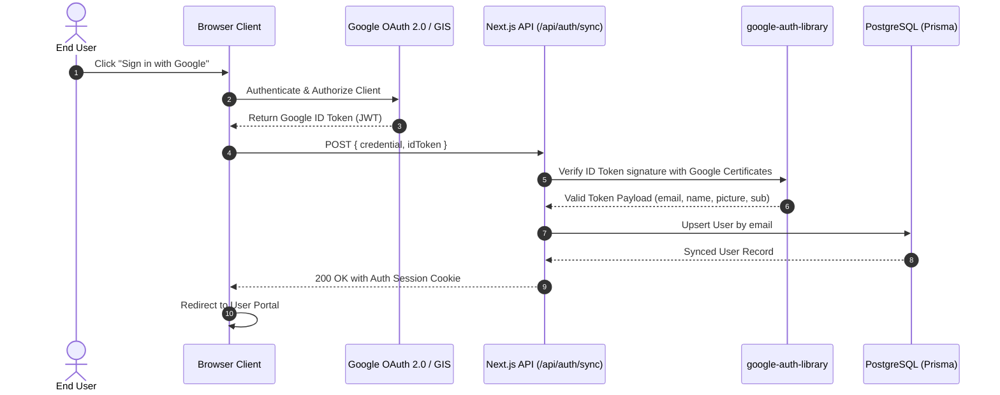

---

## 4. Role-Specific User Flows

### 4.1 Member Journey Flow

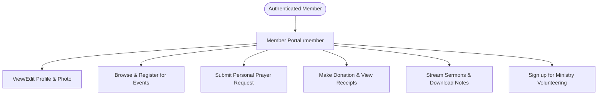

### 4.2 Pastor Workflow & AI Orchestration

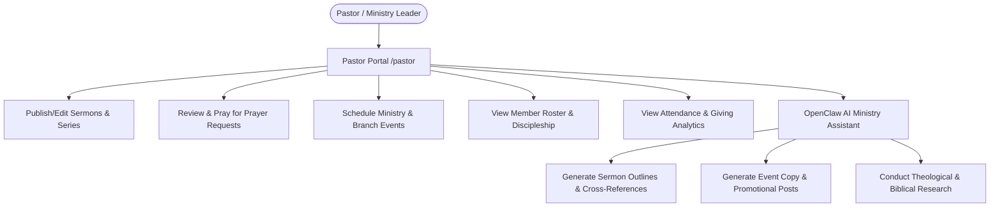

### 4.3 Admin Control Flow

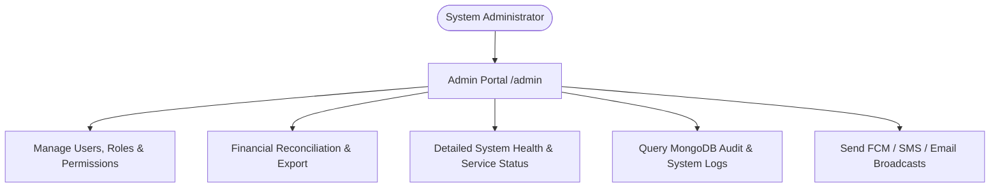

---

## 5. Feature & Subsystem Flows

### 5.1 Event Creation, Registration & Check-In Flow

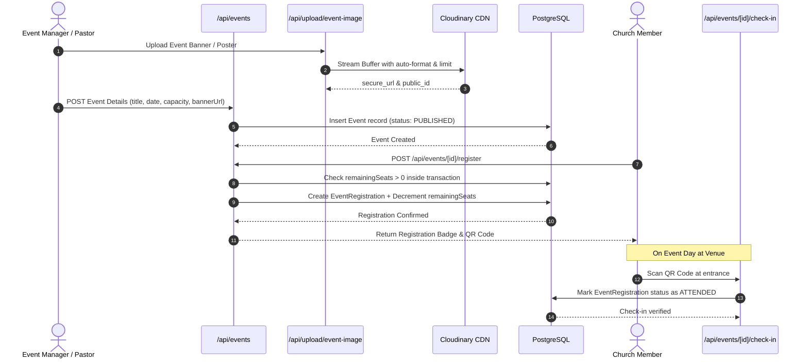

### 5.2 Prayer Request Pipeline Flow

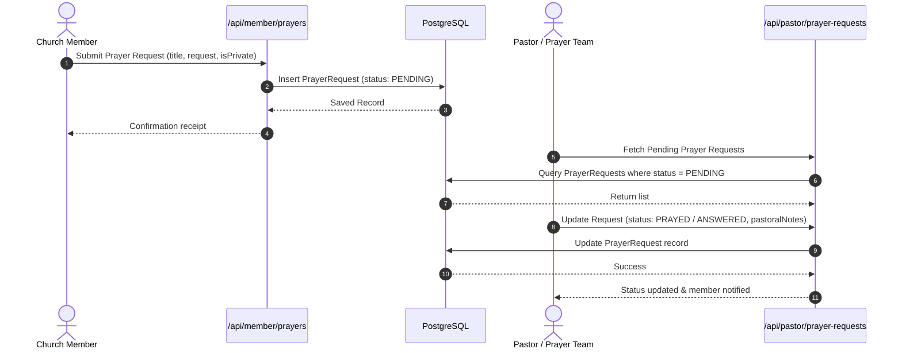

### 5.3 Sermon Streaming & Semantic Search Flow

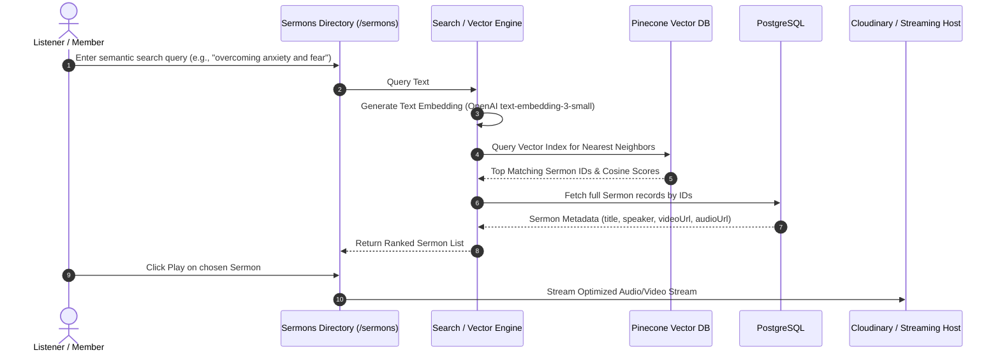

### 5.4 Donation & Automated Receipting Flow

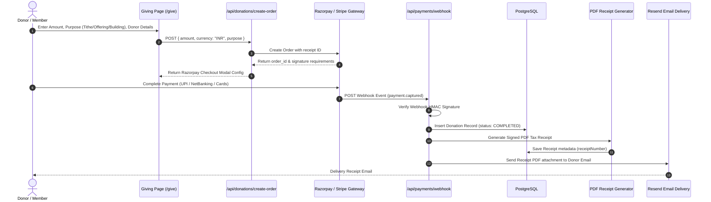

---

## 6. Media Management Flow

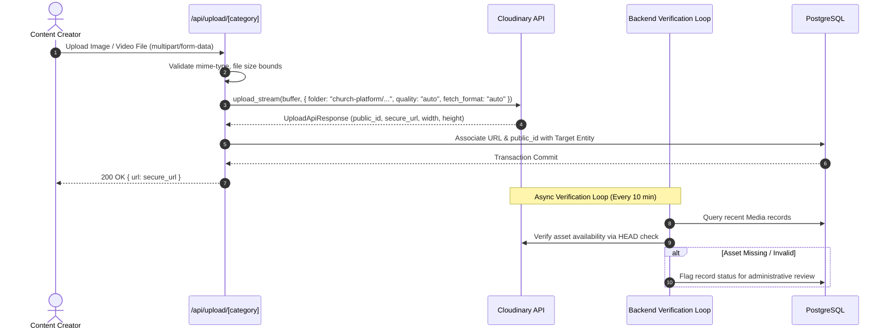

---

## 7. Offline-First PWA Synchronization Flow

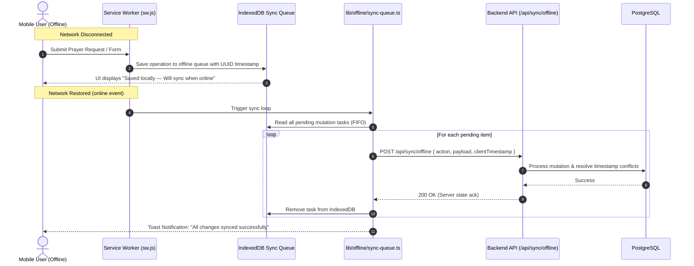

---

## 8. Kubernetes Infrastructure & GitOps Flow

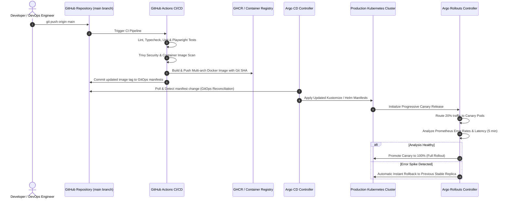

---

## 9. Observability, Logging & Alerting Topology

```mermaid
graph TD
    subgraph Workload Pods
        FrontendPods[Frontend Next.js Pods]
        BackendPods[Backend Express/Socket.io Pods]
        DBPods[CloudNativePG Database Pods]
        RedisPods[Redis Cluster Pods]
    end

    subgraph Metrics Pipeline
        FrontendPods -->|/api/metrics| Prometheus[Prometheus Operator]
        BackendPods -->|/metrics (prom-client)| Prometheus
        DBPods -->|metrics exporter: 9187| Prometheus
        RedisPods -->|redis_exporter: 9121| Prometheus
        Prometheus -->|Evaluates Rules| Alertmanager[Prometheus Alertmanager]
        Alertmanager -->|Critical Alerts| PagerDuty[On-Call Alert / Slack]
    end

    subgraph Log Pipeline
        WorkloadPodsLog[Pod stdout / stderr JSON] --> Fluentbit[Fluentbit / Promtail DaemonSet]
        Fluentbit --> Loki[Grafana Loki Storage]
    end

    subgraph Visualization
        Prometheus --> Grafana[Grafana Visualization]
        Loki --> Grafana
    end
```

---

## 10. Backup & Disaster Recovery Pipeline

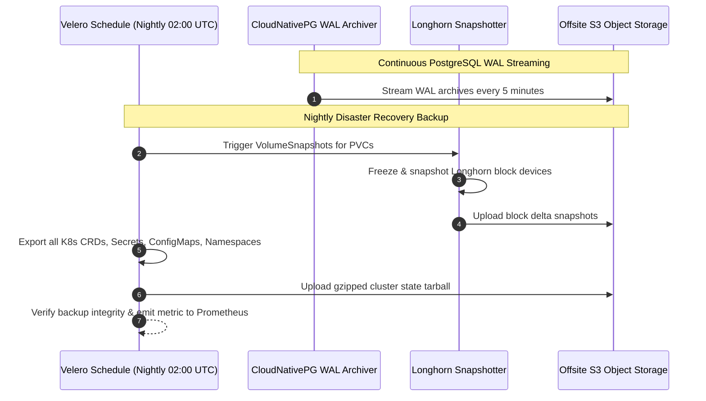

---

## Security Considerations
All communication links between clients, gateways, pods, and databases are strictly encrypted in transit using TLS 1.3. Internal database connections enforce SSL/TLS with client certificate verification.

## Related Documentation
- [Architecture.md](Architecture.md) — Textual architectural breakdown.
- [CloudNativePG.md](CloudNativePG.md) — Database cluster topology.
- [ArgoRollouts.md](ArgoRollouts.md) — Progressive delivery configuration.
