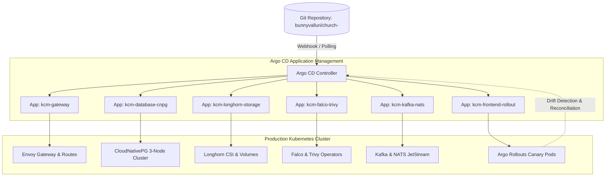

# GitOps Continuous Delivery with Argo CD

## Purpose
This document provides the technical specification for Argo CD, the declarative GitOps continuous delivery engine responsible for synchronizing Kubernetes workloads and infrastructure manifests from Git to production clusters for the Kingdom of Christ Ministries platform.

## Scope
Covers Argo CD Applications, ApplicationSets (`platform/*/argocd/`), automated sync policies, and drift remediation.

## Status
> Status: Implemented

---

## 1. GitOps Continuous Delivery Architecture



---

## 2. Application & ApplicationSet Manifests

### 2.1 Database Application (`platform/database/kubernetes/argocd-app.yaml`)
```yaml
apiVersion: argoproj.io/v1alpha1
kind: Application
metadata:
  name: kcm-database-cnpg
  namespace: argocd
spec:
  project: default
  source:
    repoURL: https://github.com/bunnyvalluri/church-.git
    targetRevision: main
    path: platform/database/clusters
  destination:
    server: https://kubernetes.default.svc
    namespace: kcm-system
  syncPolicy:
    automated:
      prune: false # Prevent accidental database volume pruning
      selfHeal: true
    syncOptions:
      - CreateNamespace=true
```

### 2.2 ApplicationSet for Modular Subsystems
ApplicationSets in `platform/helm/charts/argocd/templates/applicationset.yaml` dynamically discover and instantiate sub-applications based on Git directories.

---

## 3. Automated Sync & Self-Healing Policies

- **Automated Sync**: Synchronizes Git commits to the cluster within 3 minutes of merging.
- **Self-Healing**: If an operator manually modifies or deletes a Kubernetes deployment, Argo CD detects the configuration drift and immediately restores cluster state to match the authoritative Git manifest.
- **Prune Safeguards**: Sensitive database clusters and persistent volume claims disable automated pruning (`prune: false`) to safeguard production data.

---

## 4. Troubleshooting & Diagnostics

| Problem | Cause | Solution |
| :--- | :--- | :--- |
| `Sync Failed: ComparisonError (CRD not found)` | Sub-manifest depends on a CustomResourceDefinition not yet installed | Use Argo CD sync phases and waves (`argocd.argoproj.io/sync-wave: "1"`) to enforce CRD installation order. |
| Application stuck in `OutOfSync` | Git manifest contains mutable fields (e.g. replica count managed by HPA) | Add `ignoreDifferences` rules in the Argo CD Application spec for `spec.replicas`. |

---

## Security Considerations
- Argo CD runs in a dedicated `argocd` namespace with strict RBAC restricting project repository access.
- SSO authentication integrates with Google Workspace or GitHub Teams.

## Related Documentation
- [GitOps.md](GitOps.md) — GitOps workflow guidelines.
- [ArgoRollouts.md](ArgoRollouts.md) — Progressive delivery integration.
- [Helm.md](Helm.md) — Helm charts managed by Argo CD.
