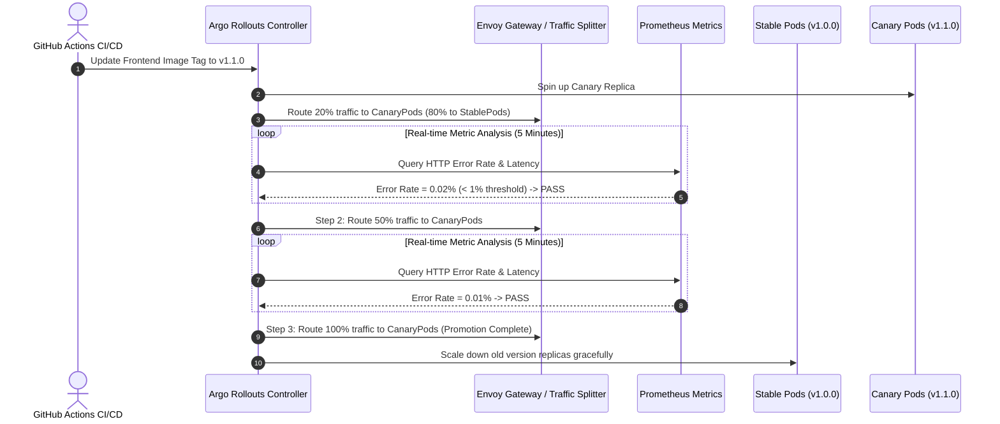

# Progressive Delivery with Argo Rollouts

## Purpose
This document specifies the progressive delivery architecture, Canary release strategies, automated metric analysis, and instant rollback triggers implemented using Argo Rollouts for the Kingdom of Christ Ministries platform.

## Scope
Covers Rollout CRDs in `platform/rollouts/`, Envoy Gateway traffic routing, and Prometheus-backed AnalysisTemplates.

## Status
> Status: Implemented

---

## 1. Progressive Delivery & Canary Architecture



---

## 2. Canary Rollout Specification

```yaml
apiVersion: argoproj.io/v1alpha1
kind: Rollout
metadata:
  name: kcm-frontend-rollout
  namespace: kcm-system
spec:
  replicas: 4
  strategy:
    canary:
      canaryService: kcm-frontend-canary
      stableService: kcm-frontend-stable
      trafficRouting:
        gatewayAPI:
          httpRouteName: kcm-frontend-route
      steps:
        - setWeight: 20
        - pause: { duration: 5m }
        - setWeight: 50
        - pause: { duration: 5m }
        - setWeight: 80
        - pause: { duration: 2m }
      analysis:
        templates:
          - templateName: success-rate-analysis
        args:
          - name: service-name
            value: kcm-frontend-canary
```

---

## 3. Automated Metric Analysis (`AnalysisTemplate`)

During each canary step, Argo Rollouts evaluates Prometheus queries continuously:
- **HTTP Error Rate**: `sum(rate(http_requests_total{status=~"5.*", app="kcm-frontend-canary"}[2m])) / sum(rate(http_requests_total{app="kcm-frontend-canary"}[2m])) <= 0.01` (Must be <= 1%).
- **P99 Latency**: `histogram_quantile(0.99, sum(rate(http_request_duration_seconds_bucket{app="kcm-frontend-canary"}[2m])) by (le)) <= 0.5` (Must be <= 500ms).

### Automated Instant Rollback
If the error rate exceeds 1% or latency spikes above 500ms during any stage, the analysis marks a failure, Envoy Gateway instantly shifts 100% traffic back to `StablePods`, and the canary pods are terminated.

---

## 4. Rollout Management Commands

```bash
# Inspect live rollout status and traffic weights
kubectl argo rollouts get rollout kcm-frontend-rollout -n kcm-system --watch

# Manually promote a paused rollout step
kubectl argo rollouts promote kcm-frontend-rollout -n kcm-system

# Abort rollout and instantly restore stable version
kubectl argo rollouts abort kcm-frontend-rollout -n kcm-system

# Roll back to specific previous revision
kubectl argo rollouts undo kcm-frontend-rollout -n kcm-system --to-revision=1
```

---

## 5. Troubleshooting & Diagnostics

| Problem | Cause | Solution |
| :--- | :--- | :--- |
| Rollout stuck in `Paused` state | Canary reached intentional evaluation pause window | Wait for duration to elapse, or promote manually with `kubectl argo rollouts promote`. |
| Analysis fails immediately on low-traffic test environment | Division by zero or insufficient request volume | Configure `minRequests` threshold or adjust analysis interval in AnalysisTemplate. |

---

## Security Considerations
- Traffic shifting is enforced cryptographically at the Envoy Gateway level.
- Failed deployments are quarantined without exposing end users to broken releases.

## Related Documentation
- [ArgoCD.md](ArgoCD.md) — GitOps continuous delivery.
- [Envoy-Gateway.md](Envoy-Gateway.md) — Traffic routing gateway.
- [Monitoring.md](Monitoring.md) — Prometheus metrics.
