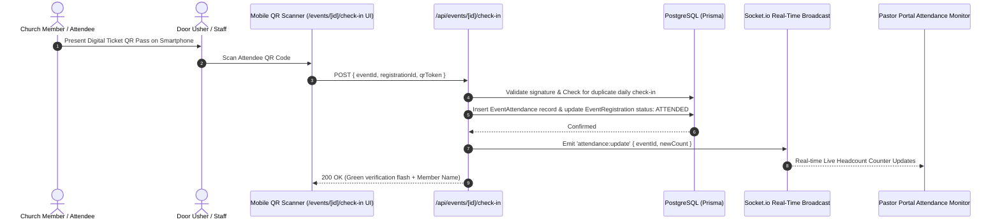

# Attendance Tracking & Analytics Specification

## Purpose
This document provides the technical specification for attendance recording, digital check-in scanning, service headcounts, and congregation engagement analytics across the Kingdom of Christ Ministries platform.

## Scope
Covers QR check-in scanning endpoints (`/api/events/[id]/check-in`), attendance reporting routes, database models (`event_attendance`), and pastoral analytics dashboards (`/pastor/reports/attendance`).

## Status
> Status: Implemented

---

## 1. Attendance Architecture & Check-In Pipeline



---

## 2. Check-In Modalities

1. **Digital QR Pass Scanning**: Primary high-speed modality for ticketed conferences and youth retreats.
2. **Manual Usher Lookup**: Ushers search member directory by phone number or name for members without smartphones.
3. **General Service Headcount**: Pastoral staff record overall sanctuary headcounts (Men, Women, Children) for regular Sunday services.

---

## 3. Database Schema (`event_attendance` table)

```prisma
model EventAttendance {
  id          String   @id @default(cuid())
  eventId     String   @map("event_id")
  userId      String?  @map("user_id")
  checkInTime DateTime @default(now()) @map("check_in_time")
  method      String   @default("QR_SCAN") // QR_SCAN, MANUAL, SELF
  verifiedBy  String?  @map("verified_by") // Usher / Staff User ID
  event       Event    @relation(fields: [eventId], references: [id], onDelete: Cascade)
  user        User?    @relation(fields: [userId], references: [id], onDelete: SetNull)

  @@index([eventId, checkInTime])
  @@map("event_attendance")
}
```

---

## 4. Attendance Analytics & Trend Intelligence

Available in `/pastor/reports/attendance`:
- **Branch Comparisons**: Tracks weekly attendance curves across Shapur Nagar, Subhash Nagar, and Bahadurpally sanctuaries.
- **Engagement Retention**: Flags members who have missed 3 or more consecutive weeks for pastoral follow-up and pastoral care calls.

---

## 5. Troubleshooting & Diagnostics

| Problem | Cause | Solution |
| :--- | :--- | :--- |
| Duplicate check-in recorded for same member | Usher scanned QR code twice in rapid succession | Check-in route enforces a 5-minute debounce lock per user/event pair. |
| Real-time headcount counter not updating on Pastor dashboard | WebSocket connection disconnected | SWR fallback polls `/api/events/[id]/status` every 15 seconds if WebSocket drops. |

---

## Security Considerations
- Check-in QR tokens expire after event conclusion to prevent reuse.
- Attendance records are strictly confidential and inaccessible to unauthorized third parties.

## Related Documentation
- [Event-Manager.md](Event-Manager.md) — Event registration and ticketing.
- [Pastor-Portal.md](Pastor-Portal.md) — Attendance dashboards.
- [Database-Architecture.md](Database-Architecture.md) — Relational schema.
