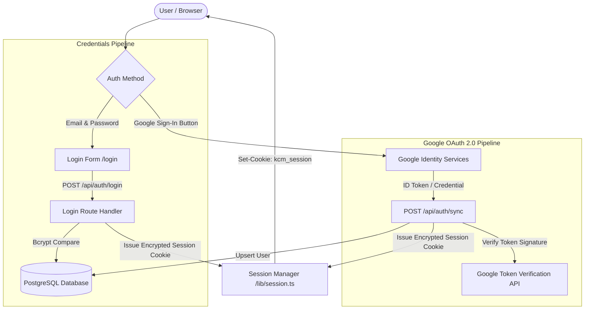

# Authentication Architecture & Identity Management

## Purpose
This document provides the authoritative technical specification for user authentication, identity verification, session management, and credential lifecycles across the Kingdom of Christ Ministries platform.

## Scope
Covers credentials login/registration, Google Identity Services (GIS) OAuth 2.0 integration, Firebase token verification, session cookie issuance, and password recovery workflows.

## Status
> Status: Implemented

---

## 1. Authentication Architecture Overview

The platform implements a multi-provider authentication subsystem supporting standard email/password credentials and frictionless Google OAuth 2.0 Sign-In.



---

## 2. Authentication Methods & Endpoints

### 2.1 Standard Credentials Registration (`/api/auth/register`)
- **Request Payload**: `{ name, email, password, phone, address, role: "MEMBER" }`
- **Validation**: Strict client and server-side Zod validation (minimum 8 characters, letters + numbers).
- **Password Hashing**: Bcrypt with 12 salt rounds (`bcryptjs`).
- **Database Action**: Inserts a new row in PostgreSQL `members` table with `role: MEMBER`.

### 2.2 Standard Credentials Login (`/api/auth/login`)
- **Request Payload**: `{ email, password }`
- **Validation**: Queries user by lowercase email; runs `bcrypt.compare(password, user.password)`.
- **Response**: Sets encrypted `kcm_session` HttpOnly cookie and returns user profile payload.

### 2.3 Google Sign-In (`/api/auth/sync`)
- **Client Integration**: Rendered via Google Identity Services (`NEXT_PUBLIC_GOOGLE_CLIENT_ID`).
- **Server Verification**: Verified using `google-auth-library`:
```typescript
import { OAuth2Client } from "google-auth-library";

const client = new OAuth2Client(process.env.GOOGLE_CLIENT_ID);

export async function verifyGoogleToken(token: string) {
  const ticket = await client.verifyIdToken({
    idToken: token,
    audience: process.env.GOOGLE_CLIENT_ID,
  });
  return ticket.getPayload(); // { email, name, picture, sub }
}
```
- **Upsert Logic**: If the email exists, the account is synced; if not, a new `MEMBER` record is created automatically.

### 2.4 Password Recovery (`/api/auth/forgot-password`)
- Generates a cryptographically secure, time-limited password reset token.
- Dispatches a password reset link to the user's registered email via Resend / Nodemailer.

---

## 3. Session Handling & Cookie Security

| Property | Configuration | Rationale |
| :--- | :--- | :--- |
| **Cookie Name** | `kcm_session` | Standard session cookie identifier |
| **HttpOnly** | `true` | Prevents JavaScript / XSS access to session token |
| **Secure** | `true` (in production) | Transmitted strictly over HTTPS |
| **SameSite** | `Lax` | Protects against Cross-Site Request Forgery (CSRF) while allowing top-level navigation |
| **Max-Age** | `604800` (7 Days) | Balance between user convenience and credential security |

---

## 4. Protected Routes & Middleware Verification

Edge middleware (`frontend/middleware.ts`) decrypts and validates the session cookie on every request:
1. Reads `kcm_session` from request headers.
2. If token is invalid or expired, deletes cookie and redirects to `/login?redirect=<target_path>`.
3. If valid, attaches user role headers to the request for downstream server component consumption.

---

## 5. Troubleshooting & Diagnostics

| Symptom | Cause | Solution |
| :--- | :--- | :--- |
| `Google Sign-In: popup_closed_by_user` | User closed OAuth popup before completing authorization | Provide intuitive retry prompt on the UI. |
| `Invalid Google ID Token (audience mismatch)` | `GOOGLE_CLIENT_ID` mismatch between frontend and backend | Ensure `NEXT_PUBLIC_GOOGLE_CLIENT_ID` and `GOOGLE_CLIENT_ID` are identical. |
| `401 Unauthorized on API calls` | Expired `kcm_session` cookie or missing Authorization header | Trigger re-authentication or refresh session. |

---

## Security Considerations
- Plaintext passwords are never stored or logged in any format.
- Rate limiting prevents brute-force password guessing attacks (5 failed attempts locks IP for 15 minutes).

## Related Documentation
- [Authorization-RBAC.md](Authorization-RBAC.md) — Role-based access control matrix.
- [Security.md](Security.md) — Application and transport security standards.
- [Firebase.md](Firebase.md) — Firebase identity verification details.
