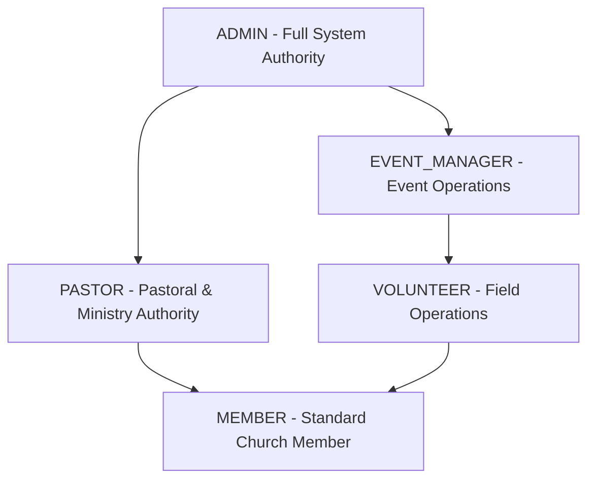

# Role-Based Access Control (RBAC) & Authorization

## Purpose
This document provides the definitive technical specification for authorization boundaries, permission matrices, role hierarchies, and enforcement mechanisms across the Kingdom of Christ Ministries platform.

## Scope
Covers frontend route protection, API endpoint authorization middleware (`frontend/lib/authMiddleware.ts`), and database row-level access control.

## Status
> Status: Implemented

---

## 1. Role Hierarchy



---

## 2. Comprehensive RBAC Permissions Matrix

| Resource / Capability | MEMBER | VOLUNTEER | EVENT_MANAGER | PASTOR | ADMIN |
| :--- | :---: | :---: | :---: | :---: | :---: |
| **Browse Sermons & Public Events** | ✅ | ✅ | ✅ | ✅ | ✅ |
| **Submit Prayer Requests** | ✅ | ✅ | ✅ | ✅ | ✅ |
| **Make Donations & View Personal Receipts**| ✅ | ✅ | ✅ | ✅ | ✅ |
| **Edit Personal Profile & Photo** | ✅ | ✅ | ✅ | ✅ | ✅ |
| **Submit Volunteer Field Reports** | ❌ | ✅ | ✅ | ✅ | ✅ |
| **Check-in Attendees via QR Code** | ❌ | ✅ | ✅ | ✅ | ✅ |
| **Create / Edit Events & Set Seat Limits** | ❌ | ❌ | ✅ | ✅ | ✅ |
| **Upload Event Media & Banners** | ❌ | ❌ | ✅ | ✅ | ✅ |
| **Publish & Manage Sermons** | ❌ | ❌ | ❌ | ✅ | ✅ |
| **Review & Pray for All Prayer Requests** | ❌ | ❌ | ❌ | ✅ | ✅ |
| **Access OpenClaw AI Ministry Assistant** | ❌ | ❌ | ❌ | ✅ | ✅ |
| **Manage Ministry & Small Groups** | ❌ | ❌ | ❌ | ✅ | ✅ |
| **View Attendance & Giving Growth Reports**| ❌ | ❌ | ❌ | ✅ | ✅ |
| **Manage Users & Reassign User Roles** | ❌ | ❌ | ❌ | ❌ | ✅ |
| **View Infrastructure Health & System Logs**| ❌ | ❌ | ❌ | ❌ | ✅ |
| **Export Financial Reconciliations** | ❌ | ❌ | ❌ | ❌ | ✅ |
| **Send Church-wide Push & SMS Broadcasts** | ❌ | ❌ | ❌ | ✅ | ✅ |

---

## 3. Enforcement Mechanisms

### 3.1 Next.js Edge Middleware (`frontend/middleware.ts`)
Enforces URL path prefix restrictions before page rendering:
- `/member/*` requires `role in ['MEMBER', 'VOLUNTEER', 'EVENT_MANAGER', 'PASTOR', 'ADMIN']`
- `/pastor/*` requires `role in ['PASTOR', 'ADMIN']`
- `/admin/*` requires `role in ['ADMIN']`
- `/field-volunteer/*` requires `role in ['VOLUNTEER', 'EVENT_MANAGER', 'ADMIN']`

### 3.2 API Route Authorization Guard (`frontend/lib/authMiddleware.ts`)
Validates user permissions within API route handlers:
```typescript
export async function requireAuth(req: NextRequest, allowedRoles?: UserRole[]) {
  const session = await getSession(req);
  if (!session || !session.user) {
    return NextResponse.json({ error: "Unauthorized" }, { status: 401 });
  }
  if (allowedRoles && !allowedRoles.includes(session.user.role)) {
    return NextResponse.json({ error: "Forbidden: Insufficient privileges" }, { status: 403 });
  }
  return session.user;
}
```

---

## 4. Row-Level Ownership Protection

To protect data privacy:
- A `MEMBER` requesting `/api/donations/history` receives only records where `userId == session.user.id`.
- A `MEMBER` viewing prayer requests receives public prayers or their own confidential prayers.
- Only users with `PASTOR` or `ADMIN` roles can query unredacted confidential prayer lists across the entire church body.

---

## 5. Troubleshooting & Diagnostics

| Symptom | Cause | Resolution |
| :--- | :--- | :--- |
| `403 Forbidden` on `/pastor` route | User has `MEMBER` role attempting to access pastoral console | Promote user role via Admin Portal (`/admin/users`) or assign proper test account. |
| Role change not reflecting immediately | Cached session cookie still contains old role claim | Re-authenticate to issue a fresh `kcm_session` cookie. |

---

## Security Considerations
- Client-side role claims are never trusted; every mutation re-verifies role against PostgreSQL in the server session.
- Privilege escalation attempts are logged with severity `WARN` to MongoDB audit trail.

## Related Documentation
- [Authentication.md](Authentication.md) — Login and session mechanisms.
- [Security.md](Security.md) — Threat model and security controls.
- [Admin-Portal.md](Admin-Portal.md) — Administrative user management.
