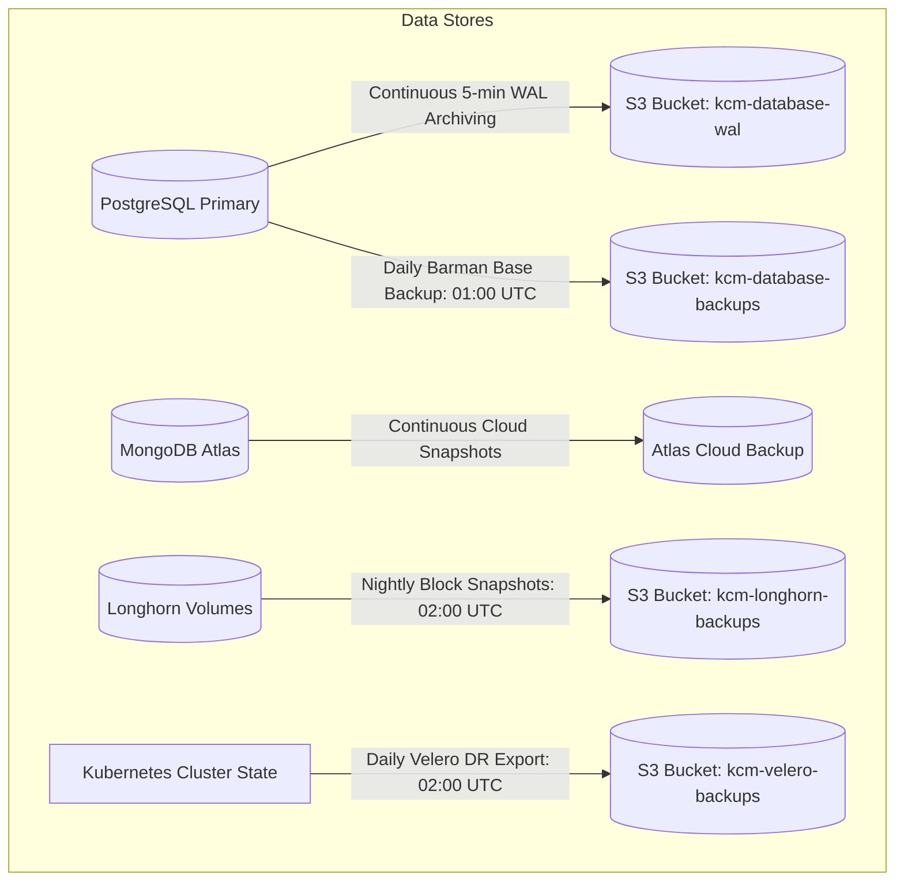

# Backup & Restore Operational Procedures

## Purpose
This document provides the standard operating procedures (SOP), validation steps, and technical commands for executing and verifying backups and restorations across PostgreSQL (CloudNativePG), MongoDB Atlas, Kubernetes cluster state (Velero), and block storage (Longhorn) for the Kingdom of Christ Ministries platform.

## Scope
Covers database backups, PersistentVolume snapshots, cluster metadata backups, and manual restore workflows.

## Status
> Status: Implemented & Tested

---

## 1. Backup Topology Overview



---

## 2. PostgreSQL Backup & Point-in-Time Recovery (PITR)

### 2.1 Trigger Manual On-Demand Base Backup
```bash
# Create an on-demand PostgreSQL backup via CloudNativePG CRD
kubectl cnpg backup kcm-db-cluster -n kcm-system --backup-name manual-pre-migration-backup
```

### 2.2 Point-in-Time Recovery (PITR) Execution
To restore the database to an exact prior second (e.g. before an accidental data deletion at 14:32:00 UTC):
1. Apply `platform/database/backups/pitr-restore.yaml` specifying `recoveryTargetTime: "2026-08-28T14:30:00Z"`.
2. CloudNativePG spins up a new cluster from the nearest base backup and replays WAL logs up to the exact target second.
3. Switch application `DATABASE_URL` service binding to point to the restored cluster.

---

## 3. Kubernetes Cluster State Restore via Velero

```bash
# 1. List available backups
velero backup get

# 2. Execute full restore of kcm-system namespace
velero restore create --from-backup daily-cluster-dr-20260828020000 \
  --include-namespaces kcm-system \
  --restore-volumes=true

# 3. Verify restore status
velero restore get
```

---

## 4. Longhorn Persistent Volume Restoration

To restore an individual corrupted volume (e.g. Redis cache or Prometheus metrics) from Longhorn backup target:
1. Navigate to Longhorn UI -> **Backup** tab.
2. Select target volume backup snapshot and click **Restore Latest Backup**.
3. Re-bind the restored volume to the respective PersistentVolumeClaim (PVC).

---

## 5. Routine Backup Verification Drills

Every 30 days, the engineering team executes an automated disaster recovery dry run:
1. Automated script provisions a temporary ephemeral namespace (`kcm-dr-test`).
2. Restores PostgreSQL database from latest S3 WAL archive.
3. Asserts database integrity (`npm run db:check`) and verifies row counts match production within 5-minute delta.
4. Tears down test namespace upon successful verification.

---

## 6. Troubleshooting & Diagnostics

| Problem | Cause | Solution |
| :--- | :--- | :--- |
| PostgreSQL restore fails with `WAL segment missing` | S3 network connectivity issue during WAL archiving | Check Barman cloud logs in CNPG operator pod to identify un-shipped WAL segments. |
| Velero restore reports `PartiallyFailed` | Target namespace had existing conflicting resources | Delete corrupted namespace or specify `--existing-resource-policy=update` during restore. |

---

## Security Considerations
- All offsite backup S3 buckets enforce AES-256 server-side encryption and Object Lock immutability.
- IAM access credentials for backup buckets use strictly isolated service accounts.

## Related Documentation
- [Disaster-Recovery.md](Disaster-Recovery.md) — Disaster recovery strategy and SLAs.
- [CloudNativePG.md](CloudNativePG.md) — Database operator configuration.
- [Velero.md](Velero.md) — Velero operator manifests.
