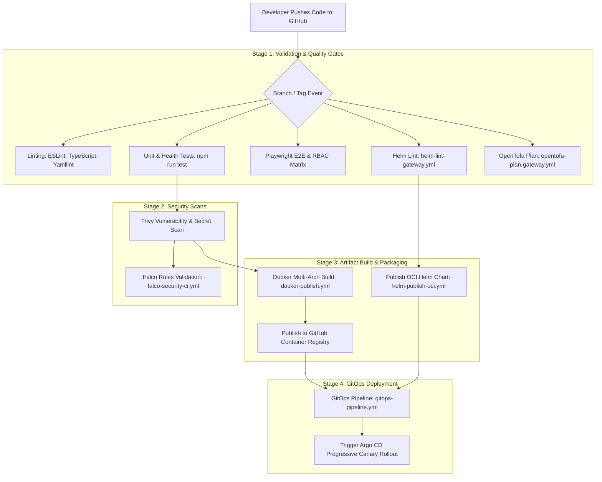

# CI/CD Pipeline Architecture & GitHub Actions

## Purpose
This document provides the technical specification for Continuous Integration and Continuous Deployment (CI/CD) pipelines executed via GitHub Actions across the Kingdom of Christ Ministries monorepo.

## Scope
Covers all workflow files in `.github/workflows/`, automated linting, test suites, container image builds, security scanning, Helm chart publishing, and GitOps triggers.

## Status
> Status: Implemented

---

## 1. CI/CD Pipeline Overview



---

## 2. GitHub Actions Workflows Catalog (`.github/workflows/`)

| Workflow File | Trigger Event | Primary Responsibilities |
| :--- | :--- | :--- |
| `ci.yml` | Pull Request / Push to `main` | Runs Next.js build, ESLint, TypeScript typecheck, Playwright tests |
| `docker-publish.yml` | Push to `main` / SemVer Tag | Builds multi-arch container image and pushes to `ghcr.io` with Git SHA |
| `helm-ci.yml` | Changes in `platform/helm/**` | Lints and validates all subcharts and umbrella charts |
| `helm-publish-oci.yml` | Release Tag | Packages Helm charts and publishes OCI artifacts to GHCR |
| `gitops-pipeline.yml` | Successful Container Build | Updates target image tags in GitOps Kustomize/Helm manifests |
| `cnpg-ci-cd.yml` | Changes in `platform/database/**` | Validates CloudNativePG manifests, backup configs, and OpenTofu plans |
| `gateway-validate.yml` | Changes in `platform/gateway/**` | Validates Envoy Gateway GatewayAPI HTTPRoute schemas |
| `gateway-deploy.yml` | Push to `main` | Deploys Envoy Gateway configurations to production cluster |
| `falco-security-ci.yml` | Changes in `platform/security/falco/**`| Validates Falco rule syntax and runs security regression tests |
| `observability-ci.yml` | Changes in `monitoring/**` | Validates Prometheus rules and Grafana JSON dashboard schemas |
| `rollout-validate.yml` | Changes in `platform/rollouts/**` | Verifies Argo Rollout AnalysisTemplates and metrics queries |
| `rollout-deploy.yml` | GitOps Tag Push | Initiates progressive Canary deployment with Argo Rollouts |

---

## 3. Automated Quality & Security Gates

A pull request cannot be merged into `main` unless the following mandatory status checks pass:
1. **`lint-and-typecheck`**: Clean ESLint run and zero TypeScript compiler errors.
2. **`playwright-tests`**: 100% pass rate across RBAC security, health check, and route tests.
3. **`trivy-scan`**: Zero unpatched **CRITICAL** or **HIGH** severity CVEs.
4. **`helm-lint`**: All Helm templates render cleanly without YAML syntax errors.

---

## 4. Pipeline Execution Commands (Local Emulation)

```bash
# 1. Run local lint and typecheck
npm run lint
npm run typecheck

# 2. Run local test suite
npm run test:health
npm run test:rbac

# 3. Validate Helm charts
helm lint platform/helm/charts/*
```

---

## 5. Troubleshooting & Diagnostics

| Problem | Cause | Solution |
| :--- | :--- | :--- |
| `docker-publish.yml` fails on GHCR login | Expired `GITHUB_TOKEN` or missing `packages: write` permission | Ensure workflow YAML defines `permissions: { packages: write, contents: read }`. |
| Playwright E2E tests fail in CI with timeout | Headless browser container running out of shared memory | Configure `--disable-dev-shm-usage` in `playwright.config.ts`. |

---

## Security Considerations
- All workflow runs use the principle of least privilege with strictly scoped GitHub Actions token permissions.
- Docker container images and Helm charts are signed with Sigstore / Cosign before publishing.

## Related Documentation
- [GitOps.md](GitOps.md) — GitOps continuous delivery.
- [Testing.md](Testing.md) — Test strategy and coverage matrix.
- [Trivy.md](Trivy.md) — CI security scanning.
