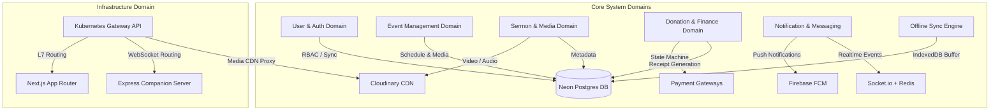
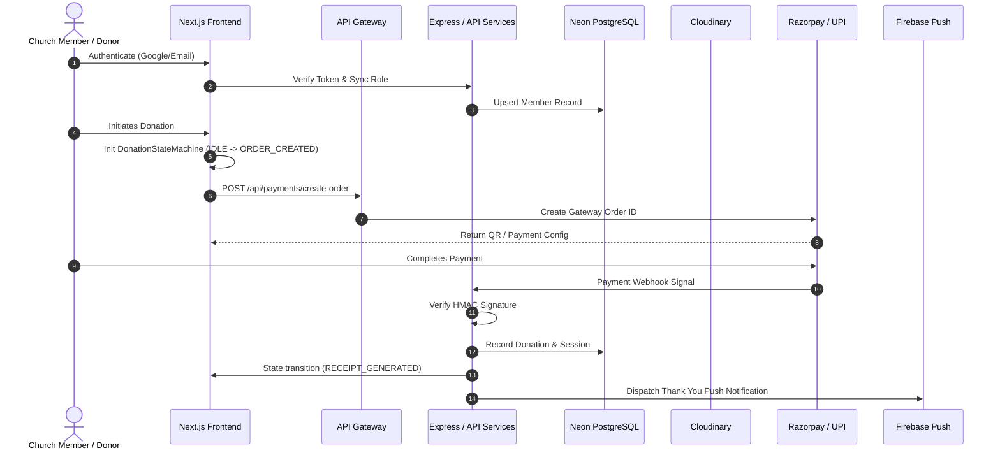
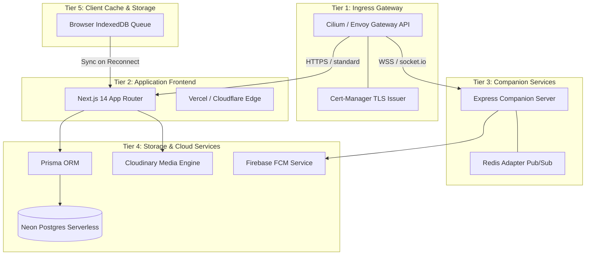
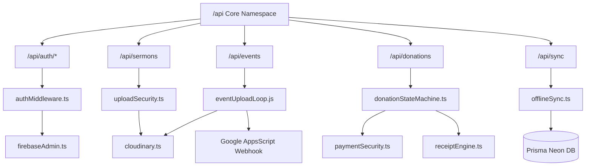
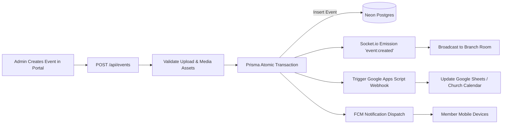
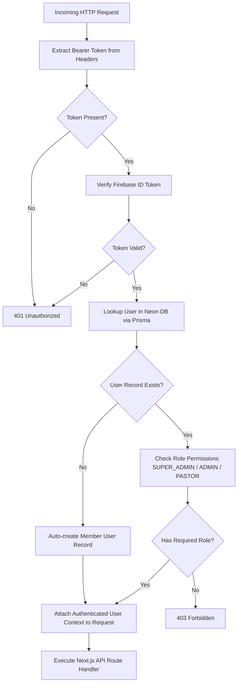
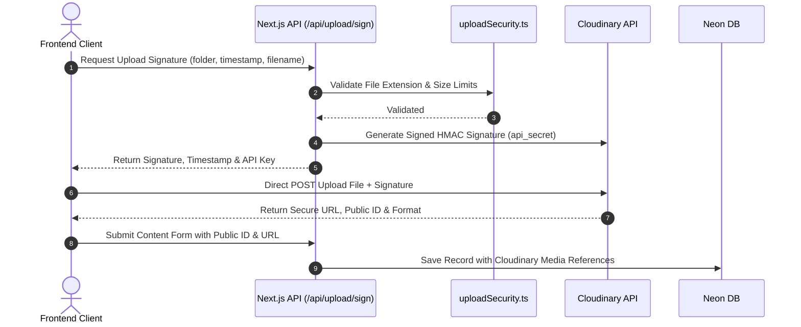
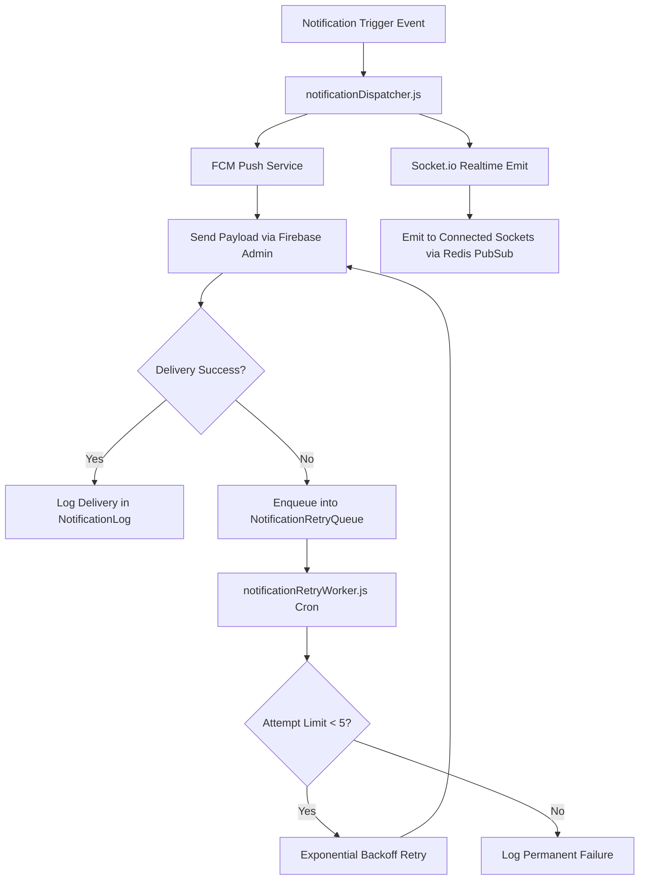

# KCM Ministries Church Platform — Code Intelligence System

Inspired by [Egonex-AI / Understand-Anything](https://github.com/Egonex-AI/Understand-Anything), this document serves as the complete Code Intelligence System for the **KCM Ministries Church Platform**. It maps high-level business domains, full-stack architectural flows, module dependencies, API structures, data relationships, and operational strategies to understand, debug, optimize, and scale the entire church platform.

---

## Stack Summary
- **Frontend / Web Core**: Next.js 14 (App Router), TypeScript, TailwindCSS
- **Backend / Realtime Services**: Node.js, Express, Socket.io, Redis Adapter
- **Database & Data Modeling**: Prisma ORM, Neon PostgreSQL (Serverless)
- **Media Engine**: Cloudinary (Direct Signed Uploads, Eager Transformations, WebP/AVIF delivery)
- **Messaging & Notifications**: Firebase FCM, Socket.io Realtime Broadcasts, Google Apps Script Webhooks
- **Gateway & Infrastructure**: Kubernetes Gateway API (Cilium/Envoy), Cert-Manager TLS, OpenTofu / Terraform

---

## Part 1: Deep Analysis of 10 Core System Subsystem Flows

### 1. Auth Flow
- **Architecture**: Dual-layer authentication & authorization using Firebase Admin SDK and Prisma ORM.
- **Entry Points**: `frontend/lib/authMiddleware.ts`, `frontend/lib/firebaseAdmin.ts`, `frontend/app/api/auth/*`.
- **Workflow**:
  1. Frontend sends standard Authorization header `Bearer <firebase_token>`.
  2. `authMiddleware.ts` extracts the Bearer token and verifies it via `verifyFirebaseToken()` (`firebaseAdmin.ts`).
  3. Upon token validation, `resolveAndSyncUser()` performs a single-query lookup in Neon PostgreSQL (`User` model).
  4. If the user does not exist in PostgreSQL, a new `MEMBER` record is created asynchronously (`password: 'firebase-authenticated-sync'`).
  5. User role permissions (`SUPER_ADMIN`, `ADMIN`, `PASTOR`, `MEMBER`, `EVENT_MANAGER`, `FIELD_VOLUNTEER`, `NGO_ADMIN`) are attached to the request context.
- **Security Protocols**: Role-based access control (RBAC), automatic UID-email alignment, and secure server-side session decoding.

### 2. Event Upload Flow
- **Architecture**: Multi-stage event creation with media attachment, database persistence, realtime web-socket emission, and external integration.
- **Entry Points**: `frontend/app/api/events/route.ts`, `backend/server.js` (`/api/events`), `backend/src/loops/eventUploadLoop.js`.
- **Workflow**:
  1. Event manager submits details and media references (cover image, banner, gallery).
  2. `eventUploadLoop.js` validates payload schema and checks venue/time conflicts.
  3. Atomic Prisma transaction creates the `Event` record along with linked `EventMedia`, `EventImage`, and `EventVideo` records.
  4. Socket.io emits `event:created` to connected clients (scoped by branch ID room if applicable).
  5. Google Apps Script Webhook (`/api/google-event-trigger`) is invoked to sync events with Google Sheets / Church Calendar.

### 3. Sermon Upload Flow
- **Architecture**: Direct client-to-Cloudinary media ingestion with metadata registration and notifications.
- **Entry Points**: `frontend/lib/cloudinary.ts`, `frontend/app/api/upload/sign/route.ts`, `frontend/app/api/sermons/route.ts`.
- **Workflow**:
  1. Frontend requests upload signature from `/api/upload/sign` with folder target `church-platform/sermons`.
  2. Client uploads raw audio/video directly to Cloudinary using HMAC signature.
  3. Cloudinary executes eager transformations: audio MP3 extraction, video HLS adaptive streaming generation (`f_auto, q_auto`).
  4. Client posts Cloudinary `public_id`, `secure_url`, duration, series, and speaker to `/api/sermons`.
  5. API saves `Sermon` record in Neon Postgres and triggers FCM push notifications to members subscribed to sermon alerts.

### 4. Donation Flow
- **Architecture**: 16-state deterministic finite state machine (`donationStateMachine.ts`) handling UPI/Razorpay payments, receipt generation, and notification queues.
- **Entry Points**: `frontend/lib/donationStateMachine.ts`, `frontend/lib/paymentService.ts`, `frontend/lib/paymentSecurity.ts`, `frontend/lib/receiptEngine.ts`.
- **Workflow**:
  1. State transition: `IDLE` → `AMOUNT_SELECTED` → `DONOR_FILLED` → `ORDER_CREATING`.
  2. Order initialized via Razorpay / Dynamic UPI QR generator (`ORDER_CREATED` → `QR_DISPLAYED`).
  3. Webhook / polling detects completion (`PAYMENT_PROCESSING` → `PAYMENT_VERIFIED`).
  4. `receiptEngine.ts` renders PDF tax receipt, assigns serial receipt number, and persists `Receipt` record (`RECEIPT_GENERATED`).
  5. `donationNotificationService.ts` dispatches multi-channel thank-you messages (`COMPLETED`).

### 5. Notification Flow
- **Architecture**: Hybrid multi-channel notification engine (Firebase FCM push + Socket.io realtime + retry queue worker).
- **Entry Points**: `backend/src/services/fcmService.js`, `backend/src/services/notificationDispatcher.js`, `backend/src/cron/notificationRetryWorker.js`.
- **Workflow**:
  1. Devices register push tokens via `POST /api/device-tokens`, stored in the `DeviceToken` table in Neon Postgres.
  2. Trigger event (e.g. new sermon, event alert, donation receipt) invokes `dispatchEventNotification()`.
  3. Push payload sent via Firebase Admin SDK.
  4. Realtime socket event emitted to active user rooms via `@socket.io/redis-adapter`.
  5. Failed FCM dispatches are enqueued into `NotificationRetryQueue` and retried with exponential backoff up to 5 attempts.

### 6. Cloudinary Integration Flow
- **Architecture**: Direct signed upload architecture avoiding server memory overhead for large media.
- **Entry Points**: `frontend/lib/cloudinary.ts`, `frontend/lib/uploadSecurity.ts`.
- **Workflow**:
  1. Server defines standard folder targets (`church-platform/events`, `/sermons`, `/ngo`, `/profiles`, `/branches/*`).
  2. `uploadSecurity.ts` validates file extension, mime-type, and max size constraints (10MB image, 500MB video).
  3. API returns signed parameters (`timestamp`, `folder`, `signature`, `api_key`).
  4. Upload executes directly from client browser to Cloudinary edge nodes.
  5. Public IDs stored in PostgreSQL enable dynamic image transformations on demand (e.g. `c_fill,w_800,h_600,f_auto,q_auto`).

### 7. Socket.io Realtime Flow
- **Architecture**: Distributed Socket.io cluster backed by Redis Pub/Sub adapter for horizontal pod scaling in Kubernetes.
- **Entry Points**: `backend/server.js`, `frontend/lib/socketTrigger.ts`.
- **Workflow**:
  1. Express server initializes Socket.io with `@socket.io/redis-adapter` using `REDIS_URL`.
  2. Clients establish WebSocket connections and join rooms (`socket.emit('join', 'branch:shapur-nagar')`).
  3. Express backend or Next.js API routes publish events through `socketTrigger.ts` or Redis emitter.
  4. Redis adapter distributes message across all active backend pods.
  5. Sockets push realtime updates to connected browsers (e.g., live donation counters, chat, agent progress).

### 8. API Gateway Architecture
- **Architecture**: Layer 7 Kubernetes Gateway API managed via OpenTofu/Terraform and YAML manifests.
- **Entry Points**: `platform/gateway/gateways/kcm-gateway.yaml`, `platform/gateway/httproutes/*`, `platform/gateway/tls/*`.
- **Workflow**:
  1. Ingress traffic enters via `kcm-gateway` (Cilium/Envoy GatewayClass).
  2. TLS terminated at gateway using Cert-Manager Let's Encrypt `ClusterIssuer` (`cluster-issuer-prod.yaml`).
  3. `httproutes` inspect path prefixes and headers:
     - `frontend-route.yaml` → `/*` routed to Next.js Pods
     - `backend-api-route.yaml` → `/api/events`, `/api/notifications` routed to Node Express Pods
     - `websocket-route.yaml` → `/socket.io/*` routed to Socket Companion Pods (with session affinity)
     - `media-route.yaml` → `/media/*` routed to CDN / Storage rules
     - `webhook-route.yaml` → `/api/webhooks/*` routed with rate-limiting policies

### 9. Database Relationship Graph
- **Architecture**: Relational schema in Neon PostgreSQL defined in `database/schema.prisma`.
- **Core Entities**:
  - `User`: Central actor linked to `donations`, `eventRegistrations`, `eventsCreated`, `deviceTokens`, `sermonLikes`, `sermonComments`, `auditLogs`.
  - `Event`: Linked to `Branch`, `User` (creator), `EventRegistration`, `EventMedia`, `EventImage`, `EventVideo`, `EventAttendance`.
  - `Sermon`: Linked to `SermonSeries`, `Speaker`, `SermonLike`, `SermonComment`, `SermonBookmark`, `SermonView`.
  - `Donation` & `DonationSession`: Linked to `User`, `Branch`, `Receipt`.
  - `DeviceToken` & `NotificationLog`: Track user push tokens and delivery attempt audit logs.
  - `AgentReachTask` & `ChurchNewsArticle`: Store AI agent intelligence results and web scraping sources.

### 10. Offline Sync Architecture
- **Architecture**: Client-side IndexedDB persistence with automatic sync reconciliation when online connectivity is restored.
- **Entry Points**: `frontend/lib/offlineSync.ts`, `frontend/app/api/sync/route.ts`.
- **Workflow**:
  1. When offline, field workers fill event reports / volunteer activity.
  2. `queueReport()` stores payload (with base64 media) in IndexedDB (`kcm_offline_reports_db`, store `reports_queue`).
  3. `offlineSync.ts` registers a `window.addEventListener('online')` listener.
  4. Upon network restoration, `flushOfflineQueue()` reads all stored items and posts to `/api/sync`.
  5. Server validates payloads, executes atomic Prisma transaction, and returns sync IDs.
  6. Successfully synced items are removed from IndexedDB, and UI receives success confirmation toast.

---

## Part 2: Complete Code Intelligence Graphs & Visualizations

### Graph 1: Knowledge Graph (Domain & Subsystem Mapping)


### Graph 2: Dependency Graph (Module Architecture & Packages)
```mermaid
graph LR
    subgraph Frontend Layer
        App[Next.js App Router] --> AuthMW[lib/authMiddleware.ts]
        App --> CloudHelper[lib/cloudinary.ts]
        App --> DonSM[lib/donationStateMachine.ts]
        App --> OffSync[lib/offlineSync.ts]
        App --> SockTrig[lib/socketTrigger.ts]
    end

    subgraph Core Utility Layer
        AuthMW --> FBAdmin[lib/firebaseAdmin.ts]
        AuthMW --> PrismaClient[lib/prisma.ts]
        DonSM --> PaymentSec[lib/paymentSecurity.ts]
        DonSM --> ReceiptEng[lib/receiptEngine.ts]
        DonSM --> DonNotify[lib/donationNotificationService.ts]
    end

    subgraph Backend & Infrastructure Layer
        BE[backend/server.js] --> RedisAdapter[@socket.io/redis-adapter]
        BE --> EventLoop[src/loops/eventUploadLoop.js]
        BE --> AgentEngine[src/services/agentReachEngine.js]
        BE --> FCMService[src/services/fcmService.js]
        PrismaClient --> NeonDB[(Neon Postgres)]
    end
```

### Graph 3: Business Flow Map (End-to-End Lifecycles)


### Graph 4: Architecture Visualization (5-Tier Infrastructure)


### Graph 5: API Dependency Tree (Endpoints & Handlers)


### Graph 6: Event Flow Graph (Creation, Broadcast, and Webhook)


### Graph 7: Auth Flow Graph (RBAC Authorization Pipeline)


### Graph 8: Upload Pipeline Graph (Direct Signed Upload)


### Graph 9: Realtime Notification Graph (Socket & FCM Retry)


---

## Part 3: Operational Guide — Understand, Debug, Optimize, & Scale

### 1. How to Debug Common Issues
- **Authentication / 401/403 Errors**:
  1. Inspect `authMiddleware.ts` logs for token decoding failures.
  2. Verify `FIREBASE_SERVICE_ACCOUNT_KEY` environment variable format in server environment.
  3. Ensure user record is synced in Neon DB (`SELECT * FROM members WHERE email = '...'`).
- **Donation Payment Webhook Failures**:
  1. Verify HMAC signature validation in `paymentSecurity.ts`.
  2. Inspect state machine history (`DonationState`) to pinpoint where the transition stalled.
  3. Check `Receipt` table for failed PDF rendering.
- **WebSocket Disconnection / Realtime Multi-Pod Issues**:
  1. Check Redis adapter logs in `backend/server.js`.
  2. Verify sticky sessions (session affinity) configured in Gateway API `websocket-route.yaml`.

### 2. Performance Optimization Strategies
- **Database Query Optimization**:
  - Utilize Prisma connection pooling URL for Neon PostgreSQL (`@prisma/client` with pooled connection string).
  - Implement selective field querying (`select: { id: true, role: true }`) instead of fetching entire user rows.
- **Media Optimization**:
  - Always generate signed direct upload signatures to offload media streaming from Next.js server memory.
  - Deliver Cloudinary media using `f_auto,q_auto,w_auto` flags to automatically serve AVIF/WebP assets based on browser support.
- **Caching Layer**:
  - Implement memory LRU cache (`lib/lruCache.ts`) for static church content, news articles, and branch configurations.

### 3. Scaling Guidelines for Enterprise Growth
- **Stateless Backend Scaling**:
  - Scale Express companion backend pods horizontally (`PROCESS_TYPE=socket` vs `PROCESS_TYPE=api`).
  - Ensure Redis Pub/Sub adapter is active so socket broadcasts reach clients regardless of which pod they are connected to.
- **Database Read Scaling**:
  - Configure Neon PostgreSQL read replicas for heavy read operations (e.g., sermon search, event listing, public member portal).
- **Gateway API Rate Limiting**:
  - Enforce Gateway API policies (`platform/gateway/policies`) to rate-limit `/api/auth` and `/api/webhooks` to protect against DDoS attacks.

---
*Documentation maintained by KCM Ministries Software Architecture Team.*
