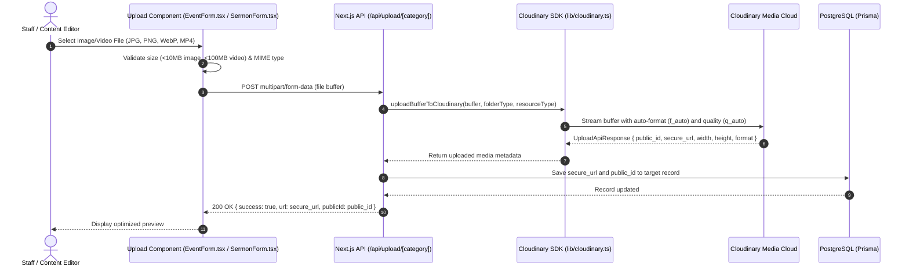

# Cloudinary Media Storage & Transformation Architecture

## Purpose
This document provides the technical specification for Cloudinary integration within the Kingdom of Christ Ministries platform, covering media upload pipelines, automated transformations, folder hierarchy, CDN delivery, and programmatic asset deletion.

## Scope
Covers the Cloudinary Node SDK implementation in `frontend/lib/cloudinary.ts`, API upload routes (`frontend/app/api/upload/*`), and background media verification loops.

## Status
> Status: Implemented

---

## 1. Cloudinary Integration Architecture



---

## 2. Folder Taxonomy & Organization

To maintain a clean asset structure, media is strictly partitioned into organized folder trees:

| Target Folder Type | Cloudinary Folder Path | Description |
| :--- | :--- | :--- |
| `events` | `church-platform/events` | Event banners, posters, and gallery images |
| `sermons` | `church-platform/sermons` | Sermon cover artwork, preacher portraits, and audio/video files |
| `ngo` | `church-platform/ngo` | Community outreach photos, medical camp records, project updates |
| `profiles` | `church-platform/profiles` | Member and pastoral avatar photos |
| `announcements` | `church-platform/announcements`| Church-wide bulletin headers and notification graphic cards |
| `volunteer` | `church-platform/volunteer` | Field volunteer service photos and certificates |
| `branch-shapur-nagar` | `church-platform/branches/shapur-nagar` | Shapur Nagar branch sanctuary & service media |
| `branch-subhash-nagar`| `church-platform/branches/subhash-nagar`| Subhash Nagar branch facility photos |
| `branch-bahadurpally` | `church-platform/branches/bahadurpally` | Bahadurpally branch photos and gatherings |

---

## 3. Automated Transformations & Responsive Delivery

### 3.1 Upload Transformations
On initial upload via `uploadBufferToCloudinary()`, assets receive automatic baseline optimization:
- **Images**: Quality set to `q_auto`, format set to `f_auto` (serves WebP or AVIF based on client browser support), maximum width bounded to `2000px` (`crop: "limit"`).
- **Videos**: Audio/video quality set to `q_auto`, streaming codec set to `f_auto`.

### 3.2 Dynamic Client-Side Delivery Helper (`getOptimizedCloudinaryUrl`)
Frontend components request exact transformation URLs dynamically:
```typescript
import { getOptimizedCloudinaryUrl } from "@/lib/cloudinary";

// Generates a 800x600 cropped thumbnail with auto quality
const thumbUrl = getOptimizedCloudinaryUrl(publicIdOrUrl, {
  width: 800,
  height: 600,
  crop: "fill",
  quality: "auto",
  format: "auto",
  blur: false
});
```

---

## 4. Programmatic Asset Deletion

When an event, sermon, or profile photo is deleted or replaced, the associated Cloudinary asset is destroyed using `deleteCloudinaryAsset(publicId, resourceType)` to avoid orphaned storage costs:
- **Public ID**: Stored in PostgreSQL (e.g. `coverImagePublicId`, `profilePublicId`).
- **Safety Fallback**: In non-production environments with mock keys (`CLOUDINARY_CLOUD_NAME="demo"`), deletion succeeds silently without throwing errors.

---

## 5. Development & Mock Mode

When developing locally without Cloudinary credentials:
- If `CLOUDINARY_CLOUD_NAME="demo"` or `CLOUDINARY_API_KEY="1234567890"`, the SDK automatically resolves uploads with high-quality deterministic mock images (Unsplash CDN), permitting full feature testing without network failures.

---

## 6. Troubleshooting & Diagnostics

| Problem | Cause | Resolution |
| :--- | :--- | :--- |
| `Upload Error: Must supply api_key` | Missing `CLOUDINARY_API_KEY` in `.env.local` | Add valid Cloudinary credentials or keep default demo strings for mock mode. |
| `413 Payload Too Large` | Client uploaded a file exceeding Next.js body limits | Configure Next.js Route Segment Config `export const dynamic = 'force-dynamic'` and stream via Busboy/multer. |
| Broken image on legacy Safari | Client browser does not support requested modern format | Ensure `f_auto` is used; Cloudinary CDN automatically delivers JPEG for incompatible clients. |

---

## Security Considerations
- `CLOUDINARY_API_SECRET` is kept server-side only and never exposed with `NEXT_PUBLIC_` prefix.
- Upload endpoints authenticate session tokens to prevent unauthorized anonymous file uploads.

## Related Documentation
- [Media-Management.md](Media-Management.md) — Comprehensive media lifecycle and background verification loops.
- [Environment-Variables.md](Environment-Variables.md) — Cloudinary environment variables.
