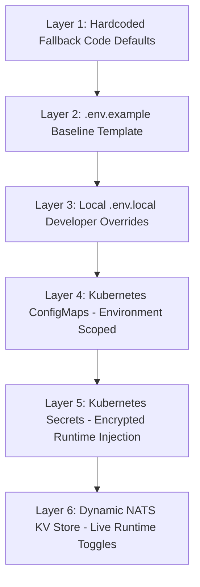

# Configuration Management Architecture

## Purpose
This document provides the technical specification for configuration layering, build-time vs runtime parameter injection, and dynamic feature flag distribution across the Kingdom of Christ Ministries platform.

## Scope
Covers local development configurations, Next.js build parameters, Express runtime settings, and Kubernetes ConfigMaps.

## Status
> Status: Implemented

---

## 1. Configuration Layering Model



1. **Build-Time Parameters**: Variables prefixed with `NEXT_PUBLIC_` are inlined into client JavaScript bundles during `npm run build`.
2. **Server Runtime Parameters**: Standard variables (e.g. `DATABASE_URL`, `RESEND_API_KEY`) are evaluated dynamically at request time on Node.js runtime instances.
3. **Dynamic Operational Toggles**: Dynamic flags (e.g. `enable_live_stream_banner: true`, `maintenance_mode: false`) are pushed to the NATS JetStream `app_runtime_config` key-value store, updating all running pods instantly without requiring container restarts.

---

## 2. Kubernetes ConfigMap Manifest (`k8s/configmap.yaml`)

```yaml
apiVersion: v1
kind: ConfigMap
metadata:
  name: kcm-frontend-config
  namespace: kcm-system
data:
  NODE_ENV: "production"
  PORT: "3000"
  NEXTAUTH_URL: "https://kcmchurch.org"
  SMS_PROVIDER: "httpsms"
  EMAIL_PROVIDER: "resend"
  RATE_LIMIT_MAX: "100"
  RATE_LIMIT_WINDOW_MS: "900000"
```

---

## 3. Dynamic Feature Flag Schema

Distributed via NATS KV / Redis cache:
- `feature.ai_assistant_enabled`: `true` | `false`
- `feature.stripe_payments_enabled`: `true` | `false`
- `feature.offline_pwa_banner`: `true` | `false`
- `feature.new_year_camp_registration`: `true` | `false`

---

## 4. Troubleshooting & Diagnostics

| Problem | Cause | Solution |
| :--- | :--- | :--- |
| Client-side component receives `undefined` for environment variable | Variable missing `NEXT_PUBLIC_` prefix | Add `NEXT_PUBLIC_` prefix if variable is intentionally safe for public browser exposure. |
| ConfigMap update not reflecting in running pods | Next.js pods caching old environment variables | Trigger pod restart: `kubectl rollout restart deployment kcm-frontend -n kcm-system`. |

---

## Security Considerations
- Non-public keys are strictly excluded from client webpack compilation bundles.

## Related Documentation
- [Environment-Variables.md](Environment-Variables.md) — Comprehensive parameter list.
- [Secrets-Management.md](Secrets-Management.md) — Secret distribution and rotation.
