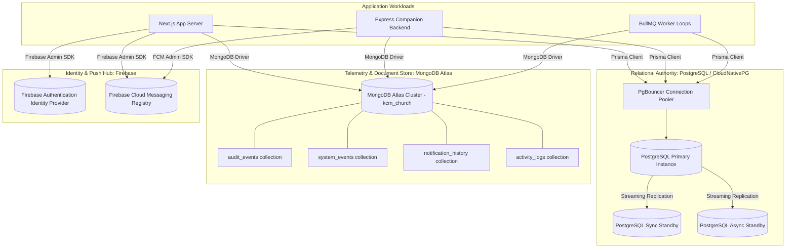

# Database Architecture & Data Ownership Specification

## Purpose
This document specifies the multi-database architecture, data segregation principles, connection lifecycles, and consistency models used across the Kingdom of Christ Ministries platform.

## Scope
Covers PostgreSQL (managed via CloudNativePG operator and Prisma ORM), MongoDB Atlas (document telemetry and audit logs), and Firebase (authentication identities and FCM device registry).

## Status
> Status: Implemented

---

## 1. Multi-Database Topology & Separation of Concerns

To preserve strict ACID transactional guarantees for financial and relational entities while avoiding database lock contention during high-throughput logging, the platform implements a clear separation of data ownership:

---

## 2. Data Ownership Matrix

| Entity Type | Authoritative Source of Truth | Data Store | Replication / Backup SLA |
| :--- | :--- | :--- | :--- |
| **Members & User Profiles** | PostgreSQL | PostgreSQL (`members` table) | Sync Standby + 5-min WAL archiving |
| **Events & Registrations** | PostgreSQL | PostgreSQL (`events`, `event_registrations`) | Sync Standby + 5-min WAL archiving |
| **Sermons & Series** | PostgreSQL | PostgreSQL (`sermons`, `sermon_series`) | Sync Standby + 5-min WAL archiving |
| **Donations, Offerings, Tithes** | PostgreSQL | PostgreSQL (`donations`, `donation_sessions`) | Sync Standby + 5-min WAL archiving |
| **Official Tax Receipts** | PostgreSQL | PostgreSQL (`receipts` table) | Sync Standby + 5-min WAL archiving |
| **Prayer Requests** | PostgreSQL | PostgreSQL (`prayer_requests` table) | Sync Standby + 5-min WAL archiving |
| **Attendance & Check-Ins** | PostgreSQL | PostgreSQL (`event_attendance` table) | Sync Standby + 5-min WAL archiving |
| **Security Audit Logs** | MongoDB Atlas | MongoDB (`audit_events` collection) | Atlas Automated Snapshots |
| **System Health Telemetry** | MongoDB Atlas | MongoDB (`system_events` collection) | Atlas Automated Snapshots + 90-day TTL |
| **Notification Logs & Retries** | MongoDB Atlas | MongoDB (`notification_history` collection) | Atlas Automated Snapshots + 30-day TTL |
| **Google OAuth Sign-In Tokens** | Firebase Auth | Google Cloud Managed Auth | Managed Google SLA (99.99%) |
| **FCM Push Device Tokens** | PostgreSQL & FCM | PostgreSQL (`device_tokens`) + Firebase | Synced on registration / login |

---

## 3. Connection Architecture & Pool Management

### 3.1 PostgreSQL Connection Management (Prisma & PgBouncer)
- **Prisma Client Singleton**: Instantiated once in `frontend/lib/db.ts` to prevent connection leaks during Next.js Hot Module Reloading (HMR).
- **PgBouncer Pooling**: Sits in front of the CloudNativePG cluster in transaction pooling mode, enabling thousands of client requests to share a pool of 50-200 physical database connections.
- **Connection Timeout**: 10 seconds with query execution timeouts set to 15 seconds.

### 3.2 MongoDB Atlas Connection Architecture
- **MongoClient Reuse**: Managed via `frontend/lib/mongodb/client.ts` and `backend/src/infrastructure/mongodb/client.js` with global caching in development and production environments.
- **Pool Sizing**: `maxPoolSize: 50`, `minPoolSize: 10`, `serverSelectionTimeoutMS: 5000`.
- **Offline Fallback**: If `MONGODB_OFFLINE="true"` is set, writes gracefully fallback to local memory structures to guarantee zero downtime during local offline development.

---

## 4. Failure Handling & High Availability Strategy

1. **CloudNativePG Automated Failover**: If the PostgreSQL primary instance fails, CloudNativePG detects the outage via Raft consensus within 10 seconds and automatically promotes the synchronous standby to primary. PgBouncer transparently reroutes traffic.
2. **MongoDB Replica Set Resiliency**: MongoDB Atlas replica sets automatically handle primary node election without dropping connection pools.
3. **Database Write Isolation**: Failures in MongoDB telemetry logging never block or roll back transactional PostgreSQL user/donation transactions.

---

## Security Considerations
- All PostgreSQL connections require SSL (`sslmode=require`).
- MongoDB Atlas enforces IP Access Lists (IP Whitelisting) and TLS 1.3 encryption in transit.
- No database credentials or connection strings are stored in plaintext code.

## Related Documentation
- [PostgreSQL.md](PostgreSQL.md) — Relational schema, Prisma client, and migrations.
- [MongoDB-Atlas.md](MongoDB-Atlas.md) — Event schemas and TTL indexes.
- [Firebase.md](Firebase.md) — Firebase identity and push integration.
- [CloudNativePG.md](CloudNativePG.md) — Kubernetes operator setup and failover runbooks.
