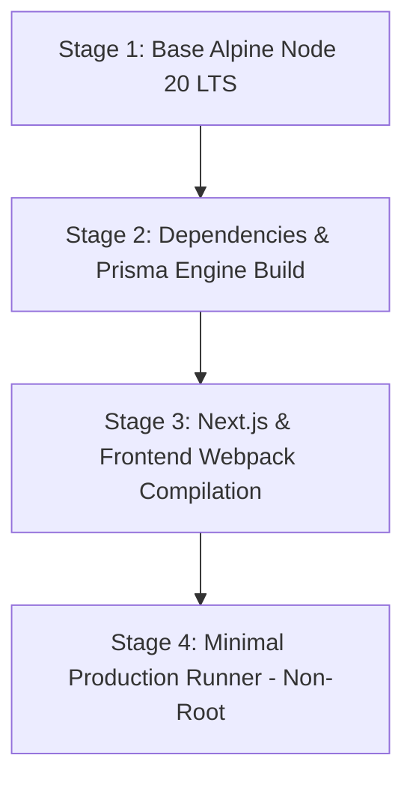

# Container Architecture & Docker Deployment

## Purpose
This document specifies the multi-stage Docker container architecture, image optimization strategies, local multi-service orchestration (Docker Compose), and container security hardening for the Kingdom of Christ Ministries platform.

## Scope
Covers `docker/Dockerfile`, `docker/docker-compose.yml`, `docker/docker-compose.prod.yml`, and container build pipelines.

## Status
> Status: Implemented

---

## 1. Multi-Stage Dockerfile Architecture

To produce minimal, ultra-secure production images with zero compiler overhead, the Dockerfile employs a 4-stage build pipeline:



### Stage Breakdown
1. **`base`**: Lightweight `node:20-alpine` with `libc6-compat` for native bindings.
2. **`deps`**: Installs root and workspace `package.json` dependencies with `npm ci`.
3. **`builder`**: Generates Prisma Client artifacts (`npx prisma generate`) and builds standalone Next.js bundles (`npm run build`).
4. **`runner`**: Copies only `.next/standalone`, public assets, and generated Prisma runtime. Executes as non-root user `nextjs:nodejs` (UID 10001).

---

## 2. Docker Compose Orchestration

### 2.1 Local Development Environment (`docker/docker-compose.yml`)
Runs the full local development stack with live hot-reloading:
- **`frontend`**: Next.js App Router server on port `3000`.
- **`backend`**: Express & Socket.io server on port `3001`.
- **`postgres`**: PostgreSQL 16 on port `5432` with pre-seeded database volume.
- **`redis`**: Redis in-memory cache and pub/sub on port `6379`.

```bash
# Start local development stack
npm run docker:dev

# Stop and clean up containers
npm run docker:dev:down
```

### 2.2 Production Simulation Stack (`docker/docker-compose.prod.yml`)
Runs optimized standalone container builds with production environment variables:
```bash
# Start production containers locally
npm run docker:prod
```

---

## 3. Container Security Hardening

- **Non-Root Execution**: Container process runs under dedicated UID/GID `10001:10001`.
- **Minimal Image Size**: Standalone output reduces container image footprint from 1.4 GB to **< 180 MB**.
- **Vulnerability Minimization**: Alpine Linux base ensures minimal system packages and near-zero CVE exposure.

---

## 4. Troubleshooting & Diagnostics

| Problem | Cause | Solution |
| :--- | :--- | :--- |
| `PrismaClientInitializationError: Query engine binary not found` | Prisma client generated for wrong platform target | Ensure `binaryTargets = ["native", "linux-musl-openssl-3.0.x"]` is specified in `database/schema.prisma`. |
| Docker build hangs on `npm ci` | Network timeout during package download | Use Docker buildkit cache mounts: `RUN --mount=type=cache,target=/root/.npm npm ci`. |

---

## Security Considerations
- Zero secrets or `.env` files are baked into container image layers.
- Trivy scans all container images before publishing to registry.

## Related Documentation
- [Kubernetes.md](Kubernetes.md) — Kubernetes workload manifests.
- [CI-CD.md](CI-CD.md) — Automated GitHub Actions container build pipeline.
- [Trivy.md](Trivy.md) — Container image vulnerability scanning.
