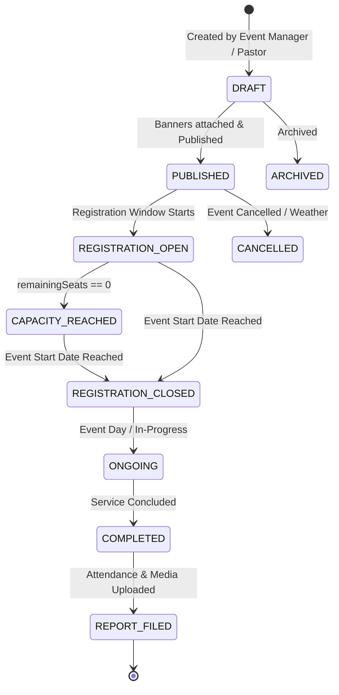

# Event Manager Module Specification

## Purpose
This document specifies the architecture, workflows, and operational capabilities of the Event Manager module, covering the full event lifecycle from scheduling, capacity management, banner uploads, attendee registration, door QR check-in, to post-event reporting.

## Scope
Covers event creation workflows, attendee registration endpoints (`/api/events/*`), QR check-in validation, and post-event media uploads.

## Status
> Status: Implemented

---

## 1. Event Lifecycle & Workflow State Machine



---

## 2. Key Capabilities & Technical Mechanics

### 2.1 Atomic Seat & Capacity Management
To prevent overbooking when hundreds of members register simultaneously for major conferences or youth retreats:
- `registrationLimit` defines max attendee threshold.
- `remainingSeats` is decremented inside a strict PostgreSQL serializable transaction:
```typescript
await prisma.$transaction(async (tx) => {
  const event = await tx.event.findUnique({ where: { id: eventId } });
  if (event.registrationRequired && event.remainingSeats <= 0) {
    throw new Error("Event capacity has been reached");
  }
  await tx.eventRegistration.create({ data: { eventId, userId, status: "CONFIRMED" } });
  if (event.registrationRequired) {
    await tx.event.update({
      where: { id: eventId },
      data: { remainingSeats: { decrement: 1 } },
    });
  }
});
```

### 2.2 Digital QR Tickets & Door Check-In
1. On registration, the member receives a unique QR code encoding `registrationId:eventId:userId:signature`.
2. Door ushers scan the QR code using mobile device cameras hitting `/api/events/[id]/check-in`.
3. The server marks `EventRegistration.status = ATTENDED` and creates an immutable `EventAttendance` entry.

### 2.3 Post-Event Media & Reporting
Event managers upload event photos and summary reports (`/api/event-manager/reports`) to document community impact and archive recordings.

---

## 3. Associated API Endpoints

- `GET /api/events` — Retrieves published events with search and branch filters.
- `POST /api/events` — Creates a new event record.
- `POST /api/events/[id]/register` — Registers an authenticated member or guest.
- `POST /api/events/[id]/check-in` — Verifies and marks attendance via QR ticket.
- `POST /api/events/[id]/upload` — Uploads post-event gallery media to Cloudinary.
- `POST /api/event-manager/reports` — Submits post-event attendance and minister reports.

---

## 4. Troubleshooting & Diagnostics

| Problem | Cause | Solution |
| :--- | :--- | :--- |
| Member receives "Capacity Reached" but seats appear open | Unconfirmed pending checkouts holding temporary lock | Expired locks are automatically released after 15 minutes by backend cleanup loop. |
| QR scanner fails to read ticket | Low screen brightness or damaged screen on attendee device | Ushers can perform manual check-in by searching member phone number or email in Event Manager console. |

---

## Security Considerations
- QR tickets include cryptographic HMAC signatures to prevent counterfeit ticket generation.
- Seat allocation logic runs in ACID transactions to eliminate race conditions.

## Related Documentation
- [Events.md](Events.md) — Public event calendar specification.
- [Attendance.md](Attendance.md) — Attendance tracking and analytics.
- [Cloudinary.md](Cloudinary.md) — Event banner and photo storage.
