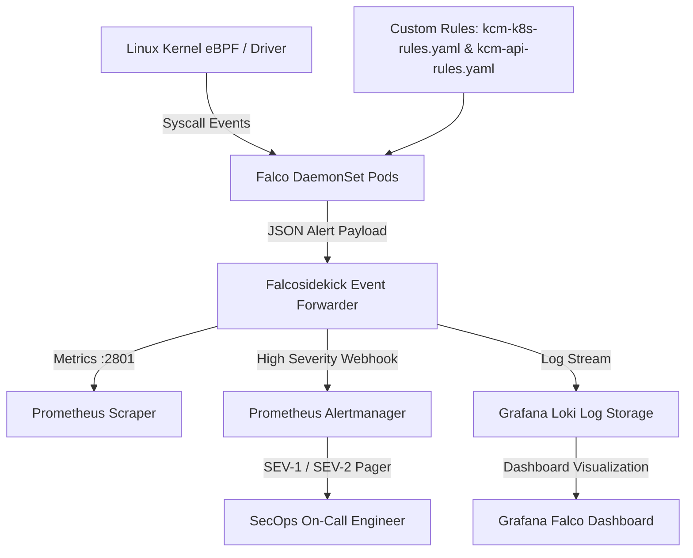

# Falco Runtime Threat Detection & Anomaly Monitoring

## Purpose
This document provides the architectural and operational specification for Falco, the runtime behavioral security and syscall monitoring engine protecting the Kingdom of Christ Ministries Kubernetes infrastructure.

## Scope
Covers Falco DaemonSet deployment, custom rule configurations (`platform/security/falco/rules/`), Prometheus alert integration, and security incident response runbooks.

## Status
> Status: Implemented

---

## 1. Falco Architecture & Event Pipeline

---

## 2. Rule Definitions & Threat Categories

Falco rules are defined in `platform/security/falco/rules/`:

### 2.1 Kubernetes & Workload Protection Rules (`kcm-k8s-rules.yaml`)
- **Terminal Shell in Container**: Triggers `WARNING` if `bash`, `sh`, `zsh`, or `csh` is spawned inside an application pod (`frontend`, `backend`, `cloudnativepg`).
- **Read Sensitive Files**: Triggers `CRITICAL` if a non-root process attempts to read `/etc/shadow`, `/etc/sudoers`, or Kubernetes service account tokens without authorization.
- **Write to Binary Directories**: Triggers `CRITICAL` if any process writes to `/bin`, `/sbin`, `/usr/bin`, or `/usr/sbin`.

### 2.2 API & Microservice Anomaly Rules (`kcm-api-rules.yaml`)
- **Outbound Network Connection from Database Pod**: Triggers `EMERGENCY` if the PostgreSQL pod initiates unexpected outbound connections to untrusted public IP addresses.
- **Crypto-mining Execution**: Detects known mining processes (`xmrig`, `minerd`) or suspicious stratum protocol traffic.

---

## 3. Prometheus Alerting Rules

Defined in `platform/security/falco/alerts/prometheus-rules.yaml`:
- **`FalcoCriticalSecurityEvent`**: Fires immediately when Falco detects a `CRITICAL` or `EMERGENCY` priority event in the `kcm-system` namespace.
- **`FalcoTerminalSpawned`**: Fires when an interactive container exec session is detected in production.

---

## 4. Operational Incident Runbooks

When a Falco alert triggers, on-call engineers execute standardized response runbooks located in `platform/security/falco/runbooks/`:
1. **Identify Affected Pod**: Run `kubectl get pod <pod_name> -n kcm-system -o yaml` to inspect container state.
2. **Isolate Pod**: Apply quarantine label `security.kcm.org/quarantined: "true"` to trigger network isolation via NetworkPolicy.
3. **Capture Forensic State**: Run `kubectl logs <pod_name> -n kcm-system > forensic_logs.txt`.
4. **Terminate Pod**: Run `kubectl delete pod <pod_name> -n kcm-system` to allow the deployment controller to spawn a clean replacement.

---

## 5. Troubleshooting & Diagnostics

| Problem | Cause | Resolution |
| :--- | :--- | :--- |
| `Falco engine initialization failed: driver not found` | Host kernel headers missing for kernel module probe | Switch Falco driver to modern eBPF probe (`driver.kind=modern_ebpf`). |
| High Falco CPU usage | Excessive syscall noise from build or test pods | Add rule exceptions (`macro: kcm_known_clean_processes`) to ignore high-frequency benign syscalls. |

---

## Security Considerations
- Falco rules and configuration files are signed and mounted as read-only ConfigMaps.
- Alerts are streamed over TLS directly to Falcosidekick and Loki.

## Related Documentation
- [Runtime-Security.md](Runtime-Security.md) — Kubernetes pod hardening.
- [Trivy.md](Trivy.md) — Image and vulnerability scanner.
- [Security-Checklist.md](Security-Checklist.md) — Production audit checklist.
