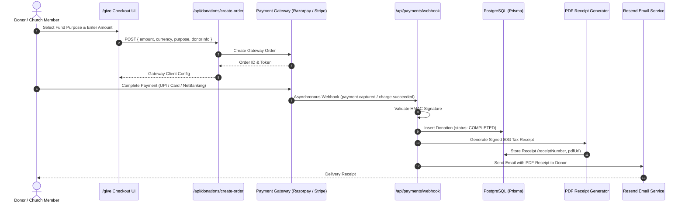

# Financial Management & Reconciliation Architecture

## Purpose
This document specifies the financial tracking architecture, payment reconciliation workflows, fund accounting categories, 80G tax receipt generation, and auditing standards for the Kingdom of Christ Ministries platform.

## Scope
Covers payment processing pipelines (Razorpay and Stripe), donation database models, receipt generation routines (`frontend/app/api/receipts/`), and financial export handlers.

## Status
> Status: Implemented

---

## 1. Fund Accounting & Purpose Allocation

To ensure strict financial stewardship, all received gifts are categorized into dedicated purpose funds:

| Fund Purpose Token | Display Label | Fund Category | Tax Deductible (80G) |
| :--- | :--- | :--- | :---: |
| `TITHE` | General Tithes (10%) | Operating Ministry Fund | Standard Charitable |
| `OFFERING` | Sunday & Thanksgiving Offering | General Ministry Fund | Standard Charitable |
| `BUILDING_FUND` | Sanctuary & Infrastructure Expansion| Capital Improvement Fund | Standard Charitable |
| `MISSIONS` | Evangelism & Church Planting | Outbound Missions Fund | Standard Charitable |
| `NGO_RELIEF` | Community Care & Medical Outreach | Humanitarian NGO Fund | ✅ 80G Exemption Eligible |

---

## 2. Payment Lifecycle & Webhook Reconciliation

---

## 3. Automated 80G Tax Receipts (`/api/receipts/[id]/pdf`)

- **Sequential Receipt Numbers**: Receipts follow a strictly sequential format (`KCM-REC-YYYYMM-XXXXX`).
- **Cryptographic Watermark**: PDF documents embed a verifiable digital hash and church registration numbers.
- **On-Demand PDF Streaming**: Receipts can be re-downloaded at any time by the donor from `/member/give` or verified publicly via `/give/receipt/[donationId]`.

---

## 4. Financial Reporting & Auditor Exports

- **Administrative Reporting (`/admin/donations`)**: Financial administrators filter donations by date range, fund purpose, payment method, or branch.
- **CSV & Excel Export**: Generates sanitized reconciliation spreadsheets for annual third-party financial audits.

---

## 5. Troubleshooting & Diagnostics

| Problem | Cause | Solution |
| :--- | :--- | :--- |
| Payment charged on donor bank account but showing PENDING in portal | Webhook delivery delayed or dropped by network glitch | Trigger manual reconciliation via `/api/donations/session/verify` or run nightly payment reconciliation worker. |
| Tax receipt PDF fails to generate | Missing donor PAN / Tax ID in profile | System generates standard receipt with note prompting donor to provide PAN for 80G filing. |

---

## Security Considerations
- Zero credit card numbers or bank CVVs are stored on application servers.
- Financial audit logs are written to MongoDB with immutable before-and-after transaction states.

## Related Documentation
- [Donations.md](Donations.md) — Public giving interface.
- [Database-Architecture.md](Database-Architecture.md) — PostgreSQL donation models.
- [Privacy.md](Privacy.md) — Financial privacy policies.
