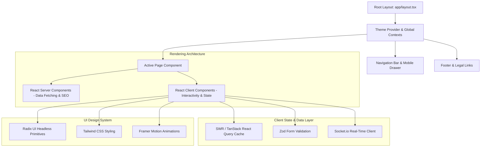

# Frontend Application Architecture

## Purpose
This document provides the definitive architectural and engineering specification for the Next.js 14 frontend web application powering the Kingdom of Christ Ministries platform.

## Scope
Covers React Server Components (RSC), App Router layouts, component hierarchies, state management, SWR/React Query data caching, UI primitives, and bundle optimization.

## Status
> Status: Implemented

---

## 1. Framework & Architecture Topology

The frontend is built on **Next.js 14.2.0** utilizing the App Router architecture, React 18 concurrent rendering, and server/client component boundaries:



---

## 2. Component Hierarchy & Organization

Components are organized into reusable, domain-focused modules in `frontend/components/`:

| Directory | Scope & Purpose | Key Components |
| :--- | :--- | :--- |
| `components/ui/` | Core Design System Primitives | Buttons, Dialogs, Dropdowns, Tabs, Inputs, Badges, Toast, Select |
| `components/auth/` | Authentication & Security Guards | `LoginForm.tsx`, `RegisterForm.tsx`, `ProtectedRoute.tsx` |
| `components/events/` | Event Management & Registration | `EventCard.tsx`, `EventForm.tsx`, `EventCalendar.tsx`, `CheckInModal.tsx` |
| `components/member/` | Member Experience & Self-Service | `ProfileForm.tsx`, `GivingTable.tsx`, `PrayerSubmissionModal.tsx` |
| `components/pastor/` | Pastoral Administration & Sermons | `SermonEditor.tsx`, `AttendanceChart.tsx`, `MemberRosterTable.tsx` |
| `components/openclaw/`| AI Ministry Orchestrator UI | `OpenClawOrchestratorView.tsx`, `PromptCard.tsx`, `SkillsDrawer.tsx` |
| `components/pwa/` | PWA & Offline Experience | `OfflineBanner.tsx`, `PWAInstallPrompt.tsx`, `SyncStatusIndicator.tsx` |

---

## 3. Data Fetching, State Management & Caching

1. **Server-Side Fetching**: React Server Components query PostgreSQL directly using the singleton Prisma client (`@/lib/db`) during SSR/SSG.
2. **Client-Side SWR / React Query**: Dynamic client views (e.g. real-time prayer lists, donation histories, event seat counters) use SWR:
```typescript
import useSWR from "swr";

const fetcher = (url: string) => fetch(url).then((res) => res.json());

export function useUpcomingEvents() {
  const { data, error, isLoading, mutate } = useSWR("/api/events/upcoming", fetcher, {
    revalidateOnFocus: true,
    dedupingInterval: 5000,
  });
  return { events: data?.events ?? [], isLoading, error, mutate };
}
```
3. **Optimistic UI Updates**: When a member likes a sermon or submits a prayer request, SWR mutates local cache immediately before receiving server confirmation, providing instantaneous visual feedback.

---

## 4. Layouts, Loading States & Error Boundaries

- **Nested Layouts**: Each portal (`/member/layout.tsx`, `/pastor/layout.tsx`, `/admin/layout.tsx`) encapsulates sidebar navigation, mobile headers, and role guards.
- **Streaming & Suspense**: Pages provide dedicated `loading.tsx` skeletons that stream content progressively to eliminate blank loading screens.
- **Error Boundaries**: `error.tsx` catch unexpected runtime exceptions gracefully, providing intuitive "Retry" actions without crashing the full application.

---

## 5. Performance, Lazy Loading & Code Splitting

- **Dynamic Imports**: Heavy client components (MapLibre vector maps, video streaming players, chart analytics) use `next/dynamic` with SSR disabled for fast initial page loads.
- **Image Optimization**: `next/image` handles responsive sizing, AVIF/WebP conversion, and layout shift prevention (`sizes="(max-width: 768px) 100vw, 50vw"`).

---

## 6. Troubleshooting & Diagnostics

| Problem | Cause | Solution |
| :--- | :--- | :--- |
| `Hydration failed because the initial UI does not match the server-rendered HTML` | Client-only state (e.g. `localStorage` or `Date.now()`) rendered during initial SSR | Wrap client-only elements in a `useEffect` mount check or `suppressHydrationWarning`. |
| SWR not refreshing after database update | Missing cache mutation after POST/PUT | Call `mutate('/api/target-endpoint')` upon successful mutation callback. |

---

## Security Considerations
- Client bundles exclude backend secrets and database drivers.
- All user-rendered HTML is sanitized to block XSS attacks.

## Related Documentation
- [UI-UX.md](UI-UX.md) — Design system and animation guidelines.
- [Responsive-Design.md](Responsive-Design.md) — Mobile-first viewport standards.
- [Routing.md](Routing.md) — Complete page routing matrix.
