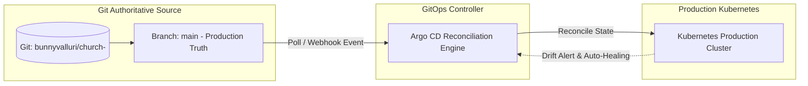

# Declarative GitOps Operations & Architecture

## Purpose
This document provides the technical specification for the declarative GitOps delivery model powering the Kingdom of Christ Ministries platform, establishing Git as the single authoritative source of truth for all Kubernetes infrastructure, application deployments, and operational policies.

## Scope
Covers GitOps repository structures, branching workflows, Argo CD reconciliation loops, environment promotions, and automated drift correction.

## Status
> Status: Implemented

---

## 1. GitOps Core Principles & Topology

1. **Declarative State**: All infrastructure, storage classes, routes, security policies, and microservice definitions are stored as version-controlled YAML manifests.
2. **Automated Convergence**: Argo CD continuously compares desired Git state against live cluster state and automatically reconciles discrepancies.
3. **Drift Detection**: Any manual `kubectl edit` or uncommitted modification in the cluster is flagged as Out-of-Sync and overwritten back to the Git baseline.

---

## 2. Branching & Promotion Strategy

- **`feature/*` Branches**: Developers implement feature changes or infrastructure updates on short-lived branches.
- **Pull Request & CI Validation**: Automated GitHub Actions run linting, unit tests, security scans, and render Helm templates.
- **Merge to `main`**: Merging into `main` creates an immutable container image tag (Git SHA) and updates the GitOps manifest directory.
- **Production Canary Rollout**: Argo CD detects the commit and triggers a progressive canary deployment via Argo Rollouts.

---

## 3. Disaster Recovery via GitOps

Because all application and infrastructure states are fully declared in Git:
1. In the event of total cluster loss, a replacement cluster can be spun up in minutes using OpenTofu (`tofu apply`).
2. Pointing Argo CD to the Git repository restores all namespaces, CRDs, network policies, and application workloads automatically.
3. Database and persistent storage are restored from S3 backups via Velero and CloudNativePG.

---

## 4. Troubleshooting & Diagnostics

| Problem | Cause | Solution |
| :--- | :--- | :--- |
| Cluster state does not match Git after merge | Argo CD sync polling interval (3m) or auto-sync disabled | Trigger immediate manual sync via Argo CD UI or CLI: `argocd app sync kcm-platform`. |
| Merge conflict in automated GitOps image tag commit | Multiple parallel CI pipelines updating image tags | Configure GitHub Actions with rebase retry logic on manifest tag commits. |

---

## Security Considerations
- Direct write access (`kubectl apply`) to the production cluster is disabled; all changes must flow through peer-reviewed Git Pull Requests.

## Related Documentation
- [ArgoCD.md](ArgoCD.md) — Argo CD configuration.
- [ArgoRollouts.md](ArgoRollouts.md) — Progressive canary delivery.
- [CI-CD.md](CI-CD.md) — CI/CD build automation.
