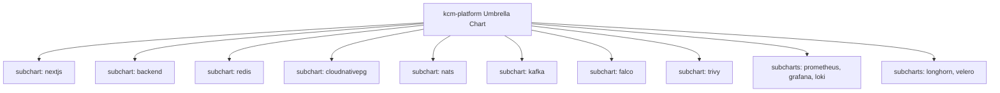

# Helm Packaging & Chart Architecture

## Purpose
This document provides the technical specification for the Helm chart architecture, umbrella charts, subchart dependencies, values overrides, and OCI registry publishing across the Kingdom of Christ Ministries platform.

## Scope
Covers charts in `platform/helm/charts/`, umbrella chart definitions, and Helm CI/CD automation pipelines.

## Status
> Status: Implemented

---

## 1. Helm Chart Hierarchy & Umbrella Architecture

To manage multi-service dependencies declaratively, the platform implements an **Umbrella Chart** architecture:



---

## 2. Subchart Inventory & Specifications

| Subchart | Directory Path | Primary Resources Packaged |
| :--- | :--- | :--- |
| `nextjs` | `platform/helm/charts/nextjs` | Frontend Deployment, Service, HPA, ConfigMap, HTTPRoute |
| `backend` | `platform/helm/charts/backend` | API, Socket, Worker Deployments, ServiceMonitor, Redis Adapter |
| `redis` | `platform/helm/charts/redis` | Redis StatefulSet, Headless Service, Longhorn PVC |
| `cloudnativepg`| `platform/helm/charts/cloudnativepg` | CloudNativePG Cluster CRD, ScheduledBackups, NetworkPolicy |
| `nats` | `platform/helm/charts/nats` | NATS JetStream StatefulSet, Streams CRD, KV Stores |
| `kafka` | `platform/helm/charts/kafka` | Apache Kafka Strimzi Cluster, Topics, PodDisruptionBudget |
| `falco` | `platform/helm/charts/falco` | Falco DaemonSet, Custom Rules ConfigMaps, Falcosidekick |
| `trivy` | `platform/helm/charts/trivy` | Trivy Operator, Vulnerability CRDs, Prometheus Monitor |
| `longhorn` | `platform/helm/charts/longhorn` | Longhorn CSI Driver, StorageClasses, BackupTarget |
| `velero` | `platform/helm/charts/velero` | Velero Operator, S3 BackupStorageLocation, Schedules |

---

## 3. Values Hierarchy & Environment Overrides

Configuration is driven by a clean values inheritance model:
1. **Subchart Defaults**: `platform/helm/charts/<subchart>/values.yaml`
2. **Environment Base Values**: `platform/helm/kcm-gateway/values.yaml`
3. **Runtime Overrides**: Passed during GitOps or manual deployment via `--set` or secret values files.

---

## 4. Packaging & Deployment Operations

```bash
# 1. Lint all charts in the monorepo
helm lint platform/helm/charts/*

# 2. Render templates locally to verify manifest generation
helm template kcm-release platform/helm/kcm-gateway -f platform/helm/kcm-gateway/values.yaml

# 3. Deploy / Upgrade release to Kubernetes cluster
helm upgrade --install kcm-release platform/helm/kcm-gateway \
  --namespace kcm-system \
  --create-namespace \
  --values platform/helm/kcm-gateway/values.yaml
```

---

## 5. Troubleshooting & Diagnostics

| Problem | Cause | Solution |
| :--- | :--- | :--- |
| `Error: UPGRADE FAILED: another operation is in progress` | Interrupted previous Helm deployment | Run `helm rollback kcm-release -n kcm-system` to reset release lock. |
| Subchart templates failing validation | Missing required value in parent values file | Verify subchart scope in parent values (e.g. `nextjs.replicaCount: 2`). |

---

## Security Considerations
- Charts are cryptographically signed and published as OCI artifacts to GHCR (`ghcr.io/bunnyvalluri/church-helm/*`).

## Related Documentation
- [Kubernetes.md](Kubernetes.md) — Base workload manifests.
- [ArgoCD.md](ArgoCD.md) — GitOps synchronization.
- [OpenTofu.md](OpenTofu.md) — Terraform/OpenTofu infrastructure provisioning.
