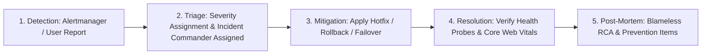

# Incident Response Framework & Severity Classification

## Purpose
This document provides the standard operating procedures (SOP), incident severity classifications, escalation protocols, and post-mortem templates for operational incidents across the Kingdom of Christ Ministries platform.

## Scope
Covers all infrastructure, database, application, security, and payment processing incidents.

## Status
> Status: Implemented

---

## 1. Incident Severity Classification Matrix

| Severity Level | Definition | Target Response Time | Notification Channels | Escalation Path |
| :--- | :--- | :--- | :--- | :--- |
| **SEV-1 (Critical)** | Complete platform outage, payment processing down during live service, data corruption | `< 5 Minutes` | PagerDuty, Phone Alert, Ops Slack | On-Call Lead -> Engineering Architect -> Senior Leadership |
| **SEV-2 (Major)** | Major feature failure (e.g. Video streaming broken, SMS alerts delayed, non-critical pod restarting)| `< 15 Minutes`| Ops Slack, Email | On-Call Engineer -> Component Tech Lead |
| **SEV-3 (Minor)** | Degraded performance (P95 latency elevated, non-blocking UI formatting glitch) | `< 2 Hours` | Slack `#kcm-ops-alerts` | Component Developer |
| **SEV-4 (Low)** | Minor bug, typo on non-critical page, cosmetic dashboard issue | `< 24 Hours` | JIRA / GitHub Issues | Scheduled Sprint Backlog |

---

## 2. Incident Response Lifecycle



---

## 3. Incident Team Roles & Responsibilities

- **Incident Commander (IC)**: Leads incident coordination, assigns investigation tasks, and authorizes emergency rollbacks or failovers.
- **Technical Lead (TL)**: Deep-dives logs (Loki), metrics (Prometheus), and traces (Jaeger) to identify root cause and implement mitigation.
- **Communications Lead (CL)**: Posts status updates to church operations channels and communicates with pastoral leadership.

---

## 4. Post-Mortem / Root Cause Analysis (RCA) Template

Following resolution of any SEV-1 or SEV-2 incident, the team publishes an RCA within 24 hours:

```markdown
# Incident Post-Mortem: [Incident Title]
- **Date**: YYYY-MM-DD
- **Severity**: SEV-1 / SEV-2
- **Duration**: [e.g. 14 Minutes]
- **Incident Commander**: [Name]

## Summary
Brief 2-3 sentence overview of what happened and the impact on members/church services.

## Impact
- Total downtime: X minutes
- Affected users: Y members
- Failed transactions: Z donation attempts

## Timeline (UTC)
- 14:02 - Alertmanager triggers `HighHttpErrorRate`
- 14:05 - On-call engineer initiates investigation
- 14:10 - Identified faulty deployment commit
- 14:12 - Executed `kubectl argo rollouts abort`
- 14:16 - Health probes normalized, 100% traffic restored

## Root Cause
Detailed technical explanation of the failure mechanism.

## Corrective Actions & Preventative Items
1. [Action Item 1]: Add automated regression test to CI suite.
2. [Action Item 2]: Adjust Prometheus alerting threshold.
```

## 5. Secret Leak & Credential Compromise Response Protocol

If a database URI, private key, or API secret is detected in public version control or flagged by GitHub Secret Scanning:
1. **Immediate Revocation (Minute 0-5)**:
   - Access the provider console (MongoDB Atlas, GCP, Razorpay, Resend) and immediately delete or rotate the compromised key.
   - Never wait for Git history scrubbing before revoking the credential.
2. **Update Environment Stores (Minute 5-15)**:
   - Inject replacement secrets into Vercel Project Environment Variables and Kubernetes Secrets.
3. **Trigger Zero-Downtime Redeployment (Minute 15-20)**:
   - Redeploy the application and verify health probes (`/api/health`).
4. **Git Sanitization & Force-Push (Minute 20-30)**:
   - Sanitize all local tracked files and replace with `<PLACEHOLDER>` values.
   - If history scrubbing is required, coordinate with team members to rewrite and force-push sanitized refs.
5. **Publish Security Post-Mortem (Within 24 Hours)**:
   - Document root cause, affected scopes, and preventive push protection rules.

---

## Security Considerations
- Incident bridge channels are private and restricted to authorized response team members.
- Security-related incident post-mortems redact sensitive attacker IPs or vulnerability details.
- Rotate the exposed MongoDB credential before considering the incident resolved.

## Related Documentation
- [Secrets-Management.md](Secrets-Management.md) — Secrets management & rotation workflows.
- [MongoDB-Security.md](MongoDB-Security.md) — MongoDB Atlas least-privilege configuration.
- [Disaster-Recovery.md](Disaster-Recovery.md) — Disaster recovery playbooks.
- [Monitoring.md](Monitoring.md) — Real-time alerting rules.
- [Troubleshooting.md](Troubleshooting.md) — Issue resolution runbooks.
