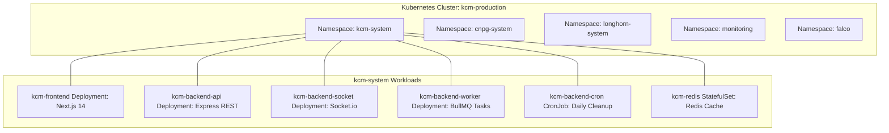

# Kubernetes Architecture & Workload Deployment

## Purpose
This document provides the technical specification for the Kubernetes cluster architecture, workload partitioning, Kustomize deployment manifests, resource allocation, and scaling strategies across the Kingdom of Christ Ministries infrastructure.

## Scope
Covers manifests in `k8s/` and platform configurations in `platform/kubernetes/`.

## Status
> Status: Implemented

---

## 1. Cluster Namespace Topology



---

## 2. Workload Specifications (`k8s/`)

| Workload Manifest | Kind | Port | Resource Requests (CPU / Mem) | Resource Limits (CPU / Mem) |
| :--- | :--- | :--- | :--- | :--- |
| `frontend.yaml` | Deployment | `3000` | `250m` / `512Mi` | `1000m` / `1536Mi` |
| `backend-api.yaml` | Deployment | `3001` | `200m` / `384Mi` | `800m` / `1024Mi` |
| `backend-socket.yaml`| Deployment | `3001` | `250m` / `512Mi` | `1000m` / `1024Mi` |
| `backend-worker.yaml`| Deployment | N/A | `150m` / `256Mi` | `500m` / `768Mi` |
| `backend-cron.yaml` | CronJob | N/A | `100m` / `128Mi` | `300m` / `256Mi` |
| `redis.yaml` | StatefulSet | `6379` | `200m` / `256Mi` | `500m` / `1024Mi` |

---

## 3. Health Probes & Zero-Downtime Rollouts

All deployments configure standardized Kubernetes probes:
- **Startup Probe**: `GET /api/health` (Initial delay: 5s, period: 5s, failureThreshold: 30) allows Next.js bundle compilation without premature pod termination.
- **Readiness Probe**: `GET /api/ready` (Period: 5s, failureThreshold: 2) verifies PostgreSQL connection before receiving gateway traffic.
- **Liveness Probe**: `GET /api/health` (Period: 10s, failureThreshold: 3) restarts deadlocked processes.
- **Rolling Update Strategy**: `maxSurge: 25%`, `maxUnavailable: 0%` guarantees zero-downtime during standard rollouts.

---

## 4. Kustomize Operations

Deploy and inspect workloads using standard root npm scripts:

```bash
# Apply full Kustomize workload bundle to cluster
npm run k8s:apply

# Inspect status of all pods, services, and HPA in kcm-system
npm run k8s:status

# Teardown workloads (staging/test only)
npm run k8s:delete
```

---

## 5. Troubleshooting & Diagnostics

| Problem | Cause | Solution |
| :--- | :--- | :--- |
| Pod in `CrashLoopBackOff` | Database connection failed or missing required secret | Inspect pod logs via `kubectl logs <pod-name> -n kcm-system` and verify secret bindings. |
| Pod in `OOMKilled` (Exit Code 137) | Memory consumption exceeded limit during heavy image build | Increase `resources.limits.memory` in `k8s/frontend.yaml`. |

---

## Security Considerations
- Pods execute with restricted security contexts (`runAsNonRoot: true`).
- Secrets are encrypted at rest in etcd.

## Related Documentation
- [Docker.md](Docker.md) — Container builds.
- [Helm.md](Helm.md) — Helm package management.
- [ArgoRollouts.md](ArgoRollouts.md) — Progressive delivery.
