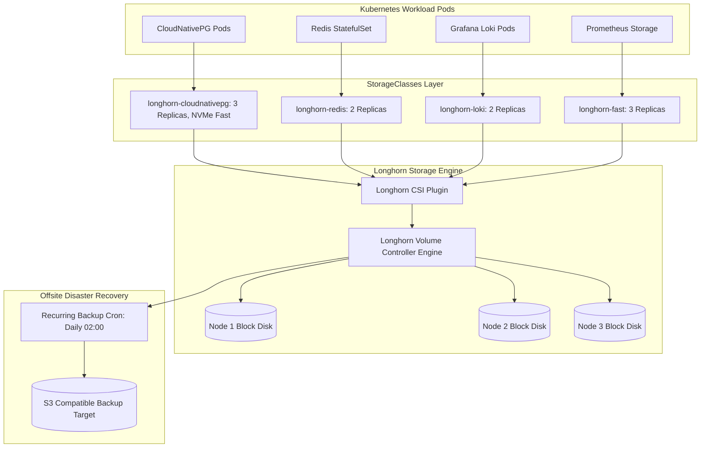

# Longhorn Distributed Block Storage Architecture

## Purpose
This document provides the technical specification for Longhorn, the enterprise distributed block storage system providing high-performance, replicated persistent volumes, automated snapshots, and offsite backups across the Kingdom of Christ Ministries Kubernetes infrastructure.

## Scope
Covers StorageClasses (`platform/storage/longhorn/storageclasses/`), PersistentVolumeClaims (`platform/storage/longhorn/volumes/`), snapshot CRDs, and disaster recovery runbooks.

## Status
> Status: Implemented

---

## 1. Longhorn Distributed Storage Topology

---

## 2. StorageClass Specifications (`platform/storage/longhorn/storageclasses/`)

| StorageClass Name | Replicas | Data Locality | Primary Workloads |
| :--- | :---: | :--- | :--- |
| `longhorn-cloudnativepg` | `3` | `best-effort` | PostgreSQL database primary and standby nodes |
| `longhorn-fast` | `3` | `strict-local`| High-IOPS Prometheus metrics storage |
| `longhorn-redis` | `2` | `best-effort` | Redis AOF persistence and session buffers |
| `longhorn-loki` | `2` | `best-effort` | Grafana Loki compressed log chunks |
| `longhorn-crypto` | `3` | `best-effort` | Encrypted persistent volumes (LUKS encryption) |
| `longhorn-single-replica`| `1` | `disabled` | Ephemeral test workloads and build caches |

---

## 3. Recurring Snapshots & Offsite Backups

Configured in `platform/storage/longhorn/snapshots/` and `backups/`:
- **Hourly Volume Snapshots**: Retains 24 rolling snapshots locally for near-instant rollback.
- **Nightly Offsite Backups**: Compresses and uploads block delta blocks to S3 offsite storage at `02:00 UTC`.
- **Velero CSI Integration**: Velero utilizes the `velero-longhorn-plugin` to take coordinated volume snapshots during cluster-wide DR jobs.

---

## 4. Operational Runbooks (`platform/storage/longhorn/runbooks/`)

- `volume-expansion-runbook.md`: Online PVC resizing without pod downtime.
- `replica-rebuilding-runbook.md`: Rebuilding degraded replicas following disk or node failure.
- `node-recovery-runbook.md`: Node maintenance and storage evacuation workflows.
- `disaster-recovery-restore-runbook.md`: Restoring persistent volumes from S3 backup target.

---

## 5. Troubleshooting & Diagnostics

| Problem | Cause | Solution |
| :--- | :--- | :--- |
| Volume status is `Degraded` | One node rebooted or network partitioned | Longhorn automatically rebuilds missing replica onto another healthy node within 10 minutes. |
| Volume expansion not reflecting in pod | Filesystem resizing pending | Trigger online resize: `kubectl patch pvc <pvc_name> -p '{"spec":{"resources":{"requests":{"storage":"50Gi"}}}}'`. |

---

## Security Considerations
- Data at rest can be encrypted using `longhorn-crypto` StorageClass with Kubernetes secret key bindings.

## Related Documentation
- [Velero.md](Velero.md) — Disaster recovery backup operator.
- [CloudNativePG.md](CloudNativePG.md) — PostgreSQL storage configuration.
- [Backup-Restore.md](Backup-Restore.md) — Full recovery procedures.
