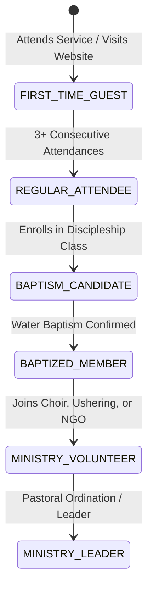

# Church Membership Lifecycle & Discipleship Architecture

## Purpose
This document specifies the church membership onboarding lifecycle, discipleship tracking stages, family unit modeling, branch associations, and external Google Sheets synchronization across the Kingdom of Christ Ministries platform.

## Scope
Covers membership application routes (`/membership`), registration workflows, pastoral member rosters (`/pastor/members`), and Google Sheets Apps Script webhook sync.

## Status
> Status: Implemented

---

## 1. Membership Lifecycle & Discipleship Pipeline



---

## 2. Key Membership Capabilities

### 2.1 Online Membership Application (`/membership`)
- Prospective members submit full contact information, spiritual testimony, baptism status, and home sanctuary preference (Shapur Nagar, Subhash Nagar, Bahadurpally).
- Upon submission, a notification alert is sent to pastoral staff for pastoral review and welcome home visitation scheduling.

### 2.2 Google Sheets & Apps Script Bi-Directional Sync
To support legacy church administration workflows:
- The system connects to the official KCM Members Database Google Sheet (`GOOGLE_SHEETS_ID`).
- **Webhooks (`/api/google-event-trigger`)**: Receives real-time member roster updates from Google Apps Script webhooks with HMAC signature verification (`GOOGLE_WEBHOOK_SECRET`).

---

## 3. Database Schema (`members` & `branches` tables)

```prisma
model User {
  id                 String    @id @default(cuid())
  name               String
  email              String    @unique
  phone              String?
  address            String?
  role               UserRole  @default(MEMBER)
  branchId           String?   @map("branch_id")
  branch             Branch?   @relation(fields: [branchId], references: [id])
  createdAt          DateTime  @default(now())
  updatedAt          DateTime  @updatedAt
  
  @@map("members")
}

model Branch {
  id          String   @id @default(cuid())
  name        String   // "Shapur Nagar Sanctuary", etc.
  slug        String   @unique
  address     String
  pastorName  String?  @map("pastor_name")
  phone       String?
  members     User[]
  events      Event[]
  
  @@map("branches")
}
```

---

## 4. Associated API Endpoints

- `POST /membership` — Submits an online membership application.
- `GET /api/pastor/members` — Pastoral search and filter endpoint for member directory.
- `POST /api/google-event-trigger` — Webhook listener for Google Sheets member sync.

---

## 5. Troubleshooting & Diagnostics

| Problem | Cause | Solution |
| :--- | :--- | :--- |
| Member sync from Google Sheets failing | `GOOGLE_WEBHOOK_SECRET` mismatch | Verify matching secret key in Google Apps Script Script Properties and backend `.env`. |
| Member branch assignment not updating | Missing `branchId` foreign key in payload | Ensure valid branch CUID is passed in the update payload. |

---

## Security Considerations
- Member contact directories are strictly confidential and accessible only by `PASTOR` and `ADMIN` accounts.
- Google Sheets webhooks enforce cryptographic signature headers.

## Related Documentation
- [Pastor-Portal.md](Pastor-Portal.md) — Pastoral member roster.
- [Database-Architecture.md](Database-Architecture.md) — Relational schema.
- [Privacy.md](Privacy.md) — Confidentiality and PII protection.
