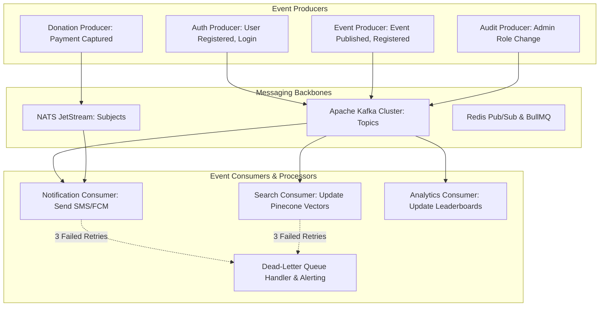

# Asynchronous Messaging & Event-Driven Architecture

## Purpose
This document provides the technical specification for the asynchronous messaging and event-driven architecture powering decoupled microservices across the Kingdom of Christ Ministries platform.

## Scope
Covers Apache Kafka event streaming (`platform/messaging/kafka/`), NATS JetStream messaging (`platform/messaging/nats/`), and Redis Pub/Sub event distribution.

## Status
> Status: Implemented

---

## 1. Messaging Subsystems & Technology Mapping

To optimize performance and resource efficiency across distinct workloads, the platform implements a tiered event-driven architecture:

| Subsystem | Underlying Technology | Primary Use Case | Throughput / SLA |
| :--- | :--- | :--- | :--- |
| **Event Streaming & Audit History** | **Apache Kafka (Strimzi)** | High-throughput event logs, audit streaming, analytics pipelines | 50,000+ msgs/sec |
| **Microservice Pub/Sub & Key-Value**| **NATS JetStream** | Lightweight service messaging, real-time command events, distributed KV cache | Ultra-low latency (<1ms) |
| **Real-Time WebSockets & Task Queues**| **Redis (BullMQ / Socket.io)** | Frontend live broadcasts, background worker tasks, rate-limit counters | In-memory (<0.5ms) |

---

## 2. Event-Driven Architectural Flow



---

## 3. Standard Event Envelope Schema

All published events adhere to a standard JSON schema contract:

```typescript
export interface ChurchDomainEvent<T = any> {
  eventId: string;          // UUIDv4 unique event identifier
  eventType: string;        // e.g. "kcm.donation.captured", "kcm.event.registered"
  producer: string;         // e.g. "kcm-frontend-api"
  timestamp: string;        // ISO 8601 UTC timestamp
  correlationId: string;    // Distributed trace correlation ID
  idempotencyKey: string;   // Unique key for deduplication
  data: T;                  // Typed event payload
}
```

---

## 4. Idempotency & Dead-Letter Queue (DLQ) Handling

- **Deduplication**: Consumers store processed `idempotencyKey` values in Redis with a 24-hour TTL. If a duplicate message arrives, it is acknowledged and ignored.
- **Exponential Retry & DLQ**: If a consumer encounters a transient failure (e.g. downstream SMS provider down), the message is retried 3 times with exponential backoff before being routed to the `kcm.dead-letter.events` topic for manual administrative inspection.

---

## 5. Troubleshooting & Diagnostics

| Problem | Cause | Solution |
| :--- | :--- | :--- |
| High consumer lag on notification topic | Downstream email/SMS gateway throttling rate | Scale consumer replicas horizontally or adjust BullMQ concurrency bounds. |
| Message stuck in Dead-Letter Queue (DLQ) | Malformed payload failing schema validation | Use the DLQ drainage runbook (`platform/messaging/nats/runbooks/dlq-drain-reprocess.md`) to reprocess corrected messages. |

---

## Security Considerations
- Kafka topics and NATS subjects enforce TLS 1.3 encryption and SASL/SCRAM authentication.
- Access Control Lists (ACLs) restrict producer and consumer permissions per microservice.

## Related Documentation
- [Kafka.md](Kafka.md) — Apache Kafka cluster specification.
- [NATS.md](NATS.md) — NATS JetStream specification.
- [Notification-System.md](notification-system.md) — Notification dispatcher engine.
