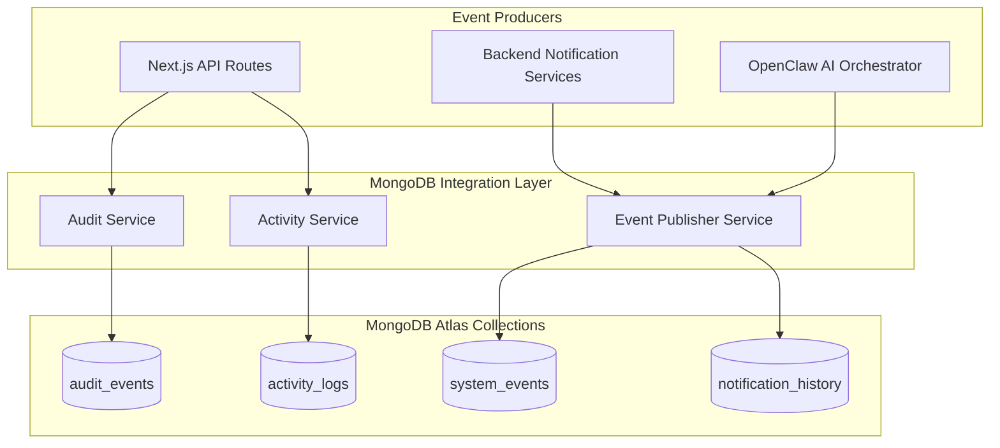

# MongoDB Atlas Telemetry & Event Storage

## Purpose
This document provides the technical specification for MongoDB Atlas, used as the dedicated document database for system telemetry, security audit logging, notification dispatch histories, and operational activity streams across the Kingdom of Christ Ministries platform.

## Scope
Covers MongoDB client architecture, repositories, collection schemas, TTL indexing, and the offline development simulation layer.

## Status
> Status: Implemented

---

## 1. MongoDB Architecture & Role

MongoDB Atlas operates strictly as an asynchronous event and telemetry store, decoupling high-frequency log writes and analytical feeds from the relational PostgreSQL transactional master.



---

## 2. Collections & Document Schemas

### 2.1 `audit_events` Collection
Records administrative actions, role modifications, financial exports, and security-relevant mutations.
- **Fields**:
  - `_id`: ObjectId
  - `action`: String (e.g. `USER_ROLE_UPDATED`, `DONATION_RECORD_EXPORTED`, `SERMON_DELETED`)
  - `actorId`: String (ID of admin or service performing action)
  - `actorEmail`: String
  - `targetEntity`: String (e.g. `User`, `Event`, `Donation`)
  - `targetId`: String
  - `metadata`: Object (Previous state, new state, IP address, user agent)
  - `timestamp`: Date (Indexed)

### 2.2 `system_events` Collection
Tracks microservice health events, worker cycle completions, and API latency anomalies.
- **Fields**: `serviceName`, `eventType`, `severity` (`INFO`, `WARN`, `ERROR`, `CRITICAL`), `details`, `timestamp`.
- **TTL Expiration**: Automatically purged after 90 days via MongoDB TTL index.

### 2.3 `notification_history` Collection
Logs all outbound SMS, FCM Push, and Email deliveries along with delivery statuses, provider transaction IDs, and retry attempts.
- **Fields**: `recipientId`, `channel` (`SMS`, `FCM`, `EMAIL`, `WHATSAPP`), `templateId`, `status` (`DELIVERED`, `QUEUED`, `FAILED`), `attempts`, `errorDetails`, `sentAt`.
- **TTL Expiration**: Automatically purged after 30 days via MongoDB TTL index.

### 2.4 `activity_logs` Collection
Powers real-time activity feeds in the Member and Pastor portals (e.g. "Pastor David published a new sermon", "Youth Camp registration opened").

---

## 3. Indexes & TTL Configuration

Indexes are programmatically verified and asserted on application startup (`frontend/lib/mongodb/indexes.ts` and `backend/src/infrastructure/mongodb/indexes.js`):

```typescript
export async function ensureMongoIndexes(db: Db) {
  // Audit Events Indexing
  await db.collection("audit_events").createIndex({ timestamp: -1 });
  await db.collection("audit_events").createIndex({ actorId: 1, action: 1 });

  // System Events TTL (90 Days = 7,776,000 seconds)
  await db.collection("system_events").createIndex(
    { timestamp: 1 },
    { expireAfterSeconds: 7776000 }
  );

  // Notification History TTL (30 Days = 2,592,000 seconds)
  await db.collection("notification_history").createIndex(
    { sentAt: 1 },
    { expireAfterSeconds: 2592000 }
  );
  await db.collection("notification_history").createIndex({ recipientId: 1, channel: 1 });
}
```

---

## 4. Repositories & Service Layer

The application interacts with MongoDB exclusively through typed repository patterns:
- `analyticsEventRepository.ts`: Aggregates sermon play counts and event page views.
- `auditEventRepository.ts`: Inserts immutable audit log entries.
- `notificationEventRepository.ts`: Logs and queries notification dispatch records.
- `systemEventRepository.ts`: Records system health telemetry for the Admin Portal dashboard.

---

## 5. Offline & Local Development Mode

To allow local development without requiring live MongoDB Atlas credentials:
- Set `MONGODB_OFFLINE="true"` in `.env.local`.
- In offline mode, the MongoDB client returns structured in-memory mock responses and avoids connection timeouts, ensuring the Next.js app starts instantly.

---

## 6. Troubleshooting & Diagnostics

| Problem | Cause | Solution |
| :--- | :--- | :--- |
| `MongoServerSelectionError: connect ECONNREFUSED` | Invalid Atlas URI or IP address not whitelisted in Atlas Network Access | Add developer/cluster IP to MongoDB Atlas IP Access List or toggle `MONGODB_OFFLINE="true"`. |
| `MongoBulkWriteError: TTL Index Conflict` | Changing `expireAfterSeconds` on an existing TTL index | Drop the existing index via `db.system_events.dropIndex("timestamp_1")` and restart application. |
| High Query Latency on Audit Logs | Missing composite index on filtered fields | Verify indexes using `db.audit_events.getIndexes()`. |

---

## Security Considerations
- Sensitive fields (credit card tokens, passwords) are filtered and stripped before being written to MongoDB.
- MongoDB Atlas connections enforce TLS 1.3 encryption and SCRAM-SHA-256 authentication.

## Related Documentation
- [Database-Architecture.md](Database-Architecture.md) — Multi-database topology.
- [Logging.md](Logging.md) — Structured logging and Loki integration.
- [Admin-Portal.md](Admin-Portal.md) — Audit log viewer in Admin Portal.
