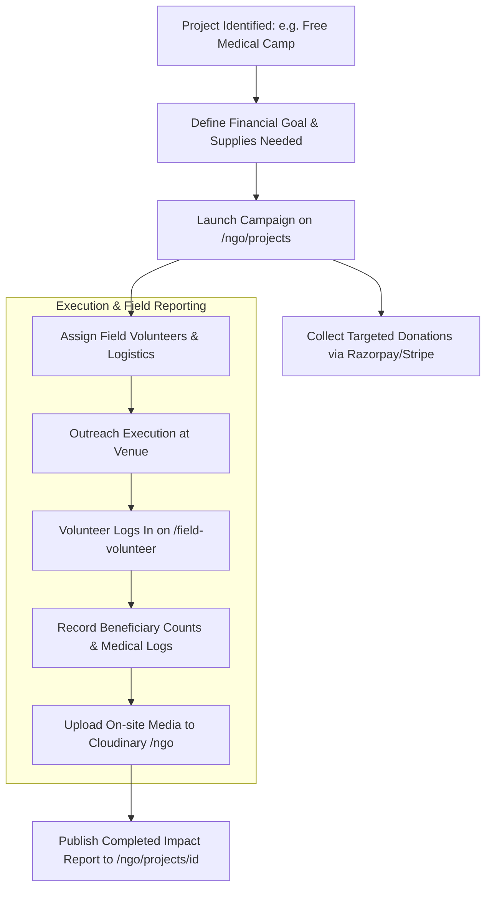

# KCM NGO & Community Outreach Platform

## Purpose
This document provides the functional and technical specification for the KCM NGO & Community Outreach Platform, dedicated to managing humanitarian projects, medical relief camps, food drives, educational aid, field volunteer reporting, and dedicated charitable giving.

## Scope
Covers frontend pages in `frontend/app/ngo/`, field volunteer reporting at `/field-volunteer`, API endpoints in `frontend/app/api/ngo/` and `frontend/app/api/field-volunteer/`, and NGO media assets.

## Status
> Status: Implemented

---

## 1. Module Overview & Routes

| Route | Purpose | Permissions | Primary Features |
| :--- | :--- | :--- | :--- |
| `/ngo` | NGO Outreach Landing Portal | Public | Impact statistics, active initiatives, humanitarian mission |
| `/ngo/projects` | Community Projects Directory | Public | Project cards, budget targets, progress indicators |
| `/ngo/projects/[id]`| Project Details & Impact Case | Public | Full project report, photo gallery, donate button |
| `/ngo/gallery` | Outreach Photo & Video Gallery | Public | Filterable media categories (Medical, Food, Orphanage) |
| `/ngo/donations` | Dedicated NGO Relief Fund Giving | Public | Targeted donations with 80G tax exemption receipts |
| `/ngo/volunteers` | Volunteer Application & Orientation | Public | Skill matching, availability submission form |
| `/field-volunteer` | Field Volunteer Reporting & Check-in| `VOLUNTEER`, `ADMIN`| Live GPS check-in, relief distribution logs, photo upload |

---

## 2. Outreach Project Lifecycle & Tracking

---

## 3. Key Technical Capabilities

### 3.1 Field Volunteer Check-In & Reporting (`/field-volunteer`)
- **Field Reporting API (`/api/field-volunteer/report`)**: Allows field team members to record the number of families served, food packets distributed, or patients examined during outreach drives.
- **Offline Resilience**: Supports offline logging via IndexedDB; reports automatically sync when volunteers return to cell coverage areas.

### 3.2 Targeted Humanitarian Offerings
- Donations made through `/ngo/donations` are automatically earmarked with `purpose: "NGO_RELIEF"`.
- Generates 80G tax exemption receipts with NGO registration numbers and audited foundation credentials.

### 3.3 NGO Media CDN Storage
- Outreach photography and videos are stored in Cloudinary under `church-platform/ngo` with automated facial clarity optimization and responsive compression.

---

## 4. Associated API Endpoints

- `GET /api/ngo/projects` — Returns active and completed community outreach initiatives.
- `GET /api/ngo/projects/[id]` — Returns detailed case study and financial breakdown for an initiative.
- `POST /api/ngo/campaigns` — Creates a new fundraising outreach campaign.
- `POST /api/ngo/volunteers` — Submits a volunteer service application.
- `POST /api/field-volunteer/report` — Records on-site field distribution and attendance logs.
- `POST /api/upload/ngo-media` — Streams field imagery to Cloudinary NGO folders.

---

## 5. Troubleshooting & Diagnostics

| Problem | Cause | Solution |
| :--- | :--- | :--- |
| Field volunteer unable to upload photos in remote area | Low bandwidth cellular connection | Application queues photos locally in IndexedDB `media_blobs` store and retries in background. |
| NGO donation receipt missing tax exemption clause | Donation was submitted under general church tithe purpose | Ensure donor selects the NGO Relief category on the checkout form. |

---

## Security Considerations
- Field volunteer reports validate user identity to prevent fraudulent impact reporting.
- Beneficiary personal dignity and privacy are protected; photos adhere to ethical NGO publishing guidelines.

## Related Documentation
- [Donations.md](Donations.md) — Charitable giving flows.
- [Cloudinary.md](Cloudinary.md) — Media storage.
- [Offline-Sync.md](Offline-Sync.md) — Remote field report synchronization.
