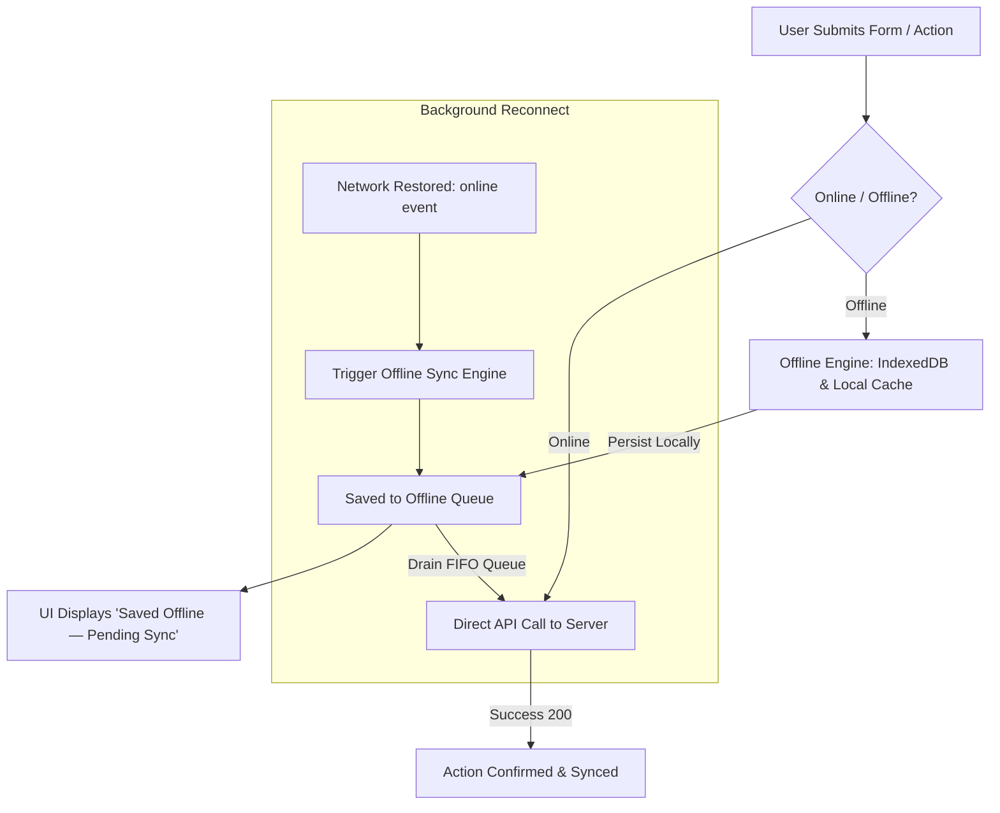

# Offline-First Architecture & Data Availability

## Purpose
This document specifies the offline-first architectural principles, local data storage tiers, network availability listeners, and offline user experience flows implemented across the Kingdom of Christ Ministries platform.

## Scope
Covers client-side state caching, offline drafts (`frontend/hooks/useOfflineDraft.ts`), connection health detection, and UI state indicators.

## Status
> Status: Implemented

---

## 1. Offline-First Principles & Church Context

In many ministry and outreach scenarios (rural mission trips, medical camps, crowded sanctuaries with congested cellular towers), internet connectivity can be intermittent or unavailable.



---

## 2. Offline Feature Availability Matrix

| Feature Area | Offline Capability | Storage Mechanism | Sync Behavior |
| :--- | :--- | :--- | :--- |
| **Sermon Catalog & Transcripts** | Read cached sermon notes and scripture references | Cache Storage & IndexedDB | Read-only offline; auto-refreshed on reconnect |
| **Weekly Service Schedule** | View Sunday & midweek service times and directions | Pre-cached Shell Cache | Read-only offline |
| **Prayer Request Submission** | Compose & submit personal/family prayer requests | IndexedDB Mutation Queue | Auto-synced to PostgreSQL when connection restored |
| **Event Registration Drafts** | Save event registration forms offline | `useOfflineDraft` Local Storage | Prompt to confirm submission upon reconnecting |
| **Field Volunteer Reports** | Log outreach hours, medical camp counts, photos | IndexedDB Blob & Queue | Uploaded and processed in background upon reconnect |
| **Online Giving & Offering** | Disabled offline for financial security | Disabled (Requires Live Gateway) | Displays informative message to connect to internet |

---

## 3. Network Detection & UI States

The frontend exposes real-time connectivity status via custom React hooks (`useOffline.ts`):
- Listens to `window.addEventListener('online')` and `'offline'`.
- Broadcasts real-time visual banners (`OfflineBanner.tsx`):
  - **Offline State**: "You are currently offline. Actions are saved locally and will sync automatically."
  - **Reconnecting State**: "Connection restored. Synchronizing pending updates..."
  - **Synced State**: "All changes successfully synchronized."

---

## 4. Offline Form Draft Hook (`useOfflineDraft.ts`)

```typescript
export function useOfflineDraft<T>(formKey: string, initialData: T) {
  const [data, setData] = useState<T>(() => {
    if (typeof window === "undefined") return initialData;
    const saved = localStorage.getItem(`draft_${formKey}`);
    return saved ? JSON.parse(saved) : initialData;
  });

  const saveDraft = (newData: T) => {
    setData(newData);
    localStorage.setItem(`draft_${formKey}`, JSON.stringify(newData));
  };

  const clearDraft = () => {
    localStorage.removeItem(`draft_${formKey}`);
  };

  return { draftData: data, saveDraft, clearDraft };
}
```

---

## 5. Troubleshooting & Diagnostics

| Problem | Cause | Solution |
| :--- | :--- | :--- |
| Network indicator shows online, but API calls fail (Captive Portal) | Device connected to Wi-Fi with no internet access | Perform periodic lightweight ping to `/api/health` in addition to `navigator.onLine`. |
| Draft data exceeds LocalStorage quota (5MB) | Storing large base64 image strings in LocalStorage | Store binary image buffers in IndexedDB (`lib/offline/indexeddb.ts`) instead of LocalStorage. |

---

## Security Considerations
- Sensitive financial credentials are never held in offline draft stores.
- IndexedDB storage is scoped to the origin and isolated from other browser tabs.

## Related Documentation
- [PWA.md](PWA.md) — Service worker implementation.
- [Offline-Sync.md](Offline-Sync.md) — Conflict resolution and background queue.
- [Health-Checks.md](Health-Checks.md) — `/api/health` endpoint specification.
