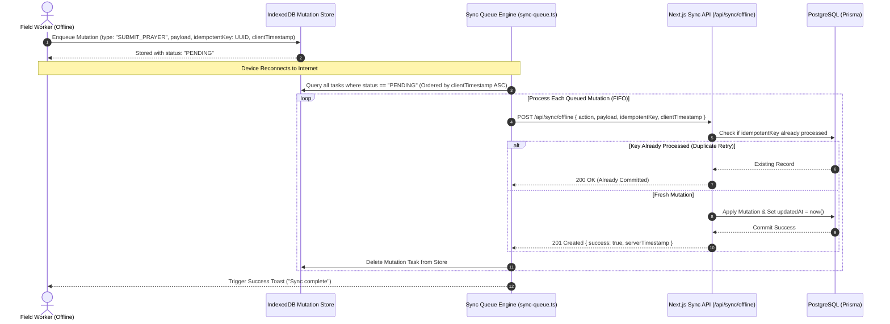

# Offline Synchronization & Conflict Resolution

## Purpose
This document provides the technical specification for the IndexedDB mutation queue, background synchronization engine, conflict resolution strategies, and server sync handlers across the Kingdom of Christ Ministries platform.

## Scope
Covers `frontend/lib/offline/indexeddb.ts`, `frontend/lib/offline/sync-queue.ts`, `frontend/lib/offline/conflict-manager.ts`, and the `/api/sync/offline` server endpoint.

## Status
> Status: Implemented

---

## 1. Synchronization Architecture & Data Flow

---

## 2. IndexedDB Schema Specification (`lib/offline/indexeddb.ts`)

- **Database Name**: `kcm_offline_db`
- **Database Version**: `2`
- **Object Stores**:
  - `sync_queue`: Holds pending mutation requests (`id`, `action`, `endpoint`, `payload`, `idempotentKey`, `createdAt`, `retryCount`, `status`).
  - `offline_cache`: Key-value cache for sermon notes, event rosters, and user profile data.
  - `media_blobs`: Ephemeral binary storage for photos captured offline before upload.

---

## 3. Conflict Resolution Strategies (`lib/offline/conflict-manager.ts`)

| Scenario | Resolution Strategy | Applied Domain |
| :--- | :--- | :--- |
| **New Entity Creation** (e.g. Prayer Request, Volunteer Report) | **Idempotent Insertion**: Unique `idempotentKey` (UUIDv4) generated client-side guarantees exactly-once processing regardless of network retries. | Prayer Requests, Event Registrations, Field Reports |
| **Profile / Entity Update** | **Last-Write-Wins (LWW) with Server Arbitration**: Server compares `clientTimestamp` against the entity's current `updatedAt`. If `clientTimestamp < updatedAt`, server rejects update and returns latest server state. | User Profiles, Member Notification Preferences |
| **Event Capacity Contention** | **Server Capacity Enforcement**: If event seats filled up while user was offline, server returns `409 Conflict` with reason `SEATS_EXHAUSTED` and places user on automated waitlist. | Event Registrations |

---

## 4. Exponential Backoff & Retry Policies

When a network failure occurs mid-sync:
1. The mutation's `retryCount` is incremented.
2. Next retry delay is calculated: `delay = min(baseDelay * 2^retryCount, maxDelay)` (e.g. 1s, 2s, 4s, 8s, up to max 60s).
3. If `retryCount >= 5`, the task is marked `FAILED_PERMANENT` and the user is prompted to manually review or discard the draft.

---

## 5. Server-Side Sync Endpoint (`/api/sync/offline`)

The server endpoint processes batch synchronization payloads inside a single transactional boundary:
- Validates session authentication token.
- Verifies payload schema with Zod.
- Dispatches domain mutations via Prisma.
- Returns comprehensive reconciliation statuses (`{ synced: 3, failed: 0 }`).

---

## 6. Troubleshooting & Diagnostics

| Problem | Cause | Solution |
| :--- | :--- | :--- |
| `QuotaExceededError` in IndexedDB | User stored excessive high-resolution offline images | Compress photos using browser canvas (`max 1600px width`) before writing to `media_blobs` store. |
| Mutations stuck in PENDING status | Unhandled JavaScript error in background sync loop | Open Browser DevTools -> Application -> IndexedDB -> `sync_queue` to inspect error logs. |

---

## Security Considerations
- Mutation payloads in IndexedDB are isolated per browser profile and deleted immediately upon successful server confirmation.

## Related Documentation
- [Offline-First.md](Offline-First.md) — Offline principles.
- [PWA.md](PWA.md) — Service Worker configuration.
- [API-Documentation.md](API-Documentation.md) — Sync API specifications.
