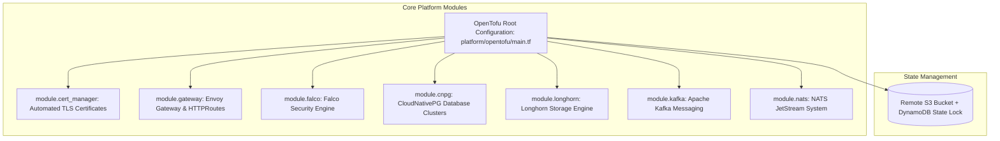

# Infrastructure as Code (IaC) with OpenTofu

## Purpose
This document provides the technical specification for OpenTofu (open-source Terraform fork), used for declarative cloud and Kubernetes infrastructure provisioning across the Kingdom of Christ Ministries platform.

## Scope
Covers OpenTofu root configurations and modular subcomponents in `platform/opentofu/`, `platform/database/opentofu/`, `platform/storage/longhorn/opentofu/`, `platform/messaging/kafka/opentofu/`, and `platform/security/falco/opentofu/`.

## Status
> Status: Implemented

---

## 1. OpenTofu Module Architecture



---

## 2. Provider Configurations (`providers.tf`)

```hcl
terraform {
  required_version = ">= 1.6.0"
  required_providers {
    kubernetes = {
      source  = "hashicorp/kubernetes"
      version = "~> 2.27"
    }
    helm = {
      source  = "hashicorp/helm"
      version = "~> 2.12"
    }
    kubectl = {
      source  = "gavinbunney/kubectl"
      version = "~> 1.14"
    }
  }
}
```

---

## 3. Modular Subsystems & Responsibilities

| Module Name | Path | Primary Provisioned Resources |
| :--- | :--- | :--- |
| `cert-manager` | `platform/opentofu/modules/cert-manager` | Cert-Manager operator, Let's Encrypt ClusterIssuers |
| `gateway` | `platform/opentofu/modules/gateway` | Envoy Gateway Class, Gateway instance, TLS listeners |
| `falco` | `platform/opentofu/modules/falco` | Falco DaemonSet, Falcosidekick, Prometheus rule bindings |
| `cloudnativepg`| `platform/database/opentofu` | CloudNativePG operator, 3-node PostgreSQL HA cluster, PgBouncer |
| `longhorn` | `platform/storage/longhorn/opentofu` | Longhorn CSI driver, backup secrets, StorageClasses |
| `kafka` | `platform/messaging/kafka/opentofu` | Strimzi operator, Kafka cluster, Kafka topics |
| `nats` | `platform/messaging/nats/opentofu` | NATS JetStream cluster, KV buckets, object stores |

---

## 4. OpenTofu CLI Operations

```bash
# Initialize providers and remote state backend
tofu -chdir=platform/opentofu init

# Generate declarative execution plan
tofu -chdir=platform/opentofu plan -out=tfplan

# Apply verified infrastructure changes
tofu -chdir=platform/opentofu apply tfplan

# Inspect infrastructure outputs
tofu -chdir=platform/opentofu output
```

---

## 5. Troubleshooting & Diagnostics

| Problem | Cause | Solution |
| :--- | :--- | :--- |
| `Error: state lock acquired by another process` | Previous OpenTofu run crashed or terminated abruptly | Run `tofu force-unlock <LOCK_ID>` after verifying no other pipeline is executing. |
| Provider authentication error to Kubernetes cluster | Expired kubeconfig credentials | Refresh cluster kubeconfig via cloud CLI before executing plan. |

---

## Security Considerations
- Sensitive state files are encrypted at rest with AES-256 in the remote S3 state backend.
- Provider secrets are injected via environment variables (`TF_VAR_*`) and never hardcoded in `.tf` files.

## Related Documentation
- [Helm.md](Helm.md) — Helm charts provisioned by OpenTofu.
- [CloudNativePG.md](CloudNativePG.md) — Database cluster module.
- [Envoy-Gateway.md](Envoy-Gateway.md) — Gateway module.
