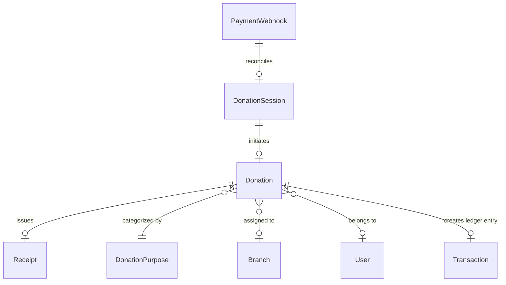

# Payment Database Schema & Entity Relationships

The KCM Payment subsystem relies on PostgreSQL (via Prisma ORM) as the authoritative single source of truth for all financial transactions.

## Entity Details

### 1. `DonationSession`
Tracks short-lived checkout and QR code sessions.
- `id` (String, Primary Key)
- `referenceNumber` (String, Unique) — Stores Razorpay Order ID (`order_...`)
- `amount` (Float)
- `currency` (String, default "INR")
- `status` (`PROCESSING`, `COMPLETED`, `EXPIRED`, `FAILED`)
- `expiresAt` (DateTime)
- `ipAddress` (String)

### 2. `Donation`
Authoritative record for all contributions.
- `id` (String, Primary Key)
- `userId` (String, optional Foreign Key)
- `amount` (Float)
- `currency` (String)
- `purpose` (String)
- `razorpayOrderId` (String, Indexed)
- `razorpayPaymentId` (String, Indexed)
- `razorpaySignature` (String)
- `donorName`, `donorEmail`, `donorPhone`, `panNumber`
- `status` (`PENDING`, `PROCESSING`, `COMPLETED`, `FAILED`, `EXPIRED`, `REFUNDED`)
- `amountVerified` (Boolean)
- `signatureVerified` (Boolean)
- `verifiedBy` (`WEBHOOK`, `RAZORPAY_API`, `CHECKOUT_VERIFY`)

### 3. `Receipt`
Immutable 80G tax receipt records.
- `id` (String, Primary Key)
- `receiptNumber` (String, Unique)
- `donationId` (String, Unique Foreign Key)
- `donorName`, `donorEmail`, `donorPan`
- `verificationCode` (String, Unique)
- `issuedAt` (DateTime)

### 4. `PaymentWebhook`
Tracks raw webhook deliveries for idempotency and forensic auditing.
- `id` (String, Primary Key)
- `webhookEventId` (String, Unique Index) — `SHA-256(orderId|paymentId|eventType)`
- `payload` (JSON)
- `signature` (String, masked)
- `status` (`PENDING`, `PROCESSED`, `DUPLICATE`, `FAILED`, `IGNORED`)
- `processedAt` (DateTime)
