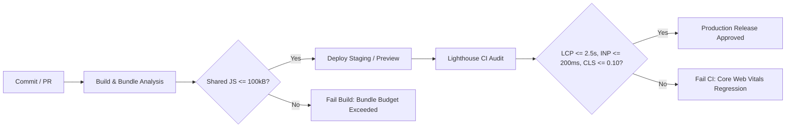

# KCM Church Application — Performance Budget Specification

**Project:** Kingdom of Christ Ministries (KCM) Church Application  
**Production URL:** [https://kcmchurch.vercel.app/](https://kcmchurch.vercel.app/)  
**Document Version:** 1.0.0  
**Enforcement Policy:** Automated CI/CD Quality Gate + Lighthouse Assertions  

---

## 1. Core Web Vitals Performance Budgets

| Metric | Target (Mobile) | Target (Desktop) | Critical Threshold (CI Fail) | Metric Class |
| :--- | :--- | :--- | :--- | :--- |
| **LCP (Largest Contentful Paint)** | $\le 2.20\text{ s}$ | $\le 1.20\text{ s}$ | $> 2.50\text{ s}$ | Core Web Vital (Loading) |
| **INP (Interaction to Next Paint)** | $\le 120\text{ ms}$ | $\le 50\text{ ms}$ | $> 200\text{ ms}$ | Core Web Vital (Responsiveness) |
| **CLS (Cumulative Layout Shift)** | $\le 0.05$ | $\le 0.02$ | $> 0.10$ | Core Web Vital (Visual Stability) |
| **FCP (First Contentful Paint)** | $\le 1.40\text{ s}$ | $\le 0.60\text{ s}$ | $> 1.80\text{ s}$ | Diagnostic Metric |
| **TTFB (Time to First Byte)** | $\le 120\text{ ms}$ | $\le 50\text{ ms}$ | $> 250\text{ ms}$ | Network / Server Metric |
| **TBT (Total Blocking Time)** | $\le 100\text{ ms}$ | $\le 30\text{ ms}$ | $> 200\text{ ms}$ | Main-thread metric |

---

## 2. Resource Transfer Size Budgets (Compressed / Over the Wire)

| Resource Category | Budget (Per Route) | Critical Limit | Optimization Strategy |
| :--- | :--- | :--- | :--- |
| **Shared Base JS Bundle** | $\le 100\text{ kB}$ | $> 150\text{ kB}$ | Next.js code splitting + dynamic imports |
| **Page-Specific JS** | $\le 40\text{ kB}$ | $> 80\text{ kB}$ | Tree-shaking, package import optimizations |
| **Total Route JS (Initial)** | $\le 150\text{ kB}$ | $> 250\text{ kB}$ | Dynamic component loading on interaction |
| **Critical CSS** | $\le 25\text{ kB}$ | $> 50\text{ kB}$ | Tailwind JIT minification, zero unused CSS |
| **Critical Fonts** | $\le 40\text{ kB}$ | $> 80\text{ kB}$ | WOFF2 format, `font-display: swap`, subsetting |
| **LCP Image Transfer** | $\le 120\text{ kB}$ | $> 200\text{ kB}$ | AVIF/WebP, responsive `srcset`, CDN compression |
| **Initial Total Page Transfer** | $\le 450\text{ kB}$ | $> 750\text{ kB}$ | Lazy-loading below-fold media |

---

## 3. Main-Thread & Runtime Execution Budgets

| Metric | Budget | Enforcement Mechanism |
| :--- | :--- | :--- |
| **Long Tasks (> 50ms)** | $0\text{ tasks}$ during initial load | Chrome DevTools Performance Trace |
| **Max Individual Task Duration** | $\le 35\text{ ms}$ | Web Vitals profiler |
| **Hydration CPU Time** | $\le 60\text{ ms}$ (Mobile) | React Concurrent Hydration profiling |
| **Frame Rate / Animation Budget** | $60\text{ fps}$ ($16.6\text{ms/frame}$) | Compositor-only (`transform`, `opacity`) CSS animations |

---

## 4. API & Database Query Latency Budgets

| Service / Layer | Target Latency (p95) | Maximum Budget | Architecture Pattern |
| :--- | :--- | :--- | :--- |
| **Edge Middleware Execution** | $\le 15\text{ ms}$ | $\le 30\text{ ms}$ | Web Crypto HMAC edge verification + static bypass |
| **Public CMS Reads (ISR)** | $\le 10\text{ ms}$ | $\le 30\text{ ms}$ | Vercel Edge Network ISR (60s revalidate) |
| **Authenticated API Endpoints** | $\le 60\text{ ms}$ | $\le 120\text{ ms}$ | Prisma indexed queries, connection pooling |
| **Neon PostgreSQL Queries** | $\le 25\text{ ms}$ | $\le 60\text{ ms}$ | Single-query composite joins, B-tree indexes |
| **Third-Party Payment Handlers** | $\le 250\text{ ms}$ | $\le 500\text{ ms}$ | Async webhook processing, non-blocking UI |

---

## 5. Media & Asset Budgets

| Asset Type | Dimension & Format Rule | Loading Strategy |
| :--- | :--- | :--- |
| **Hero Image / LCP Element** | Max width $1920\text{px}$ (Desktop), $750\text{px}$ (Mobile). Format: AVIF/WebP. | `fetchpriority="high"`, `loading="eager"`, explicit `width`/`height` |
| **Gallery Thumbnails** | Max width $640\text{px}$. Compressed WebP $\le 35\text{kB}$. | `loading="lazy"`, `decoding="async"`, IntersectionObserver chunking |
| **Video Previews / Posters** | WebP thumbnail poster $\le 45\text{kB}$. | No inline autoplay on mobile. Video players initialized on click. |
| **Brand SVGs & Icons** | Inline or optimized SVG $\le 5\text{kB}$. | Lucide icon tree-shaking via Next.js compiler |

---

## 6. Continuous Budget Enforcement Pipeline

