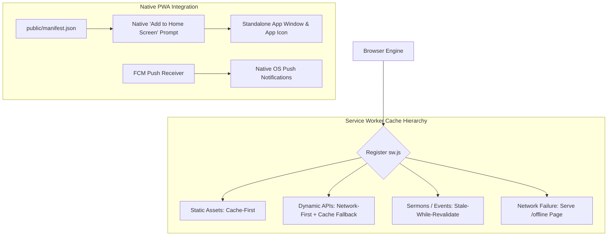

# Progressive Web Application (PWA) Architecture

## Purpose
This document specifies the Progressive Web Application (PWA) architecture, service worker lifecycle, offline caching policies, web app manifest configuration, and standalone installation experience for the Kingdom of Christ Ministries platform.

## Scope
Covers `frontend/public/sw.js`, `frontend/public/manifest.json`, offline fallback pages (`/offline`), and client-side service worker registration hooks.

## Status
> Status: Implemented

---

## 1. PWA Architecture & Capabilities

The KCM web application functions as a full-featured Progressive Web App (PWA), providing native-like desktop and mobile app experiences without requiring app store downloads:



---

## 2. Web App Manifest Specification (`public/manifest.json`)

```json
{
  "name": "Kingdom of Christ Ministries",
  "short_name": "KCM Church",
  "description": "Kingdom of Christ Ministries — Church & Outreach Portal",
  "start_url": "/",
  "display": "standalone",
  "background_color": "#0B0F19",
  "theme_color": "#D97706",
  "orientation": "portrait-primary",
  "icons": [
    {
      "src": "/logo.png",
      "sizes": "192x192",
      "type": "image/png",
      "purpose": "any maskable"
    },
    {
      "src": "/logo.png",
      "sizes": "512x512",
      "type": "image/png",
      "purpose": "any maskable"
    }
  ]
}
```

---

## 3. Service Worker Lifecycle & Caching Strategies (`public/sw.js`)

### 3.1 Install & Pre-cache Event
Pre-caches essential offline shell assets on initial service worker installation:
- `/offline` (Offline fallback status page)
- `/logo.png`, `/grid.svg`, `/favicon.ico`
- Core stylesheet bundles and font definitions.

### 3.2 Fetch Strategies
- **Static Assets (JS, CSS, Images, Fonts)**: `Cache-First` (Serves immediately from Cache Storage, falling back to network).
- **Dynamic Content (Upcoming Events, Sermon Lists)**: `Stale-While-Revalidate` (Serves cached data instantly while refreshing from network in background).
- **Transactional APIs (Donations, Auth Sync)**: `Network-Only` (Never serves stale financial or authentication states from cache).
- **Complete Disconnection**: When navigating to a non-cached HTML page while offline, the service worker intercepts the 504/offline error and returns the pre-cached `/offline` route.

---

## 4. Standalone Installation Experience

- **Android / Chrome / Edge**: Automatically presents the native installation prompt when PWA criteria are met (`HTTPS`, `manifest.json`, registered service worker).
- **iOS Safari**: Provides an interactive onboarding sheet prompting users to select `Share -> Add to Home Screen`.

---

## 5. Troubleshooting & Diagnostics

| Problem | Cause | Solution |
| :--- | :--- | :--- |
| Service worker not updating after new deployment | Service worker script cached by browser HTTP cache | Set HTTP header `Cache-Control: no-cache, no-store, must-revalidate` on `/sw.js`. |
| PWA not installable on Android Chrome | Missing maskable icon or manifest start_url error | Validate manifest using Chrome DevTools -> Application -> Manifest panel. |

---

## Security Considerations
- Service workers run strictly on secure origins (`HTTPS` or `localhost`).
- Sensitive member and financial mutations are never cached in public cache storage.

## Related Documentation
- [Offline-First.md](Offline-First.md) — Offline architecture.
- [Offline-Sync.md](Offline-Sync.md) — IndexedDB background synchronization.
- [Browser-Compatibility.md](Browser-Compatibility.md) — Multi-browser support.
