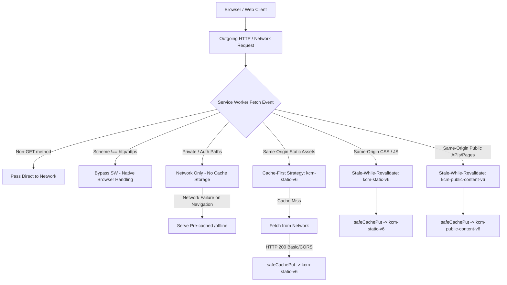

# Progressive Web Application (PWA) Architecture & Service Worker Specification

## Purpose
This document specifies the enterprise Progressive Web Application (PWA) architecture, Service Worker lifecycle, protocol scheme filtering, Cache API validation, web app manifest configuration, and cross-browser caching policies for the Kingdom of Christ Ministries platform.

## Scope
Covers:
- `frontend/public/sw.js` (Service Worker implementation)
- `frontend/public/manifest.json` (Web App Manifest)
- `frontend/components/providers/ServiceWorkerProvider.tsx` (Client registration & background sync)
- `frontend/app/offline/page.tsx` (Offline status & fallback route)
- HTTP caching headers in `next.config.js` and `vercel.json`

## Status
> Status: Production Hardened (v6)

---

## 1. PWA Architecture & Data Flow



---

## 2. Browser Extension & Protocol Scheme Protection

### 2.1 The Root Cause Problem
The W3C Cache API (`caches.open().then(cache => cache.put(request, response))`) strictly requires that a `Request` object's URL scheme must be either `http` or `https`. When a browser extension (such as MetaMask, 1Password, uBlock Origin, LastPass, or React DevTools) is installed in a client's browser, content scripts and extension assets inject requests whose URL scheme is:
```text
chrome-extension://<extension-id>/<script>.js
```
In previous service worker versions (`v5`), the fetch event intercepted any request matching `url.pathname.match(/\.(css|js)$/i)` without checking `url.protocol` or `url.origin`. When the service worker called:
```javascript
caches.open(STATIC_CACHE_NAME).then((cache) => cache.put(request, copy));
```
the browser threw an uncaught TypeError:
```text
Uncaught (in promise) TypeError: Failed to execute 'put' on 'Cache': Request scheme 'chrome-extension' is unsupported
    at sw.js:123
```

### 2.2 The Multi-Layered Resolution

1. **Top-Level Protocol Scheme Filter**:
   At the absolute entrance of the `fetch` event handler, all non-network schemes are immediately bypassed:
   ```javascript
   if (url.protocol !== "http:" && url.protocol !== "https:") {
     return; // Bypasses SW completely, allows browser extension to run unaffected
   }
   ```
   Unsupported schemes immediately bypassed:
   - `chrome-extension://`
   - `moz-extension://`
   - `safari-extension://`
   - `chrome://`
   - `devtools://`
   - `data:`
   - `blob:`
   - `file:`
   - `about:`

2. **Same-Origin Isolation for Scripts & Stylesheets**:
   Third-party scripts (Google Tag Manager, YouTube, Razorpay, Firebase) and extension content scripts are NEVER intercepted or stored in the application's static cache:
   ```javascript
   if (url.origin === self.location.origin && url.pathname.match(/\.(css|js)$/i)) { ... }
   ```

3. **`safeCachePut()` Defensive Cache Guard**:
   Every cache write is validated through `isCacheable()` prior to executing `cache.put()`:
   - Request method MUST be `GET`.
   - Protocol MUST be `http:` or `https:`.
   - Response status MUST be `200 OK`.
   - Response type MUST be `basic` or `cors` (never cache opaque `0` responses in static caches).
   - Any unexpected browser Cache API rejection is caught and logged in development rather than bubbling as an uncaught promise rejection.

---

## 3. Cache Versioning & Migration Lifecycle

| Cache Identifier | Cache Store Name | Retention Policy | Purge Trigger |
| :--- | :--- | :--- | :--- |
| Core Static Shell | `kcm-static-v6` | Cache-First / SWR | Activate event of `v7+` |
| Public Content | `kcm-public-content-v6` | Stale-While-Revalidate | Activate event of `v7+` |
| Legacy v5 Caches | `kcm-static-v5`, `kcm-public-content-v5` | Purged on SW activate | Automatic on SW v6 activation |

### Safe Cache Pruning on Activate
To avoid clearing caches created by other applications running on the same domain or local development ports, the activate event selectively targets only caches matching the application's prefix:
```javascript
self.addEventListener("activate", (event) => {
  event.waitUntil(
    caches.keys().then((cacheNames) =>
      Promise.all(
        cacheNames.map((name) => {
          if (name.startsWith("kcm-") && !ALLOWED_CACHES.includes(name)) {
            console.log("[SW] Purging outdated cache:", name);
            return caches.delete(name);
          }
        })
      )
    ).then(() => self.clients.claim())
  );
});
```

---

## 4. HTTP Headers for Service Worker Delivery

To prevent browsers from sticking to stale copies of `sw.js` in their HTTP disk cache, both Next.js and Vercel are configured with strict no-cache headers:

```javascript
// next.config.js & vercel.json
{
  source: '/sw.js',
  headers: [
    { key: 'Cache-Control', value: 'no-cache, no-store, must-revalidate' },
    { key: 'Content-Type', value: 'application/javascript; charset=utf-8' }
  ]
}
```

---

## 5. Automated Verification & Testing

- **Scheme Validation Tests**: `frontend/tests/pwa-service-worker.spec.ts` executes 30 tests across Chromium, Firefox, WebKit, Mobile Chrome, and Mobile Safari.
- **Production Smoke Tests**: `frontend/tests/smoke/production-smoke.spec.ts` verifies `/sw.js` serves HTTP 200, checks protocol guards, and monitors for zero `chrome-extension` console errors.
