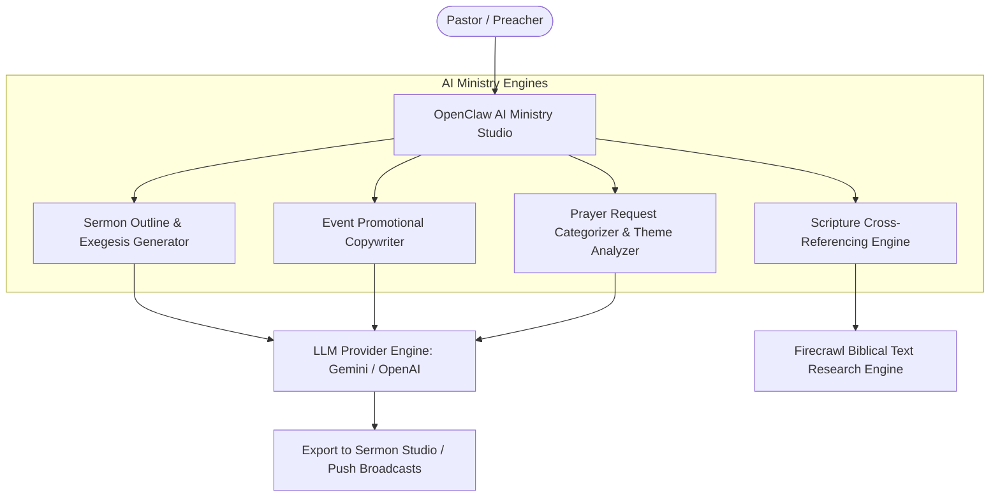

# Pastor Portal & AI Ministry Studio Specification

## Purpose
This document provides the technical specification for the Pastor Portal, the comprehensive ministry management platform empowering pastoral staff to manage sermon publications, shepherd the congregation, review prayer requests, analyze church attendance trends, and leverage AI ministry tools.

## Scope
Covers frontend pages in `frontend/app/pastor/`, pastoral API handlers in `frontend/app/api/pastor/`, and the OpenClaw AI Ministry Orchestrator (`/pastor/openclaw-orchestrator`).

## Status
> Status: Implemented

---

## 1. Module Overview & Routes

| Route | Purpose | Permissions | Primary Components |
| :--- | :--- | :--- | :--- |
| `/pastor` | Pastoral Command Dashboard | `PASTOR`, `ADMIN` | Ministry stats, pending prayer counter, upcoming services |
| `/pastor/sermons` | Sermon Management & Publishing Studio | `PASTOR`, `ADMIN` | Sermon editor, video upload modal, scripture tagger |
| `/pastor/events` | Branch Event Scheduling & Capacity | `PASTOR`, `ADMIN` | Event creator, seat limits, registration rosters |
| `/pastor/members` | Church Membership Directory | `PASTOR`, `ADMIN` | Member roster, baptism records, branch filtering |
| `/pastor/calendar` | Ministry & Visitation Calendar | `PASTOR`, `ADMIN` | Pastoral appointments, counseling slots, branch visits |
| `/pastor/announcements` | Church-wide Push & SMS Broadcasts | `PASTOR`, `ADMIN` | FCM push composer, SMS dispatcher, audience filter |
| `/pastor/reports/attendance`| Service Attendance Analytics | `PASTOR`, `ADMIN` | Attendance trend charts, branch comparison views |
| `/pastor/reports/finance` | Tithe & Offering Trend Reports | `PASTOR`, `ADMIN` | Giving charts, fund breakdowns |
| `/pastor/openclaw-orchestrator`| OpenClaw AI Ministry Assistant | `PASTOR`, `ADMIN` | AI sermon research, scripture assistant, event copy |

---

## 2. OpenClaw AI Ministry Orchestrator

The Pastor Portal includes the **OpenClaw AI Orchestrator** powered by Google Generative AI (Gemini 1.5 Pro / Flash) and OpenAI embeddings:

---

## 3. Sermon Studio & Media Publishing

1. **Media Upload**: Pastors upload video recordings (MP4) or audio recordings (MP3) directly to Cloudinary (`church-platform/sermons`).
2. **Metadata & Scripture**: Pastors assign scripture references (e.g. "Romans 8:28-39"), sermon series, and detailed sermon study notes.
3. **Semantic Indexing**: Background workers generate text embeddings for sermon study notes and publish vectors to Pinecone for natural language semantic search.

---

## 4. Prayer Request Shepherding Pipeline

- Pastors review confidential and public prayer requests submitted by members.
- Pastors can update prayer statuses (`UNDER_PRAYER`, `ANSWERED`), attach private pastoral encouragement notes, and trigger personalized notification updates to the member.

---

## 5. Associated API Endpoints

- `GET /api/pastor/sermons` — Retrieves sermon catalogue for management.
- `POST /api/pastor/sermons` — Creates and publishes a new sermon record.
- `GET /api/pastor/prayer-requests` — Retrieves all prayer requests including confidential submissions.
- `PUT /api/pastor/prayer-requests` — Updates prayer status and pastoral notes.
- `POST /api/openclaw/execute` — Executes AI prompt orchestration chains.
- `POST /api/pastor/notifications` — Dispatches church-wide push and SMS announcements.

---

## 6. Troubleshooting & Diagnostics

| Problem | Cause | Solution |
| :--- | :--- | :--- |
| OpenClaw AI returns rate limit error | Google Gemini or OpenAI API quota exhausted | Ensure multiple fallback provider keys (`GEMINI_API_KEY`, `OPENAI_API_KEY`, `OPENROUTER_API_KEY`) are populated in `.env`. |
| Sermon video upload times out on slow connection | Large file (>100MB) uploaded via standard HTTP form | Pastors can provide external YouTube/Vimeo embed links as an alternative to direct video uploads. |

---

## Security Considerations
- Access to confidential prayer requests and pastoral notes is restricted exclusively to `PASTOR` and `ADMIN` roles.
- AI prompts and generated outputs do not expose member PII to third-party model training datasets.

## Related Documentation
- [Authorization-RBAC.md](Authorization-RBAC.md) — Pastoral permissions.
- [Sermons.md](Sermons.md) — Sermon catalogue and streaming architecture.
- [Prayer-System.md](Prayer-System.md) — Prayer request workflow.
