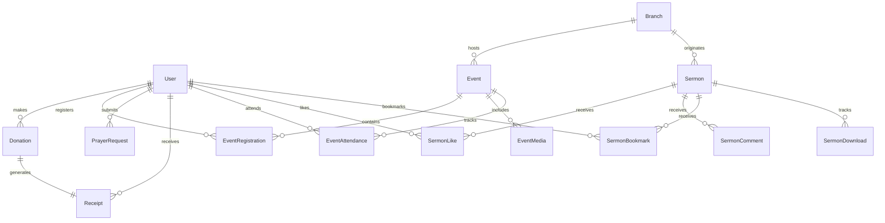

# PostgreSQL & Prisma Data Architecture

## Purpose
This document provides the definitive architectural and operational specification for PostgreSQL, the authoritative relational database engine powering the Kingdom of Christ Ministries platform, configured via Prisma ORM and deployed on Kubernetes via CloudNativePG.

## Scope
Covers database models, relational schema (`database/schema.prisma`), indexing strategies, connection pooling with PgBouncer, migration lifecycles, and performance tuning.

## Status
> Status: Implemented

---

## 1. Relational Schema Architecture

The PostgreSQL schema is managed declaratively via Prisma (`database/schema.prisma`). All table names, foreign keys, and indexes are explicitly mapped for maximum performance and strict data integrity.

### 1.1 Core Entity Relationship Overview



---

## 2. Core Relational Models

### 2.1 User / Member Model (`members` table)
```prisma
model User {
  id                 String              @id @default(cuid())
  name               String
  email              String              @unique
  emailVerified      DateTime?
  image              String?
  profilePublicId    String?
  password           String
  role               UserRole            @default(MEMBER)
  phone              String?
  address            String?
  createdAt          DateTime            @default(now())
  updatedAt          DateTime            @updatedAt
  donations          Donation[]
  eventRegistrations EventRegistration[]
  prayerRequests     PrayerRequest[]
  receipts           Receipt[]
  deviceTokens       DeviceToken[]
  eventAttendance    EventAttendance[]
  // ... Additional relational bindings
  @@map("members")
}
```

### 2.2 Event Model (`events` table)
Tracks church services, conferences, youth camps, and branch gatherings with seat limits, registration windows, and Cloudinary banner assets.
- **Keys & Unique Fields**: `id` (CUID), `slug` (unique URI slug).
- **Seat Allocation**: `registrationLimit` (Int), `remainingSeats` (Int), updated within atomic database transactions.
- **Categorization**: Service, Conference, Youth, Outreach, Prayer Night.

### 2.3 Donation & Receipt Models (`donations`, `receipts` tables)
- **Donation**: Tracks `amount`, `currency` (INR / USD), `purpose` (TITHE, OFFERING, BUILDING_FUND, MISSIONS, NGO), `paymentMethod` (RAZORPAY, STRIPE, UPI, CASH), `status` (PENDING, COMPLETED, FAILED, REFUNDED), and gateway transaction IDs.
- **Receipt**: Stores 80G tax receipt numbers (`receiptNumber`), generation timestamp, donor PAN/Tax ID, and generated PDF download URL.

### 2.4 Sermon Model (`sermons` table)
Stores sermon titles, speakers, scriptures, series IDs, video streaming URLs, audio download URLs, and Pinecone vector embedding IDs for semantic search.

---

## 3. Database Indexes & Query Optimization

| Table | Index Columns | Index Type | Optimization Target |
| :--- | :--- | :--- | :--- |
| `members` | `email` | UNIQUE B-Tree | Instant user lookup during authentication |
| `events` | `slug` | UNIQUE B-Tree | Fast SEO routing for event details (`/events/[slug]`) |
| `events` | `date, status, isPublished` | Composite B-Tree | Rapid filtering of upcoming public events on homepage |
| `sermons` | `date, speaker, seriesId` | Composite B-Tree | Fast catalog filtering and sorting by recency |
| `donations` | `userId, createdAt, status` | Composite B-Tree | Instant loading of member giving statements |
| `event_registrations`| `eventId, userId` | UNIQUE Composite | Prevents double-registration by the same member |
| `event_attendance` | `eventId, userId, date` | Composite B-Tree | Check-in verification and unique daily attendance tracking |

---

## 4. Connection Pooling with PgBouncer

In high-concurrency production environments on Kubernetes, direct connections to PostgreSQL can cause connection exhaustion. **PgBouncer** is deployed as an intermediary:

- **Pooling Mode**: `transaction` (Connection returned to pool immediately after transaction completion).
- **Default Pool Size**: `50` connections per database user.
- **Max Client Connections**: `1000` concurrent frontend/backend pods.
- **Server Reset Query**: `DISCARD ALL` to prevent session state leakage between requests.

---

## 5. Migrations & Seeding Operations

### 5.1 Prisma Migration Workflow
```bash
# Push schema changes to development database
npx prisma db push

# Generate updated Prisma Client TypeScript definitions
npx prisma generate

# Create and apply production SQL migration
npx prisma migrate dev --name <migration_name>
```

### 5.2 Database Seeding
To populate initial administrative users, default branches (Shapur Nagar, Subhash Nagar, Bahadurpally), and sample sermons:
```bash
npm run db:seed
```

---

## 6. Failure Handling & Troubleshooting

| Symptom | Probable Cause | Resolution |
| :--- | :--- | :--- |
| `P2002: Unique constraint failed` | Attempting to insert duplicate email or event slug | Return 409 Conflict to client with clear input validation error. |
| `P2025: Record to update not found` | Attempting to update a deleted or non-existent entity | Verify entity ID existence prior to running update query. |
| `Can't reach database server at 5432` | Pod network issue or CloudNativePG failover in progress | Check CloudNativePG cluster status via `kubectl get cluster kcm-db-cluster -n kcm-system`. |
| Connection Pool Exhaustion | Unclosed direct Prisma connections without PgBouncer | Ensure all queries use the singleton Prisma client instance in `lib/db.ts`. |

---

## Security Considerations
- Credential hashes are stored as bcrypt strings (`$2a$12$...`) and never returned in public API payloads.
- Row-level isolation ensures members can only query their own donations and private prayer requests.

## Related Documentation
- [Database-Architecture.md](Database-Architecture.md) — Multi-database topology.
- [CloudNativePG.md](CloudNativePG.md) — CloudNativePG cluster manifests and failover.
- [Prisma-CNPG.md](platform/database/docs/Prisma.md) — Platform Prisma integration.
