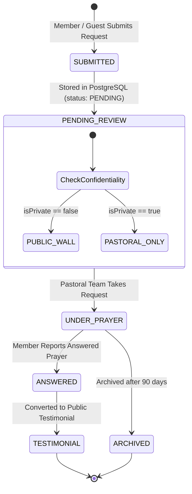

# Prayer Request & Intercession System

## Purpose
This document provides the functional and technical specification for the Prayer Request & Intercession System, covering prayer submission, confidentiality tiers, pastoral review workflows, and answered prayer testimonials across the Kingdom of Christ Ministries platform.

## Scope
Covers prayer submission routes (`/prayer`, `/member/prayers`), pastoral intercession consoles (`/pastor/main/prayer-requests`), API handlers, and notification dispatchers.

## Status
> Status: Implemented

---

## 1. Prayer Request Workflow & State Machine



---

## 2. Confidentiality Tiers & Privacy Controls

1. **Public Prayer Wall**: General prayers for community needs, health, and family blessings. Visible to logged-in church members.
2. **Confidential Pastoral Prayer**: Sensitive personal requests (family counseling, financial struggles, medical emergencies) marked with `isPrivate: true`. Restricted strictly to ordained pastoral staff.
3. **Anonymous Submission**: Members can submit requests without exposing their name to the general congregation.

---

## 3. Database Schema (`prayer_requests` table)

```prisma
model PrayerRequest {
  id            String       @id @default(cuid())
  userId        String?      @map("user_id")
  title         String
  request       String       @db.Text
  isPrivate     Boolean      @default(false) @map("is_private")
  isAnonymous   Boolean      @default(false) @map("is_anonymous")
  status        PrayerStatus @default(PENDING)
  pastoralNotes String?      @map("pastoral_notes") @db.Text
  prayedBy      String?      @map("prayed_by")
  createdAt     DateTime     @default(now()) @map("created_at")
  updatedAt     DateTime     @updatedAt
  user          User?        @relation(fields: [userId], references: [id], onDelete: SetNull)

  @@index([status, createdAt])
  @@map("prayer_requests")
}
```

---

## 4. Pastoral Updates & Automated Feedback

When a pastor marks a prayer request as `UNDER_PRAYER` or attaches an encouraging scripture note:
1. The update is persisted in PostgreSQL.
2. An automated push notification (FCM) or SMS is dispatched to the member: *"Pastor David and the KCM Intercession Team are praying for your request."*
3. The member's dashboard (`/member/prayers`) updates in real-time.

---

## 5. Associated API Endpoints

- `POST /prayer` — Public/Guest prayer submission handler.
- `GET /api/member/prayers` — Retrieves prayers submitted by the authenticated user.
- `POST /api/member/prayers` — Submits a prayer from the authenticated member portal.
- `GET /api/pastor/prayer-requests` — Retrieves all church-wide prayers for pastoral intercession.
- `PUT /api/pastor/prayer-requests` — Updates status (`UNDER_PRAYER`, `ANSWERED`) and pastoral notes.

---

## 6. Troubleshooting & Diagnostics

| Problem | Cause | Solution |
| :--- | :--- | :--- |
| Member's private prayer visible on public feed | `isPrivate` flag not set properly during form submit | Server defaults `isPrivate: true` if request contains sensitive keywords or if user checks confidentiality box. |
| Member did not receive "Prayed For" notification | Member disabled SMS/Push notifications in preferences | Check member's notification preferences before attempting dispatch. |

---

## Security Considerations
- Confidential prayer text is strictly excluded from public API responses.
- Database access to confidential prayers requires `role: PASTOR` or `ADMIN`.

## Related Documentation
- [Pastor-Portal.md](Pastor-Portal.md) — Pastoral review interface.
- [Member-Portal.md](Member-Portal.md) — Member prayer tracker.
- [Privacy.md](Privacy.md) — Data confidentiality standards.
