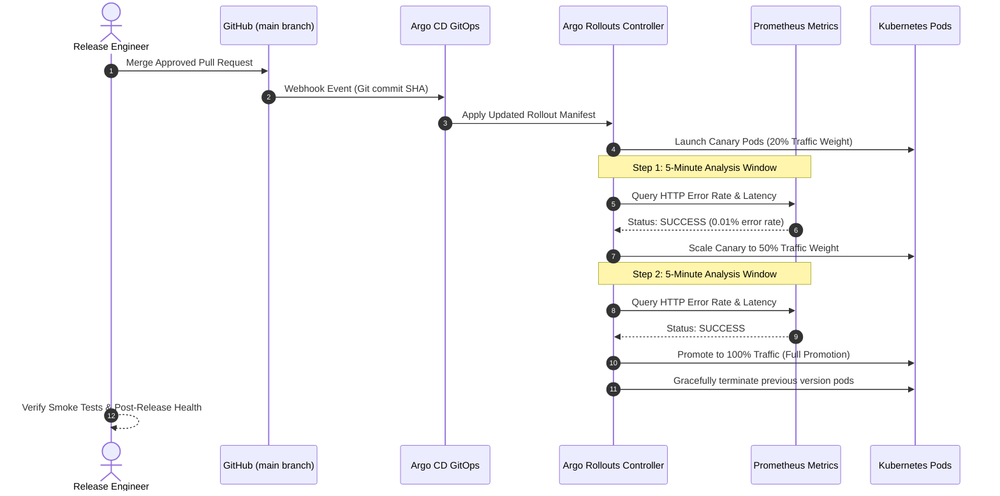

# Production Release Runbook & Zero-Downtime Deployment

## Purpose
This document provides the standard operating procedure (SOP), zero-downtime release runbook, safety checklist, and rollback execution guidelines for production deployments across the Kingdom of Christ Ministries platform.

## Scope
Covers production releases, database migration safety, Argo Rollouts progressive canary steps, and operational health validation.

## Status
> Status: Implemented

---

## 1. Pre-Deployment Safety Checklist

Prior to approving any production release:
- [x] **CI/CD Pipeline**: All tests (Unit, E2E, RBAC, a11y) passed on `main` branch.
- [x] **Security Scans**: Trivy vulnerability scan reports zero unpatched CRITICAL CVEs.
- [x] **Database Migrations**: Any schema migrations are strictly backwards-compatible (additive columns/tables only).
- [x] **Database Backup**: Verified recent CloudNativePG WAL archive in S3 and successful Velero nightly backup.
- [x] **Off-Peak Window**: Release scheduled outside of live Sunday worship service streaming hours (09:00 - 13:00 IST).

---

## 2. Zero-Downtime Deployment Execution



---

## 3. Backward-Compatible Database Migrations

To ensure zero downtime when running migrations alongside running old/new pod versions simultaneously:
1. **Phase 1 (Expand)**: Add new nullable columns or tables in Prisma schema. Run `npx prisma migrate deploy`.
2. **Phase 2 (Deploy Code)**: Deploy application code that writes to both old and new fields.
3. **Phase 3 (Contract)**: After full release promotion, remove obsolete columns in a follow-up release.

---

## 4. Rollback & Instant Abort Procedures

If error rates spike, payments fail, or unexpected regressions occur during the canary rollout:

### Automated Rollback Trigger
Argo Rollouts automatically aborts the deployment and shifts 100% of traffic back to the stable replica if the HTTP 5xx error rate exceeds **1%**.

### Manual Rollback Execution
To manually abort and roll back immediately:
```bash
# Instantly abort active rollout and return to stable replica
kubectl argo rollouts abort kcm-frontend-rollout -n kcm-system

# Roll back to the previous stable release revision
kubectl argo rollouts undo kcm-frontend-rollout -n kcm-system
```

---

## 5. Post-Deployment Smoke Verification

Execute the automated production smoke test suite immediately following release:

```bash
# Execute production smoke tests
npm run test:smoke -w frontend
```

Smoke test assertions:
- `GET /` returns HTTP 200 with complete HTML payload.
- `GET /api/health` returns operational JSON payload.
- `GET /api/ready` confirms database and Redis readiness.
- `GET /sermons` and `GET /events` return valid data arrays.

---

## Security Considerations
- Deployment triggers require two-factor authenticated GitHub authorizations.
- Production release logs and deployment metadata are archived in MongoDB audit trails.

## Related Documentation
- [Deployment.md](Deployment.md) — Multi-environment setup.
- [ArgoRollouts.md](ArgoRollouts.md) — Canary analysis configuration.
- [Troubleshooting.md](Troubleshooting.md) — Production issue runbooks.
