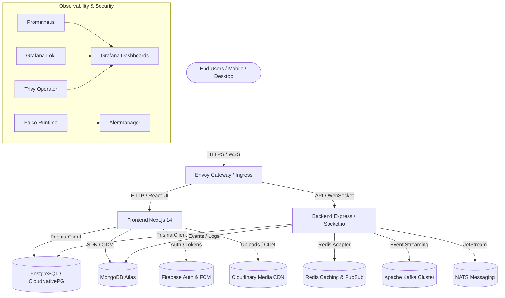

# Kingdom of Christ Ministries (KCM Church) — Enterprise Documentation Index

Welcome to the official, authoritative architectural and operational documentation repository for the **Kingdom of Christ Ministries (KCM Church)** enterprise web application and infrastructure platform.

---

## System Overview & Architecture Summary

The Kingdom of Christ Ministries platform is a multi-tier, hybrid-cloud, enterprise-grade church management and community outreach system. Built with Next.js 14 App Router, Express/Socket.io real-time engine, PostgreSQL (CloudNativePG), MongoDB Atlas, Firebase Authentication & FCM, Cloudinary Media CDN, and containerized on Kubernetes with Envoy Gateway, Argo CD, Prometheus, Grafana, Loki, Falco, and Trivy.

---

## Complete Documentation Index

### 1. Core Architecture & System Overview
- **[Architecture.md](Architecture.md)**: End-to-end system architecture, component breakdown, data flow, and runtime topology.
- **[Architecture-Diagrams.md](Architecture-Diagrams.md)**: 25+ visual Mermaid sequence, system, and lifecycle diagrams.
- **[Requirements.md](Requirements.md)**: Functional and non-functional requirements, SLAs, SLOs, and compliance constraints.
- **[Technology-Stack.md](Technology-Stack.md)**: Complete catalog of languages, runtimes, frameworks, databases, and DevOps tools.
- **[Project-Structure.md](Project-Structure.md)**: Monorepo layout, file directory hierarchy, and module boundaries.
- **[Routing.md](Routing.md)**: Full routing table for Public, Auth, Member, Admin, Pastor, Event Manager, and NGO portals.

### 2. Databases & Persistence
- **[Database-Architecture.md](Database-Architecture.md)**: Multi-database strategy, data ownership, consistency models, and CQRS patterns.
- **[PostgreSQL.md](PostgreSQL.md)**: Authoritative relational database, Prisma schema, indexing, PgBouncer, and migrations.
- **[MongoDB-Atlas.md](MongoDB-Atlas.md)**: Event audit trails, system metrics, notification histories, and document collections.
- **[Firebase.md](Firebase.md)**: Firebase Auth, Google Sign-In verification, Firebase Cloud Messaging (FCM), and Firestore offline support.

### 3. Media & Assets
- **[Cloudinary.md](Cloudinary.md)**: Cloudinary SDK setup, upload presets, dynamic responsive transformations, and media deletion.
- **[Media-Management.md](Media-Management.md)**: End-to-end asset upload pipeline, background verification loops, CDN delivery, and storage tiering.

### 4. Authentication, Authorization & Security
- **[Authentication.md](Authentication.md)**: Credentials login, Google OAuth 2.0, Firebase Admin session token validation, and session cookies.
- **[Authorization-RBAC.md](Authorization-RBAC.md)**: Role-based access control matrix (MEMBER, PASTOR, ADMIN, EVENT_MANAGER, VOLUNTEER).
- **[Security.md](Security.md)**: Threat modeling, defense-in-depth, input sanitization, rate limiting, and CORS policies.
- **[Privacy.md](Privacy.md)**: Member data privacy, PII protection, GDPR / DPDP adherence, and data retention policies.
- **[Runtime-Security.md](Runtime-Security.md)**: Kubernetes runtime security, Pod Security Standards, and kernel syscall monitoring.
- **[Falco.md](Falco.md)**: Falco rules engine, runtime threat detection, alert handling, and remediation runbooks.
- **[Trivy.md](Trivy.md)**: Container image scanning, IaC scanning, vulnerability triage, and SBOM generation (CycloneDX/SPDX).
- **[Security-Checklist.md](Security-Checklist.md)**: Production security audit matrix and operational verification steps.

### 5. Frontend & UI/UX Experience
- **[Frontend.md](Frontend.md)**: Next.js 14 App Router, React 18, SWR / React Query, Tailwind CSS, and Radix UI.
- **[UI-UX.md](UI-UX.md)**: Design system, color palettes, typography, Framer Motion animations, and micro-interactions.
- **[Responsive-Design.md](Responsive-Design.md)**: Mobile-first viewport guidelines, breakpoint matrix, and fluid layouts.
- **[Browser-Compatibility.md](Browser-Compatibility.md)**: Cross-browser matrix (Chrome, Safari, Firefox, Edge, Samsung Internet, iOS, Android).
- **[Performance.md](Performance.md)**: Core Web Vitals optimization, image compression, bundle splitting, and lighthouse metrics.
- **[SEO.md](SEO.md)**: OpenGraph tags, JSON-LD structured data, metadata API, sitemaps, and robots.txt.
- **[Accessibility.md](Accessibility.md)**: WCAG 2.1 AA conformance, ARIA landmark tags, contrast ratios, and keyboard navigation.

### 6. PWA & Offline Architecture
- **[PWA.md](PWA.md)**: Service worker lifecycle, manifest.json, caching strategies, and install prompts.
- **[Offline-First.md](Offline-First.md)**: Offline data availability, background sync, and cache hierarchies.
- **[Offline-Sync.md](Offline-Sync.md)**: IndexedDB transaction queues, sync manager, and conflict resolution rules.

### 7. Application Modules
- **[Admin-Portal.md](Admin-Portal.md)**: Management console, member administration, health monitors, and audit logs.
- **[Member-Portal.md](Member-Portal.md)**: Member dashboard, profiles, personal donation records, and prayer requests.
- **[Pastor-Portal.md](Pastor-Portal.md)**: Pastoral management, sermon scheduling, ministry groups, and OpenClaw AI orchestrator.
- **[Event-Manager.md](Event-Manager.md)**: Event creation, registration limits, check-in QR codes, and post-event reporting.
- **[NGO-Platform.md](NGO-Platform.md)**: Community outreach, NGO project campaigns, volunteer management, and gallery.
- **[Finance.md](Finance.md)**: Financial oversight, donation reconciliation, budget analytics, and tax receipt exports.
- **[Attendance.md](Attendance.md)**: Service and event check-in records, QR scanning, and attendance trend analytics.
- **[Prayer-System.md](Prayer-System.md)**: Prayer request pipeline, pastoral status tracking, and private/public moderation.
- **[Sermons.md](Sermons.md)**: Sermon audio/video streaming, notes, series tagging, and Pinecone semantic search.
- **[Events.md](Events.md)**: Public event listings, multi-branch service schedule, and calendar synchronization.
- **[Membership.md](Membership.md)**: Member onboarding, baptism/discipleship records, and branch assignments.
- **[Donations.md](Donations.md)**: Razorpay / Stripe checkout, UPI dynamic QR generation, and automated PDF receipts.

### 8. API Reference
- **[API-Documentation.md](API-Documentation.md)**: Full REST & WebSocket API specification, parameters, payloads, responses, and errors.

### 9. DevOps & Cloud Infrastructure
- **[Docker.md](Docker.md)**: Multi-stage Dockerfile, docker-compose environments, and container hardening.
- **[Kubernetes.md](Kubernetes.md)**: Cluster architecture, namespaces, manifests, PodDisruptionBudgets, and HPA.
- **[Helm.md](Helm.md)**: Helm chart hierarchy, umbrella charts, values override schemas, and packaging.
- **[OpenTofu.md](OpenTofu.md)**: Infrastructure as Code (IaC) modules, provider setups, and state management.
- **[ArgoCD.md](ArgoCD.md)**: GitOps repository synchronization, ApplicationSets, and auto-sync policies.
- **[ArgoRollouts.md](ArgoRollouts.md)**: Progressive delivery, canary analysis, automated rollback triggers, and blue-green deployments.
- **[Envoy-Gateway.md](Envoy-Gateway.md)**: Kubernetes Gateway API, HTTPRoutes, TLS termination, rate limiting, and security policies.
- **[Istio.md](Istio.md)**: Service mesh configuration, mutual TLS (mTLS), traffic routing, and telemetry.
- **[Longhorn.md](Longhorn.md)**: Distributed persistent block storage, StorageClasses, snapshots, and volume backups.
- **[Velero.md](Velero.md)**: Cluster-wide backup schedules, object storage targets, and disaster recovery restoration.
- **[CloudNativePG.md](CloudNativePG.md)**: Highly available PostgreSQL operator, automated failover, and WAL continuous archiving.

### 10. CI/CD & Deployment Operations
- **[CI-CD.md](CI-CD.md)**: GitHub Actions workflow pipelines, linting, tests, container builds, and security scans.
- **[GitOps.md](GitOps.md)**: GitOps deployment model, branch workflows, and declarative cluster convergence.
- **[Deployment.md](Deployment.md)**: Environments guide (Local, Staging, Production) and release lifecycles.
- **[Production-Deployment.md](Production-Deployment.md)**: Production release runbook, zero-downtime execution, and validation checklists.

### 11. Monitoring, Observability & Health
- **[Monitoring.md](Monitoring.md)**: Prometheus metric scrapers, Alertmanager routing, and alerting rule definitions.
- **[Prometheus.md](Prometheus.md)**: Metric types, scrape configurations, PodMonitors, and ServiceMonitors.
- **[Grafana.md](Grafana.md)**: Pre-built dashboards (Backend, PostgreSQL, Redis, Kafka, NATS, Longhorn, Trivy, Falco).
- **[Observability.md](Observability.md)**: Unified telemetry (Metrics, Logs, Distributed Traces via Jaeger/OTel).
- **[Health-Checks.md](Health-Checks.md)**: Liveness, readiness, and startup probe specifications (`/api/health`, `/api/ready`, `/api/live`).

### 12. Logging
- **[Logging.md](Logging.md)**: Structured JSON logging standards, log levels, correlation IDs, and PII masking.
- **[Loki.md](Loki.md)**: Grafana Loki architecture, Promtail/Fluentbit collectors, retention policies, and LogQL queries.

### 13. Messaging & Event-Driven Systems
- **[Messaging.md](Messaging.md)**: Event-driven architecture, decoupled queues, event schemas, and idempotency patterns.
- **[Kafka.md](Kafka.md)**: Apache Kafka cluster setup, topic configurations, producer/consumer services, and DLQ handling.
- **[NATS.md](NATS.md)**: NATS JetStream messaging, subject hierarchy, KV stores, and stream persistence.

### 14. Backup, Disaster Recovery & Incident Response
- **[Backup-Restore.md](Backup-Restore.md)**: Database backups, Longhorn recurring jobs, Velero schedules, and restore procedures.
- **[Disaster-Recovery.md](Disaster-Recovery.md)**: RPO/RTO SLAs, multi-failure recovery strategies, and disaster drills.
- **[Incident-Response.md](Incident-Response.md)**: Severity classification (SEV-1 to SEV-4), escalation matrices, and post-mortem templates.

### 15. Configuration & Secrets
- **[Environment-Variables.md](Environment-Variables.md)**: Complete parameter reference table across frontend, backend, platform, and external APIs.
- **[Configuration.md](Configuration.md)**: Multi-environment configuration layering and runtime parameter injection.
- **[Secrets-Management.md](Secrets-Management.md)**: Kubernetes Secrets, base64 encoding standards, and secure key distribution.

### 16. Testing & Quality Assurance
- **[Testing.md](Testing.md)**: Unit tests, integration tests, Playwright E2E suites, mobile responsiveness, and a11y tests.
- **[Test-Strategy.md](Test-Strategy.md)**: Testing pyramid, coverage requirements, automated gates, and regression testing.

### 17. Operational Runbooks & Troubleshooting
- **[Troubleshooting.md](Troubleshooting.md)**: Symptom-to-solution operational runbooks for databases, auth, Kubernetes, media, and networking.

### 18. Practical Getting Started Guide
- **[try.md](try.md)**: Practical end-to-end guide to bootstrap, install, configure, build, run, and verify the entire system.

---

## Documentation Conventions & Status Key

Throughout these documents, system features and infrastructure components are labeled with their exact repository implementation state:

- `Status: Implemented` — Fully written, integrated, and verified in active code.
- `Status: Partially Implemented` — Core structures exist with ongoing extension or optional integration hooks.
- `Status: Planned / Not Yet Implemented` — Architecture specified for future iterations; stubs or scaffolding documented.

For any questions or updates regarding this documentation system, refer to the [DevOps and Engineering Architecture Team](file:///c:/K.C.M-Portal/platform).
