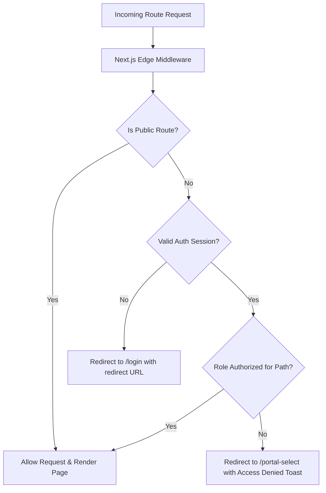

# Application Routing Specification

## Purpose
This document provides an exhaustive, authoritative reference of all frontend user-facing routes and pages in the Kingdom of Christ Ministries platform, categorized by security boundaries and role requirements.

## Scope
Covers all Next.js 14 App Router paths within `frontend/app/`.

## Status
> Status: Implemented

---

## 1. Complete Routing Table

| Route | Purpose | Authentication | Role | Status |
| :--- | :--- | :--- | :--- | :--- |
| `/` | Church Landing Page & Hero Portal | Public | None | `Implemented` |
| `/about` | Church History, Mission, Pastoral Vision | Public | None | `Implemented` |
| `/events` | Public Events Calendar & Upcoming Services | Public | None | `Implemented` |
| `/events/[slug]` | Individual Event Details & Public Registration | Public | None | `Implemented` |
| `/sermons` | Sermon Catalog & Audio/Video Streaming | Public | None | `Implemented` |
| `/sermons/[id]` | Sermon Detail, Scripture Notes & Player | Public | None | `Implemented` |
| `/give` | Online Offerings, Tithes & Dynamic UPI QR | Public | None | `Implemented` |
| `/give/receipt/[donationId]` | Public Tax Receipt Verification & Download | Public | None | `Implemented` |
| `/prayer` | Prayer Request Submission Form | Public | None | `Implemented` |
| `/locations` | Branch Locations Directory (Shapur, Subhash, Bahadurpally) | Public | None | `Implemented` |
| `/locations/[slug]` | Branch Details, Maps & Service Times | Public | None | `Implemented` |
| `/get-involved` | Volunteer & Ministry Involvement Overview | Public | None | `Implemented` |
| `/get-involved/volunteer` | Volunteer Application Form | Public | None | `Implemented` |
| `/get-involved/small-groups` | Small Groups Directory & Signup | Public | None | `Implemented` |
| `/get-involved/serve` | Ministry Service Opportunities | Public | None | `Implemented` |
| `/gallery` | Church Media, Photo & Video Gallery | Public | None | `Implemented` |
| `/resources` | Spiritual Growth & Study Resources | Public | None | `Implemented` |
| `/resources/bible-study` | Bible Study Notes & Curriculum Guides | Public | None | `Implemented` |
| `/resources/media` | Downloadable Media, Wallpapers & Audio | Public | None | `Implemented` |
| `/membership` | Membership Application & Information | Public | None | `Implemented` |
| `/privacy` | Privacy Policy & Data Handling Terms | Public | None | `Implemented` |
| `/terms` | Terms of Service & Online Giving Policy | Public | None | `Implemented` |
| `/offline` | PWA Offline Fallback Status Page | Public | None | `Implemented` |
| `/login` | Universal Member / Staff Login Page | Auth | None | `Implemented` |
| `/register` | New Member Registration Page | Auth | None | `Implemented` |
| `/forgot-password` | Password Reset Request Page | Auth | None | `Implemented` |
| `/portal-select` | Multi-role Portal Redirection Hub | Authenticated | Any | `Implemented` |
| `/member` | Member Overview Dashboard | Authenticated | `MEMBER` | `Implemented` |
| `/member/profile` | Member Profile Management & Photo Upload | Authenticated | `MEMBER` | `Implemented` |
| `/member/events` | Registered Events & Check-In QR Badges | Authenticated | `MEMBER` | `Implemented` |
| `/member/prayers` | Submitted Prayer Requests & Status | Authenticated | `MEMBER` | `Implemented` |
| `/member/give` | Member Personal Giving History & Receipts | Authenticated | `MEMBER` | `Implemented` |
| `/member/sermons` | Bookmarked Sermons & Liked Messages | Authenticated | `MEMBER` | `Implemented` |
| `/member/volunteer` | Active Volunteer Assignments & Hours | Authenticated | `MEMBER` | `Implemented` |
| `/pastor` | Pastor Overview Dashboard | Authenticated | `PASTOR` / `ADMIN` | `Implemented` |
| `/pastor/sermons` | Sermon Management & Publishing Studio | Authenticated | `PASTOR` / `ADMIN` | `Implemented` |
| `/pastor/events` | Branch Event Scheduling & Capacity Control | Authenticated | `PASTOR` / `ADMIN` | `Implemented` |
| `/pastor/members` | Church Membership Directory & Roster | Authenticated | `PASTOR` / `ADMIN` | `Implemented` |
| `/pastor/calendar` | Pastoral Ministry & Visitation Calendar | Authenticated | `PASTOR` / `ADMIN` | `Implemented` |
| `/pastor/announcements` | Church-wide Push & SMS Broadcasts | Authenticated | `PASTOR` / `ADMIN` | `Implemented` |
| `/pastor/ministry/bible-study-groups` | Bible Study Curriculum & Group Management | Authenticated | `PASTOR` / `ADMIN` | `Implemented` |
| `/pastor/ministry/small-groups` | Small Group Leadership Assignments | Authenticated | `PASTOR` / `ADMIN` | `Implemented` |
| `/pastor/ministry/volunteers` | Volunteer Coordination & Approval | Authenticated | `PASTOR` / `ADMIN` | `Implemented` |
| `/pastor/reports/attendance` | Service & Event Attendance Analytics | Authenticated | `PASTOR` / `ADMIN` | `Implemented` |
| `/pastor/reports/finance` | Tithe & Offering Trend Reports | Authenticated | `PASTOR` / `ADMIN` | `Implemented` |
| `/pastor/reports/growth` | Church Membership Growth Curves | Authenticated | `PASTOR` / `ADMIN` | `Implemented` |
| `/pastor/reports/members` | Demographic & Engagement Metrics | Authenticated | `PASTOR` / `ADMIN` | `Implemented` |
| `/pastor/openclaw-orchestrator`| OpenClaw AI Ministry Assistant Hub | Authenticated | `PASTOR` / `ADMIN` | `Implemented` |
| `/pastor/settings/general` | Pastoral Profile & Church Settings | Authenticated | `PASTOR` / `ADMIN` | `Implemented` |
| `/pastor/settings/notifications`| Pastoral Alert Preferences | Authenticated | `PASTOR` / `ADMIN` | `Implemented` |
| `/pastor/settings/security` | 2FA & Password Settings | Authenticated | `PASTOR` / `ADMIN` | `Implemented` |
| `/admin` | Administration Command Center | Authenticated | `ADMIN` | `Implemented` |
| `/admin/users` | Global User Management & Role Assignment | Authenticated | `ADMIN` | `Implemented` |
| `/admin/health` | Comprehensive Infrastructure Health View | Authenticated | `ADMIN` | `Implemented` |
| `/admin/audit-logs` | Security & Operational Audit Log Viewer | Authenticated | `ADMIN` | `Implemented` |
| `/admin/donations` | Financial Reconciliation & Export | Authenticated | `ADMIN` | `Implemented` |
| `/ngo` | KCM NGO Community Outreach Portal | Public / NGO | None | `Implemented` |
| `/ngo/projects` | Community Projects & Relief Initiatives | Public / NGO | None | `Implemented` |
| `/ngo/projects/[id]` | Individual NGO Project Details & Support | Public / NGO | None | `Implemented` |
| `/ngo/gallery` | Community Outreach Media Gallery | Public / NGO | None | `Implemented` |
| `/ngo/donations` | Dedicated NGO Relief Fund Giving | Public / NGO | None | `Implemented` |
| `/ngo/volunteers` | Field Volunteer Signup & Hours | Public / NGO | None | `Implemented` |
| `/field-volunteer` | Field Volunteer Reporting & Check-in | Authenticated | `VOLUNTEER` / `ADMIN` | `Implemented` |

---

## 2. Route Protection & Middleware Enforcement

Access control is enforced at the edge via `frontend/middleware.ts` and server-side in React Server Components:

---

## Security Considerations
- All authenticated routes validate the encrypted HTTP session cookie on each request.
- Role privilege escalation attempts are automatically captured and recorded to the MongoDB security audit log.

## Related Documentation
- [Authorization-RBAC.md](Authorization-RBAC.md) — Detailed RBAC matrix and permissions.
- [API-Documentation.md](API-Documentation.md) — Corresponding REST API handlers.
