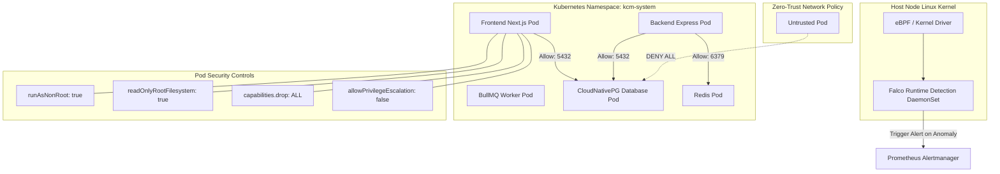

# Kubernetes Runtime Security & Workload Hardening

## Purpose
This document provides the runtime security specification for container workloads, Kubernetes pod isolation, Pod Security Standards (PSS), NetworkPolicies, and kernel-level syscall monitoring across the Kingdom of Christ Ministries infrastructure.

## Scope
Covers Kubernetes manifests in `k8s/` and `platform/security/`, Pod Security Admission, container execution contexts, and network isolation policies.

## Status
> Status: Implemented

---

## 1. Runtime Security Architecture



---

## 2. Pod Security Standards (PSS) & Security Contexts

All production pods enforce the Kubernetes **Restricted** Pod Security Standard profile:

```yaml
securityContext:
  runAsNonRoot: true
  runAsUser: 10001
  runAsGroup: 10001
  fsGroup: 10001
  allowPrivilegeEscalation: false
  readOnlyRootFilesystem: true
  capabilities:
    drop:
      - ALL
  seccompProfile:
    type: RuntimeDefault
```

---

## 3. Network Isolation (Kubernetes NetworkPolicies)

Default-deny network policies are deployed in `platform/kubernetes/network-policies/` and `monitoring/kubernetes/network-policy.yaml`:
- **Default Ingress/Egress Deny**: All unspecified ingress and egress traffic is blocked by default.
- **Microsegmentation**:
  - `frontend` pods may only communicate with `backend` on port 3001, `database` on port 5432, and external HTTPS on port 443.
  - `cloudnativepg` database pods only accept incoming connections from `frontend` and `backend` pods within the `kcm-system` namespace.
  - Ingress controllers can only reach frontend port 3000 and backend port 3001.

---

## 4. Syscall Anomaly Detection via Falco

Falco is deployed as a DaemonSet to intercept kernel-level syscalls via eBPF probes:
- **Terminal Execution**: Detects interactive shells spawned inside running containers (`sh`, `bash`, `exec`).
- **File System Tampering**: Detects unexpected writes to `/etc`, `/usr/bin`, or `/root`.
- **Privilege Escalation**: Detects unauthorized `setuid` / `setgid` system calls.

---

## 5. Troubleshooting & Diagnostics

| Symptom | Cause | Solution |
| :--- | :--- | :--- |
| `CrashLoopBackOff: Read-only file system` | Pod attempted to write to root disk instead of emptyDir mount | Mount an ephemeral `emptyDir` volume at `/tmp` or the target write directory. |
| `Pod blocked by PodSecurityAdmission` | Missing securityContext parameters required by Restricted profile | Ensure `runAsNonRoot: true` and `capabilities.drop: ["ALL"]` are defined in the pod manifest. |
| Database connection timeout from new service pod | Pod missing matching label in PostgreSQL `NetworkPolicy` | Add `app.kubernetes.io/name` label to pod to match NetworkPolicy ingress selector. |

---

## Security Considerations
- Pods are forbidden from mounting the host filesystem or sharing the host network namespace.
- All secrets are mounted as read-only volumes or injected as environment variables.

## Related Documentation
- [Falco.md](Falco.md) — Falco rules and alerting.
- [Trivy.md](Trivy.md) — Vulnerability scanning and SBOM generation.
- [Kubernetes.md](Kubernetes.md) — Cluster deployment manifests.
