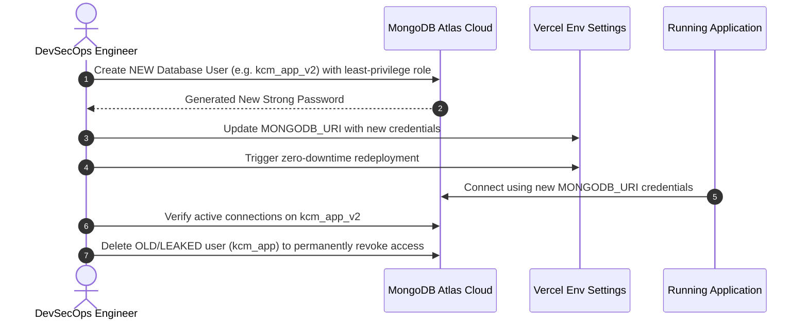

# Enterprise Secrets Management & Key Lifecycle Architecture

## Purpose
This document specifies the authoritative enterprise secrets management architecture, zero-trust credential principles, environment variable segregation, MongoDB Atlas rotation workflows, Vercel configuration, GitHub secret scanning protocols, and incident response procedures for the Kingdom of Christ Ministries platform.

## Scope
Covers database connection strings (PostgreSQL & MongoDB Atlas), API tokens, payment secrets, OAuth client credentials, and cloud service accounts.

## Status
> Status: Implemented & Enforced

---

## 1. Zero-Trust Secrets Management Architecture

```mermaid
graph TD
    subgraph Secret Injection Pipelines
        VercelVault[Vercel Environment Variables: Production & Preview] --> FrontendRuntime[Next.js Server Runtime (Node.js)]
        CloudVault[Kubernetes Secrets / External Secrets Operator] --> K8sRuntime[Production Microservice Pods]
    end

    subgraph Security Boundaries
        FrontendRuntime -->|Server-Side Execution Only| MongoAtlas[(MongoDB Atlas Database)]
        FrontendRuntime -->|Server-Side Execution Only| PostgresDB[(PostgreSQL / PgBouncer)]
        FrontendRuntime -.->|NEVER LEAK TO BROWSER| ClientBrowser[Web Browser / Mobile Client]
    end

    subgraph Automated Leak Prevention Gates
        GitCommit[Developer Git Commit] --> PreCommitGitleaks[Pre-Commit & Gitleaks Scan]
        PreCommitGitleaks --> GitHubSecretScanning[GitHub Secret Scanning & Push Protection]
        GitHubSecretScanning --> BlockMerge[Block Push if Secret Detected]
    end
```

---

## 2. Environment Variable Segregation & Configuration

Secrets are never hardcoded or committed to version control. They are injected strictly through environment variables according to the deployment tier:

### 2.1 Local Development Configuration
1. Copy `.env.example` to `.env.local`:
   ```bash
   cp .env.example .env.local
   ```
2. Populate `.env.local` with developer-specific credentials or enable offline mock flags (`MONGODB_OFFLINE="true"`, `DB_OFFLINE="true"`).
3. Ensure `.env.local` is never staged for Git commits (enforced by `.gitignore`).

### 2.2 Vercel Production & Preview Deployments
1. In the Vercel Project Dashboard (`church`), navigate to **Settings** ➔ **Environment Variables**.
2. Add server-side variables under the **Production**, **Preview**, and **Development** scopes:
   - `MONGODB_URI`: `mongodb+srv://<USERNAME>:<PASSWORD>@<CLUSTER>/<DATABASE>?retryWrites=true&w=majority`
   - `DATABASE_URL`: `postgresql://<USERNAME>:<PASSWORD>@<HOST>:5432/<DATABASE>?sslmode=require`
   - `NEXTAUTH_SECRET`: `<RANDOM_32_BYTE_HEX_SECRET>`
   - `GOOGLE_CLIENT_SECRET`: `<GOOGLE_CLIENT_SECRET>`
   - `RAZORPAY_KEY_SECRET`: `<RAZORPAY_KEY_SECRET>`
   - `RESEND_API_KEY`: `<RESEND_API_KEY>`
3. ⚠️ **Critical Rule**: Never prefix server-side database URIs or private secrets with `NEXT_PUBLIC_`. Variables prefixed with `NEXT_PUBLIC_` are baked into the public browser JavaScript bundle.

---

## 3. Kubernetes Secret Specification (`k8s/secret.yaml`)

When deploying on Kubernetes, secrets are injected via Kubernetes Secret resources with placeholders:

```yaml
apiVersion: v1
kind: Secret
metadata:
  name: kcm-frontend-secrets
  namespace: kcm-system
type: Opaque
stringData:
  DATABASE_URL: "postgresql://<DB_USER>:<DB_PASSWORD>@kcm-db-pooler:5432/church_db?sslmode=require"
  MONGODB_URI: "mongodb+srv://<DB_USER>:<DB_PASSWORD>@<DB_CLUSTER>/kcm_church?retryWrites=true&w=majority"
  NEXTAUTH_SECRET: "<RANDOM_GENERATED_32_HEX_STRING>"
  RAZORPAY_KEY_SECRET: "<RAZORPAY_SECRET_KEY>"
  STRIPE_SECRET_KEY: "<STRIPE_SECRET_KEY>"
  RESEND_API_KEY: "<RESEND_API_KEY>"
  GEMINI_API_KEY: "<GEMINI_API_KEY>"
  INTERNAL_SERVICE_TOKEN: "<INTERNAL_SERVICE_TOKEN>"
```

---

## 4. MongoDB Atlas Credential Rotation SOP

Whenever a MongoDB database user credential is rotated or flagged by secret scanning:



### Step-by-Step Rotation Checklist:
1. **Create New User**: Go to **MongoDB Atlas** ➔ **Database Access** ➔ **Add New Database User**.
2. **Assign Least Privilege**: Assign `readWrite` role scoped strictly to the `kcm_church` database (do NOT grant `atlasAdmin` or cluster-wide roles).
3. **Update Vercel & Kubernetes**: Update the `MONGODB_URI` environment variable with the new username and password.
4. **Deploy & Validate**: Trigger a deployment and verify health probes (`/api/health`).
5. **Revoke Old User**: Delete the old user from MongoDB Atlas to invalidate old connections.

---

## 5. GitHub Secret Scanning & Push Protection

- **GitHub Secret Scanning**: Automatically scans repositories for known secret patterns (MongoDB Atlas URIs, Google API keys, Stripe secrets).
- **Push Protection**: Blocks `git push` operations immediately if a high-confidence secret is detected in any commit.
- **Automated CI Scanning**: The `.github/workflows/secret-scanning.yml` workflow runs Gitleaks / Trivy on all Pull Requests to block unencrypted credentials.

---

## 6. Secret Leak Incident Response Protocol

If a credential or secret is committed or detected by secret scanning:
1. **Immediate Revocation**: Do not wait for Git history scrubbing. Immediately rotate or delete the credential in the respective provider console (MongoDB Atlas, Google Cloud, Razorpay, Resend).
2. **Sanitize Workspace**: Update local code or documentation to use safe placeholders (`mongodb+srv://<USERNAME>:<PASSWORD>@<CLUSTER>/<DATABASE>`).
3. **Git History Remediation**: If needed, execute history rewriting using `git-filter-repo` on isolated branches, coordinate with team members, and force-push sanitized refs.
4. **Post-Mortem**: Document root cause in [`Incident-Response.md`](Incident-Response.md) and verify push protection policies.

---

## 7. Credential Lifecycle & Rotation Matrix

| Secret Category | Default Rotation Window | Revocation Mechanism |
| :--- | :---: | :--- |
| **MongoDB Atlas Database Users** | `90 Days` | MongoDB Atlas Console / API User Revocation |
| **PostgreSQL CloudNativePG Passwords**| `90 Days` | CloudNativePG declarative Secret rotation |
| **Payment Gateway Secrets** | `180 Days` | Razorpay / Stripe Key Regeneration |
| **API Keys (Resend, Gemini, httpSMS)** | `90 Days` | Provider Console Token Invalidation |
| **NextAuth / JWT Signing Secrets** | `90 Days` | Vercel Environment Variable Update & Redeploy |
| **Let's Encrypt TLS Certificates** | `60 Days` | Automated cert-manager ACME renewal |

---

## Security Considerations
- Never hardcode or print real credentials in documentation, tickets, or pull requests.
- All code and documentation must use standard placeholder formats: `mongodb+srv://<USERNAME>:<PASSWORD>@<CLUSTER>/<DATABASE>`.

## Related Documentation
- [Security.md](Security.md) — Comprehensive security architecture.
- [MongoDB-Security.md](MongoDB-Security.md) — MongoDB Atlas least-privilege & network security.
- [Environment-Variables.md](Environment-Variables.md) — Parameter catalog.
- [Incident-Response.md](Incident-Response.md) — Security incident response procedures.
