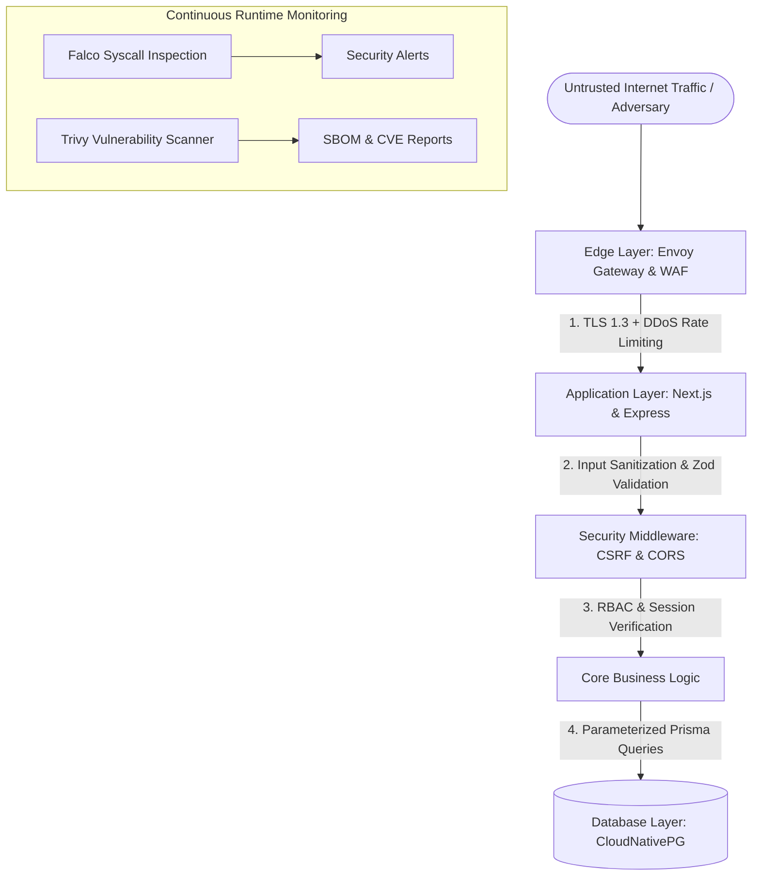

# Security Architecture & Defense-in-Depth

## Purpose
This document provides the technical security specification for the Kingdom of Christ Ministries platform, covering application hardening, threat models, input sanitization, cryptographic standards, and edge defenses.

## Scope
Covers frontend, backend APIs, webhook integrations, database access, and transport layer security.

## Status
> Status: Implemented

---

## 1. Defense-in-Depth Security Model



---

## 2. Input Sanitization & Validation

1. **Schema Validation**: Every incoming API request payload is strictly validated using **Zod** schemas before reaching database queries, preventing type injection and malformed objects.
2. **HTML & Rich-Text Sanitization**: User-submitted content (prayer requests, sermon notes, event descriptions) is sanitized using `sanitize-html` to neutralize Cross-Site Scripting (XSS) payloads:
```typescript
import sanitizeHtml from "sanitize-html";

export function sanitizeInput(dirty: string): string {
  return sanitizeHtml(dirty, {
    allowedTags: ["b", "i", "em", "strong", "a", "p", "ul", "ol", "li"],
    allowedAttributes: {
      a: ["href", "target", "rel"],
    },
  });
}
```
3. **SQL Injection Defense**: All relational database queries utilize Prisma ORM with parameterized SQL queries, completely eliminating SQL injection vulnerabilities.

---

## 3. HTTP Security Headers

Configured via `frontend/next.config.js` and Envoy Gateway policies:

| Header Name | Value | Purpose |
| :--- | :--- | :--- |
| **Content-Security-Policy (CSP)** | `default-src 'self'; img-src 'self' data: https://res.cloudinary.com https://images.unsplash.com; script-src 'self' 'unsafe-eval' 'unsafe-inline' https://accounts.google.com https://checkout.razorpay.com; style-src 'self' 'unsafe-inline' https://fonts.googleapis.com; font-src 'self' https://fonts.gstatic.com;` | Prevents unauthorized script injection and resource loading |
| **Strict-Transport-Security** | `max-age=63072000; includeSubDomains; preload` | Enforces HTTPS connections |
| **X-Frame-Options** | `DENY` | Protects against Clickjacking attacks |
| **X-Content-Type-Options** | `nosniff` | Prevents MIME-type sniffing |
| **Referrer-Policy** | `strict-origin-when-cross-origin` | Minimizes information leakage |
| **Permissions-Policy** | `camera=(), microphone=(), geolocation=(self)` | Restricts sensitive browser features |

---

## 4. Rate Limiting & Abuse Prevention

- **Edge Gateway Limiting**: Envoy Gateway applies global rate limiting (e.g. 100 requests per minute per IP).
- **Backend Limiting**: `express-rate-limit` enforces specialized limiters:
  - **General API**: 100 requests per 15 minutes.
  - **Authentication Endpoints**: 5 failed login attempts per 15 minutes per IP.
  - **Webhooks**: 300 requests per 5 minutes for payment and SMS provider callbacks.

---

## 5. Webhook Security & Signature Verification

External webhook endpoints verify HMAC cryptographic signatures before accepting payloads:
- **Razorpay**: Validates `X-Razorpay-Signature` using `RAZORPAY_KEY_SECRET`.
- **Stripe**: Validates `stripe-signature` using `STRIPE_WEBHOOK_SECRET`.
- **httpSMS**: Validates `X-HttpSms-Signature` using `HTTPSMS_WEBHOOK_SECRET`.
- **Google Apps Script**: Validates `X-KCM-Webhook-Secret` header using `GOOGLE_WEBHOOK_SECRET`.

---

## 6. Troubleshooting & Diagnostics

| Symptom | Cause | Resolution |
| :--- | :--- | :--- |
| `429 Too Many Requests` | Client exceeded rate limit thresholds | Inspect IP headers (e.g. `X-Forwarded-For`) to verify traffic is not behind an unconfigured NAT proxy. |
| `Webhook signature verification failed` | Secret mismatch or raw body parsed before hashing | Ensure webhook route reads raw text buffer before JSON parsing for HMAC calculation. |

---

## Security Considerations
- Zero sensitive keys are hardcoded in git.
- Audit trails record all privileged administrative mutations.

## Related Documentation
- [Authentication.md](Authentication.md) — Login and session mechanisms.
- [Authorization-RBAC.md](Authorization-RBAC.md) — Role permissions.
- [Runtime-Security.md](Runtime-Security.md) — Kubernetes kernel security.
- [Security-Checklist.md](Security-Checklist.md) — Production audit checklist.
