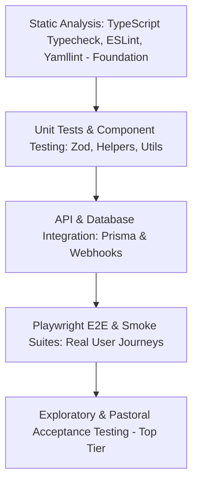

# Quality Engineering & Testing Strategy

## Purpose
This document specifies the enterprise testing strategy, testing pyramid, coverage thresholds, risk-based validation matrix, and automated quality gates for the Kingdom of Christ Ministries platform.

## Scope
Covers all layers of testing: static analysis, unit tests, API integration tests, Playwright E2E tests, cross-browser matrices, accessibility scans, and performance load testing.

## Status
> Status: Implemented & Enforced

---

## 1. The Quality Assurance Pyramid

---

## 2. Risk-Based Testing Matrix

| Risk Tier | High-Risk Critical Paths | Primary Testing Layer | Mandatory Gate |
| :--- | :--- | :--- | :--- |
| **Tier 1 (Critical)** | Online Offerings, Tithes & Webhooks | Webhook signature verification, integration tests, E2E payment mocking | 100% Pass in CI |
| **Tier 1 (Critical)** | Role-Based Access Control (RBAC) | `rbac-matrix.spec.ts` (Validates member cannot access pastor/admin routes)| 100% Pass in CI |
| **Tier 2 (High)** | Event Registration & Seat Decrement | Atomic concurrency integration tests (Prevents overselling seats) | 100% Pass in CI |
| **Tier 2 (High)** | Sermon Audio/Video Streaming & Search | Semantic vector search tests, Cloudinary playback verification | 100% Pass in CI |
| **Tier 3 (Medium)** | Prayer Request Submissions | Offline sync simulation, form validation, notification feedback | 100% Pass in CI |
| **Tier 3 (Medium)** | Cross-Browser & Mobile Viewports | Playwright matrix (Chromium, Firefox, WebKit, Mobile Safari, Pixel) | 100% Pass in CI |

---

## 3. Test Data Management & Fixtures

- **Isolated Test DB**: Automated tests run against an ephemeral test PostgreSQL database seeded with `scripts/test-seed.js`.
- **Database Rollback / Cleanup**: Tests clean up created user and registration rows upon completion, preventing pollution of shared databases.
- **Mock Services**: Third-party external APIs (Razorpay, Stripe, Resend, httpSMS, Firebase) run in mock mode during CI pipelines to prevent network flakiness.

---

## 4. Quality Acceptance Criteria for Releases

A pull request or release tag is strictly rejected if:
1. TypeScript compilation throws any error (`tsc --noEmit`).
2. Any route returns unhandled 500 error during `npm run test:health`.
3. An unauthenticated or standard member account is able to access `/admin` or `/pastor`.
4. Automated accessibility scan detects violations of WCAG 2.1 Level AA.

---

## 5. Troubleshooting & Diagnostics

| Problem | Cause | Solution |
| :--- | :--- | :--- |
| Flaky E2E test failing on animation timing | Test asserting element visibility before Framer Motion finish | Use Playwright's auto-waiting locators (`page.getByRole(...)`) instead of fixed `page.waitForTimeout()`. |
| Database unique constraint error during parallel test runs | Parallel tests using hardcoded user emails | Use dynamic random emails (`test-user-${Date.now()}@example.com`) in test fixtures. |

---

## Security Considerations
- Test credentials and fixtures are isolated from production user databases.

## Related Documentation
- [Testing.md](Testing.md) — CLI test execution commands.
- [CI-CD.md](CI-CD.md) — GitHub Actions automated gates.
- [Authorization-RBAC.md](Authorization-RBAC.md) — Access control matrix.
