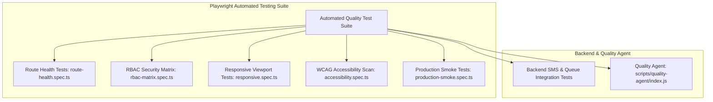

# Automated Testing & Quality Assurance Framework

## Purpose
This document provides the operational execution guide, CLI test commands, and quality validation procedures for all test suites across the Kingdom of Christ Ministries platform.

## Scope
Covers unit tests, route health tests, RBAC authorization matrix suites, mobile responsiveness validation, accessibility scans, and production smoke tests.

## Status
> Status: Implemented & Automated

---

## 1. Test Suite Architecture



---

## 2. Test Execution Commands Catalog

| Test Category | Monorepo Execution Command | Target Suite / Purpose |
| :--- | :--- | :--- |
| **All Playwright Tests** | `npm run test` | Executes full Playwright E2E and regression test suite |
| **Route Health Check** | `npm run test:health` | Asserts HTTP 200/302 statuses on all public & private routes |
| **RBAC Security Matrix** | `npm run test:rbac` | Verifies MEMBER, PASTOR, ADMIN, and VOLUNTEER access boundaries |
| **Responsive Viewports** | `npm run test:responsive` | Asserts mobile, tablet, and desktop layout rendering without overflow |
| **WCAG 2.1 AA a11y** | `npm run test:a11y` | Runs automated axe-core accessibility compliance checks |
| **Production Smoke** | `npm run test:smoke` | Validates live deployment health and primary user journeys |
| **Quality Agent Audit** | `npm run agent:audit` | Runs comprehensive code health and dependency integrity audit |
| **Quality Agent Auto-Heal**| `npm run agent:heal` | Automatically resolves common lint, route, and typing errors |
| **Backend SMS Tests** | `npm test -w backend` | Tests httpSMS gateway retry logic and template rendering |

---

## 3. Playwright Configuration (`frontend/playwright.config.ts`)

- **Browser Coverage**: Executes across Chromium, Firefox, and WebKit (Apple Safari).
- **Device Emulation**: Tests viewports for **iPhone 15**, **Pixel 7**, **iPad Pro**, and **1080p Desktop**.
- **Parallel Workers**: Configured with 4 parallel worker threads in CI.
- **Trace & Video Capture**: Automatically captures screenshots, network traces, and video recordings on test failures for instant debugging.

---

## 4. Running Tests Interactively (UI Mode)

```bash
# Launch Playwright interactive visual test runner
npx playwright test --ui
```

---

## 5. Troubleshooting & Diagnostics

| Problem | Cause | Solution |
| :--- | :--- | :--- |
| Tests fail with `Connection Refused at http://localhost:3000` | Local Next.js dev server not running before executing tests | Start dev server with `npm run dev` in background, or let Playwright `webServer` auto-start the app. |
| Playwright browser binaries missing | Playwright newly installed without browser engines | Run `npx playwright install --with-deps` to download browser engines. |

---

## Security Considerations
- Test fixtures use randomized test user emails and dummy passwords.
- No live payment cards or production API secrets are used during automated test runs.

## Related Documentation
- [Test-Strategy.md](Test-Strategy.md) — Testing strategy and pyramid.
- [CI-CD.md](CI-CD.md) — GitHub Actions automated test gates.
- [Accessibility.md](Accessibility.md) — a11y compliance details.
