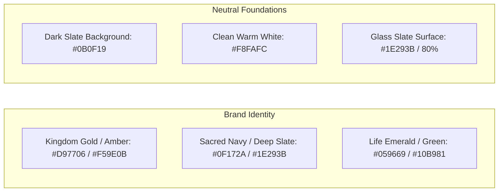

# UI/UX Design System & Animation Guidelines

## Purpose
This document specifies the design philosophy, visual design system, color palette tokens, typography scales, glassmorphism effects, and animation choreography for the Kingdom of Christ Ministries platform.

## Scope
Covers Tailwind CSS design tokens (`tailwind.config.ts`), CSS root variables (`app/globals.css`), Radix UI styling patterns, and Framer Motion micro-interactions.

## Status
> Status: Implemented

---

## 1. Design Philosophy

The KCM user interface blends **reverence, modern elegance, warmth, and clarity**. It avoids generic templates in favor of a bespoke visual identity tailored for spiritual engagement, accessibility, and high usability across all demographics.

---

## 2. Color Palette & Semantic Tokens

| Token Name | Light Mode Value | Dark Mode Value | Usage Context |
| :--- | :--- | :--- | :--- |
| `background` | `#F8FAFC` (Slate 50) | `#0B0F19` (Deep Obsidian) | Main application viewport canvas |
| `card` | `#FFFFFF` (Pure White) | `#131B2E` (Deep Slate Glass) | Content containers, sermon cards, event tiles |
| `primary` | `#D97706` (Amber 600) | `#F59E0B` (Amber 500) | Primary CTA buttons, active tabs, hero highlights |
| `primary-foreground`| `#FFFFFF` | `#0B0F19` | Text/icons rendered on top of primary buttons |
| `secondary` | `#0F172A` (Slate 900) | `#334155` (Slate 700) | Secondary badges, auxiliary buttons |
| `accent` | `#3B82F6` (Royal Blue)| `#60A5FA` (Sky Blue) | Informational callouts, active links |
| `success` | `#059669` (Emerald 600)| `#10B981` (Emerald 500)| Completed payments, verified check-ins |
| `destructive` | `#DC2626` (Red 600) | `#EF4444` (Red 500) | Delete actions, error toasts, critical warnings |

---

## 3. Typography Hierarchy

Configured via Next.js Google Font integration (`next/font/google`):
- **Primary Body & Interface**: `Inter` (Optimized for ultra-clear legibility at small sizes).
- **Headings & Displays**: `Outfit` / `Playfair Display` (Conveys dignity, warmth, and editorial elegance).

| Element | Font Family | Desktop Size / Leading | Mobile Size / Leading | Weight |
| :--- | :--- | :--- | :--- | :--- |
| `Display H1` | Outfit | 56px / 1.1 | 36px / 1.2 | Bold (700) |
| `Section H2` | Outfit | 36px / 1.2 | 28px / 1.25 | SemiBold (600) |
| `Card Title H3`| Outfit | 24px / 1.3 | 20px / 1.3 | SemiBold (600) |
| `Body Regular`| Inter | 16px / 1.5 | 15px / 1.5 | Regular (400) |
| `Caption / Meta`| Inter | 13px / 1.4 | 12px / 1.4 | Medium (500) |

---

## 4. Glassmorphism & Elevation Tokens

The interface incorporates subtle frosted glass surfaces using CSS backdrop filters:
- **Glass Card**: `background: rgba(30, 41, 59, 0.7); backdrop-filter: blur(12px); border: 1px solid rgba(255, 255, 255, 0.1);`
- **Elevations**:
  - `shadow-sm`: Subtle border elevation on cards.
  - `shadow-md`: Interactive hover elevation.
  - `shadow-xl`: Modal dialogs and dropdown menus.

---

## 5. Animation Choreography (Framer Motion)

Animations enhance engagement without introducing distracting motion:
- **Page Transitions**: Subtle fade and vertical slide (`opacity: 0 -> 1, y: 8 -> 0`, duration: `0.25s`).
- **Interactive Micro-animations**: Button tap scaling (`whileTap={{ scale: 0.98 }}`), card hover lift (`whileHover={{ y: -4 }}`).
- **Reduced Motion Support**: All motion components honor the OS setting `prefers-reduced-motion: reduce`.

---

## 6. Theme Management (`next-themes`)

- Supports Light, Dark, and System Auto-Detection modes.
- Prevents initial layout shift (FOUC) by injecting theme classes before React hydration.

---

## Security Considerations
- Color contrast ratios strictly meet WCAG 2.1 AA requirements (>= 4.5:1 for normal text).

## Related Documentation
- [Frontend.md](Frontend.md) — Frontend application architecture.
- [Responsive-Design.md](Responsive-Design.md) — Viewport layout rules.
- [Accessibility.md](Accessibility.md) — WCAG accessibility compliance.
