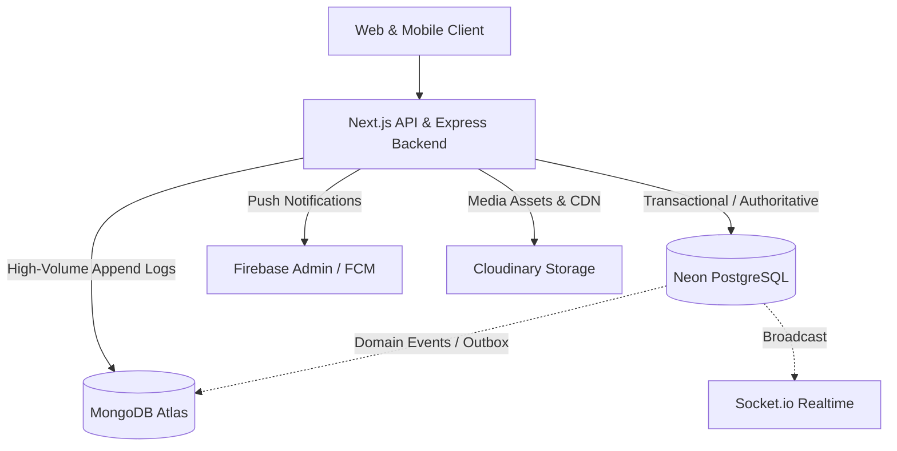

# Kingdom of Christ Ministries (KCM) — Data Ownership Specification

**Document Version**: 1.0.0  
**Effective Date**: August 2026  
**Status**: Approved Production Specification

---

## 1. Core Polyglot Persistence Principles

The Kingdom of Christ Ministries platform utilizes a multi-database polyglot persistence architecture. Every data domain has a single **Authoritative System of Record (SoR)**. 

Secondary stores may receive derived events, search indexes, or cached summaries, but must **never** become competing sources of truth.

---

## 2. Complete Data Domain Ownership Matrix

| Data Domain / Entity | Authoritative System of Record | Complementary Store (Async / Derived) | Media / Delivery Provider | Read SLA | Consistency Model |
| :--- | :--- | :--- | :--- | :--- | :--- |
| **Members & Profiles** | **PostgreSQL** (`members`, `User`) | MongoDB (`user_activity`) | Cloudinary (`profiles/`) | < 50ms | Strict Transactional (ACID) |
| **Authentication & RBAC** | **PostgreSQL** (`User.role`, `User.password`) | Firebase (ID Token Verification) | — | < 10ms | Strict Transactional |
| **Offerings & Donations** | **PostgreSQL** (`Donation`, `PaymentTransaction`) | MongoDB (`analytics_events`) | Razorpay / Stripe | < 100ms | Strict Transactional (ACID) |
| **Financial Ledger & Pledges** | **PostgreSQL** (`Pledge`, `Transaction`, `Account`) | — | — | < 100ms | Strict Transactional (ACID) |
| **Church Events & Schedules** | **PostgreSQL** (`Event`, `ChurchService`) | MongoDB (`search_documents`) | Cloudinary (`events/`) | < 50ms | Read-heavy / Cached |
| **Event Registrations** | **PostgreSQL** (`EventRegistration`) | MongoDB (`activity_logs`) | — | < 50ms | Strict Transactional (Seat bounds) |
| **Attendance & Check-in** | **PostgreSQL** (`attendance_records`, `event_attendance`) | MongoDB (`analytics_events`) | — | < 50ms | Strict Transactional |
| **Sermons & Notes** | **PostgreSQL** (`Sermon`, `SermonNotes`) | MongoDB (`content_metadata`) | Cloudinary (`sermons/`) | < 50ms | Read-heavy / Cached |
| **Prayer Requests** | **PostgreSQL** (`PrayerRequest`) | MongoDB (`activity_logs`) | — | < 50ms | Strict Transactional |
| **Branches & Ministries** | **PostgreSQL** (`Branch`, `Ministry`) | — | Cloudinary (`branches/`) | < 50ms | Read-heavy / Static |
| **Activity Feeds** | **MongoDB** (`activity_logs`) | — | — | < 20ms | Eventual Consistency |
| **Security Audit Logs** | **MongoDB** (`audit_events`) | PostgreSQL (`AuditLog` backward-compat) | — | < 20ms | Immutable Append-Only |
| **Notification History** | **MongoDB** (`notification_events`, `notification_history`) | PostgreSQL (`outbox_events` delivery queue) | Firebase FCM, Twilio, Resend | < 30ms | Eventual Consistency |
| **System Telemetry & Loops** | **MongoDB** (`system_events`, `application_logs`) | Prometheus / Loki | — | < 20ms | Append-Only / TTL Bound |
| **Platform Analytics** | **MongoDB** (`analytics_events`) | — | — | < 50ms | Time-Series / Aggregate |
| **Media Files & Documents** | **Cloudinary** | MongoDB (`media_metadata`) | Cloudinary CDN | CDN Edge | Immutable Object Storage |
| **Mobile Device Push Tokens** | **Firebase** / **PostgreSQL** (`DeviceToken`) | MongoDB (`notification_events.recipientId`) | Firebase Cloud Messaging | < 100ms | Eventual Consistency |

---

## 3. Strict Prohibitions & Anti-Patterns

1. **NO Financial Aggregation in MongoDB**:
   - Financial summaries, donation receipts, 80G statements, and fund balances must **only** be computed from PostgreSQL `Donation` and `PaymentTransaction` tables.
   - MongoDB may store masked payment event logs (`paymentId`, `amount`, `status`, `gateway`) for analytical visualization only.
2. **NO Direct Frontend Writes to MongoDB**:
   - Browser and mobile clients never connect to MongoDB. All mutations pass through authenticated backend API routes.
3. **NO Orphan Relational References**:
   - MongoDB document records referencing relational entities must store the PostgreSQL primary key string (UUID/CUID) in standard fields (`actorId`, `entityId`, `resourceId`).
4. **NO Sensitive Data Ingestion in MongoDB**:
   - Authentication credentials, auth tokens, session secrets, PAN/tax identifiers, bank account details, and raw credit card/UPI PIN information must never be inserted into MongoDB logs or metadata fields. Client IP addresses must be SHA-256 hashed.

---

## 4. Conflict Resolution Strategy

If an existing legacy subsystem attempts to read or write business state in a conflicting manner:
1. PostgreSQL is treated as the ground truth.
2. MongoDB state is resynchronized from PostgreSQL via non-blocking domain events or reconciliation scripts.
3. No destructive schema migrations are performed.
